# Using the Project Gantt Chart

### Overview

The Project Gantt Chart is a useful visual for Project Management to visualise the steps required to complete the project and where in that sequence of events the project is currently at. Moreover, the tasks that the Gantt chart is comprised of can be edited directly from the visual. Where the “Start Date” and “Finish Date” of each task can be adjusted by simply dragging the length of the item.

### How to access a Project's Gantt Chart

1. Navigate to Projects &gt; Projects  
    
2. Open the Project you wish to view the Gantt of. Find this project by either scrolling through the list or using the search bar.   
    
3. Click on the “Project Management” tab  
    
4. Click on the “Gantt”  
    

### How to adjust the Start and End dates of Project Tasks using the Project Gantt

1. Navigate to Projects &gt; Projects  
    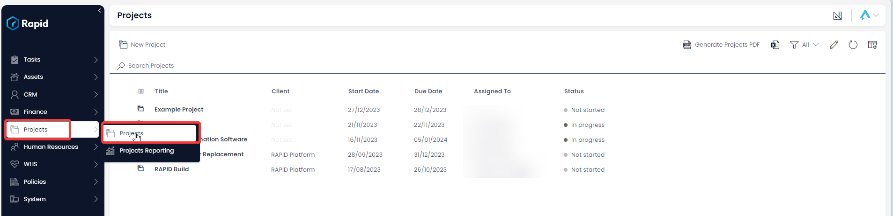
2. Open the Project you wish to view the Gantt of. Find this project by either scrolling through the list or using the search bar.   
    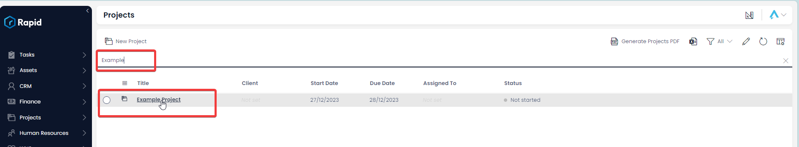
3. Click on the “Project Management” tab  
    
4. Click on the “Gantt”  
    
5. Identify the task you wish to alter the Start Date / End Date of 
    1. Click and drag the front of the task to edit the Start Date  
        
    2. Click and drag the end of the task to edit the End Date  
        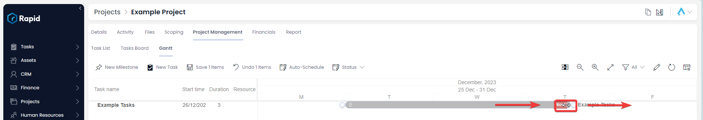
    3. Click and drag the middle of the task to shift the both the Start Date and End Date  
        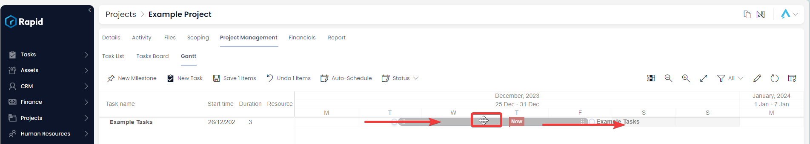
6. Press ****Save X Items**** 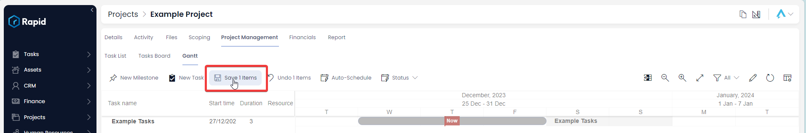

### How to create Finish-to-Start Dependencies on a Project Gantt Chart

A Gantt chart dependency is a relationship between two or more tasks in a project that dictates the sequence in which they must be executed. Dependencies illustrate the order and timing of task completion, outlining the relationships that exist between different project activities. A Finish-to-Start dependency is the most common type, where the start of one task depends on the completion of another. Task B cannot begin until Task A finishes. Follow the steps below to create a Finish-to-Start Dependencies:

1. Navigate to Projects &gt; Projects  
    
2. Open the Project you wish to view the Gantt of. Find this project by either scrolling through the list or using the search bar.   
    
3. Click on the “Project Management” tab  
    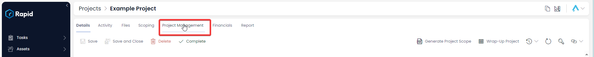
4. Click on the “Gantt”  
    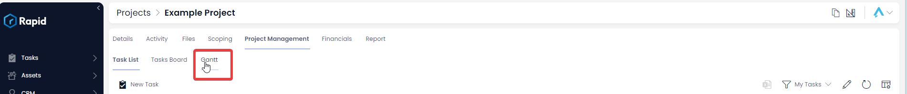
5. Identify the task you wish to create a dependency from (Task A) and the task to you wish to create a dependency to (Task B)
6. Hover your cursor over Task A, you will notice a white circle appear at the end of this task. Click and drag your cursor to the white circle at the start of Task B.  
    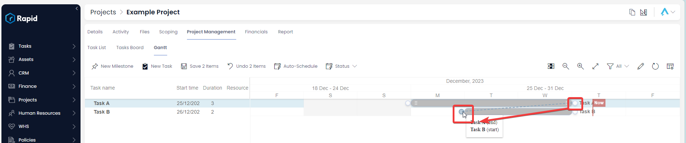
7. This results in the Task B start date shifted to the Task A End date. There is logic to accommodate non-work days.  
    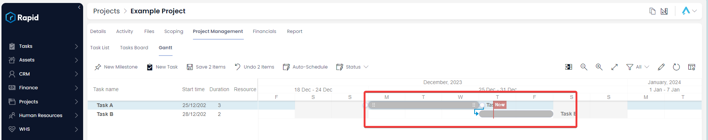
8. Press ****Save X Items**** 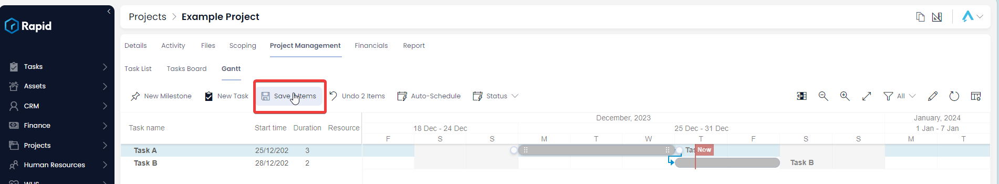

For further information on using the Gantt and creating other dependencies see the full Gantt documentation at: [How to Interact with a Gantt Chart in Explorer](https://docs.rapidplatform.com/books/experiences-oxn/page/how-to-interact-with-a-gantt-chart-in-explorer)

### How to edit a task from a Projects Gantt Chart

1. Navigate to Projects &gt; Projects  
    
2. Open the Project you wish to view the Gantt of. Find this project by either scrolling through the list or using the search bar.   
    
3. Click on the “Project Management” tab  
    
4. Click on the “Gantt”  
    
5. Double-click on the task you want to edit  
    
6. Edit any relevant fields on the sub item page as needed.  
    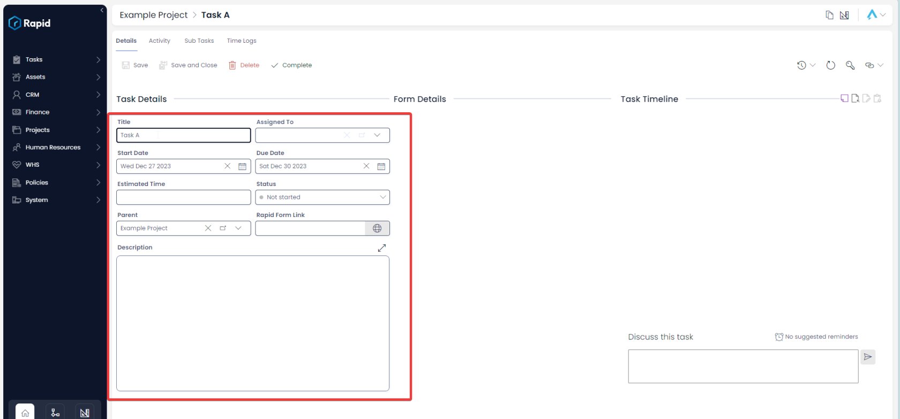
7. Once you have finished editing, click on **Save** or ****Save and Close**** 

### Milestones

Gantt milestones are significant points or achievements within a project that are represented as distinct marker to highlight key project events or goals. Milestones can be used to represent: critical points, progress tracking, and decision points.

By incorporating milestones into a Gantt chart, project managers can enhance project visibility, facilitate effective communication, and better manage and track the project's progress towards key objectives.

It is important to note that while tasks cover a date range milestones represent a point in time.

#### How to create Milestones

1. Navigate to Projects &gt; Projects  
    
2. Open the Project you wish to view the Gantt of. Find this project by either scrolling through the list or using the search bar.   
    
3. Click on the “Project Management” tab  
    
4. Click on the “Gantt”  
    
5. Click “New Milestone” in the top left corner  
    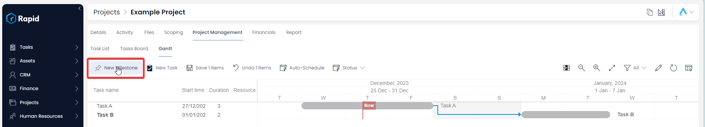
6. Enter details as needed 
    1. Title and Date are required
    2. Milestones will appear in task views  
        
7. Press **Create**  
    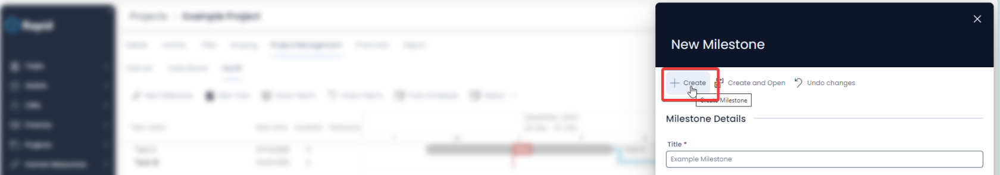
8. The Milestone will now appear on the Gantt chart  
    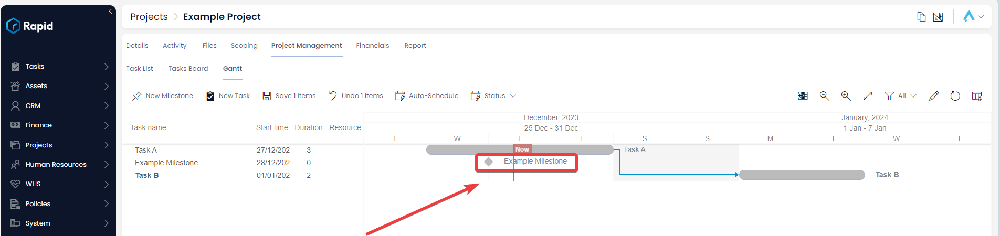

### How to Adjust a Milestones Date

1. Navigate to Projects &gt; Projects  
    
2. Open the Project you wish to view the Gantt of. Find this project by either scrolling through the list or using the search bar.   
    
3. Click on the “Project Management” tab  
    
4. Click on the “Gantt”  
    
5. Identify the milestone you wish to alter the Date of
6. Click and drag the Milestone Marker task to shift Milestone date.  
    
7. Press Save X Items  
    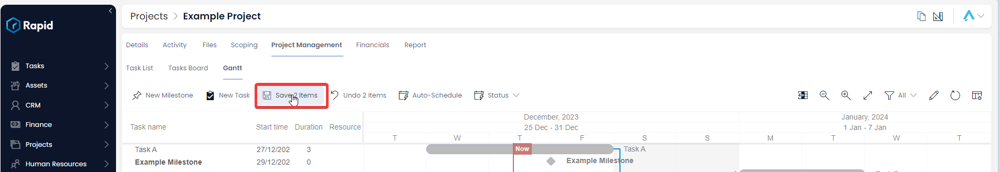

Dependencies can be created on Milestones in the same way as in tasks. See the tasks “Creating Finish-to-Start Dependencies” documentation