# Using the Project Task Board

### Overview

The task board is a great way to visualise the status of each of the project’s sub-tasks. It also provides the user the ability to easily move tasks between each of the status fields which will automatically update the status of that task. Moreover, the “view” can be changed to show tasks on the task board that are only your tasks or “All” tasks depending if you want visibility of your responsibilities or the tasks from the project as a whole.

### How to access a Projects Task Board

1. Navigate to Projects &gt; Projects  
    
2. Open the Project you wish to create child tasks in. (Find the project by scrolling through the list or using the search bar)  
    
3. Click on the **Project Management** tab  
    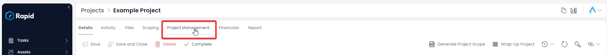
4. Click on **Tasks Board** 

### How to change the status of a task using the tasks board

1. Navigate to Projects &gt; Projects  
    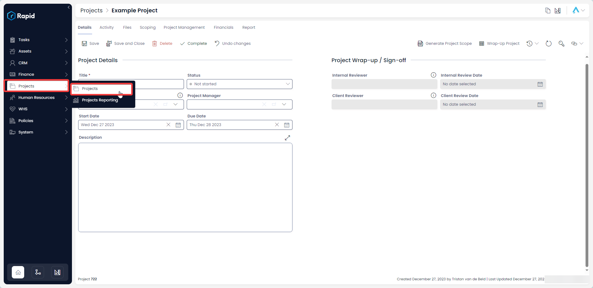
2. Open the Project you wish to create child tasks in. (Find the project by scrolling through the list or using the search bar)  
    
3. Click on the **Project Management** tab  
    
4. Click on **Tasks Board** 
5. Locate the task you wish to move between status columns by using the search bar or manually finding it on the board  
    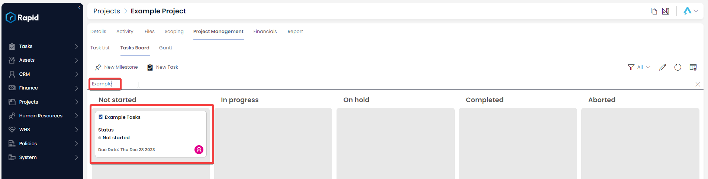
6. Click and drag the task between the columns (this will update the status of the task from the column it started on to the column you "drop" it in)  
    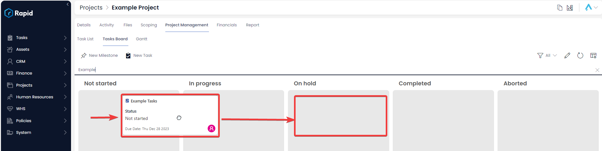
7. Press **Save X items** 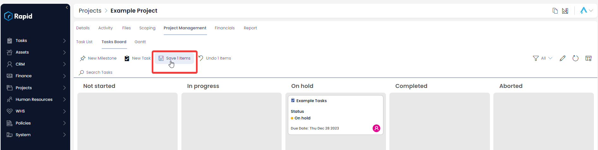

### How to change the view on a Project Task Board

The default view on the Task Board is the “My Tasks – All” view which shows all tasks assigned to the user or a group the user is a part of. This view can be changed to the “All” view to show all tasks in the project irrespective of who it is assigned to. To do this follow the steps below.

1. Navigate to Projects &gt; Projects  
    
2. Open the Project you wish to create child tasks in. (Find the project by scrolling through the list or using the search bar)  
    
3. Click on the **Project Management** tab  
    
4. Click on **Tasks Board** 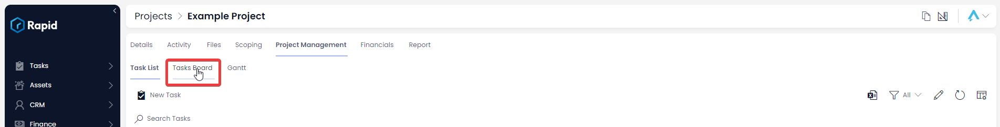
5. Click on the dropdown in the upper right corner above the task board which says “My Tasks – All”  
    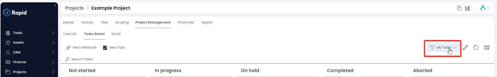
6. From the list of view select the “All” view  
    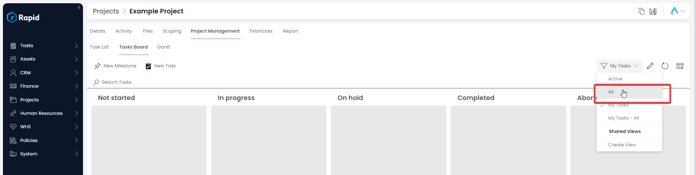
7. The tasks board now shows all tasks in the project. The same steps can be used to revert the view back to “My Tasks – All”

### How to edit a task from a Project's task board

1. Navigate to Projects &gt; Projects  
    
2. Open the Project you wish to create child tasks in. (Find the project by scrolling through the list or using the search bar)  
    
3. Click on the **Project Management** tab  
    
4. Click on **Tasks Board** 
5. Double-click on the Task Card OR Click on the Task Title you wish to edit to open it  
    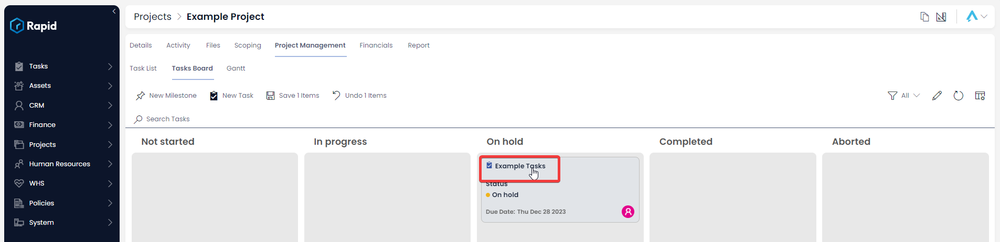
6. Edit any relevant fields on the sub item page as needed.  
    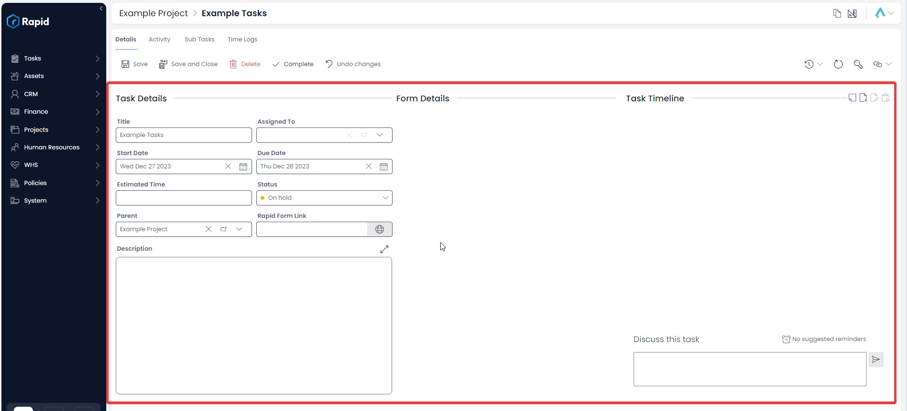
7. Once you have finished editing, click **Save** or **Save and Close** 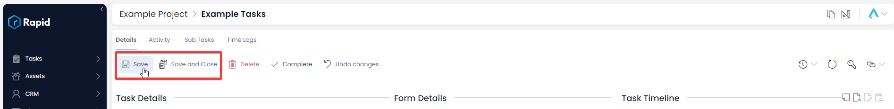