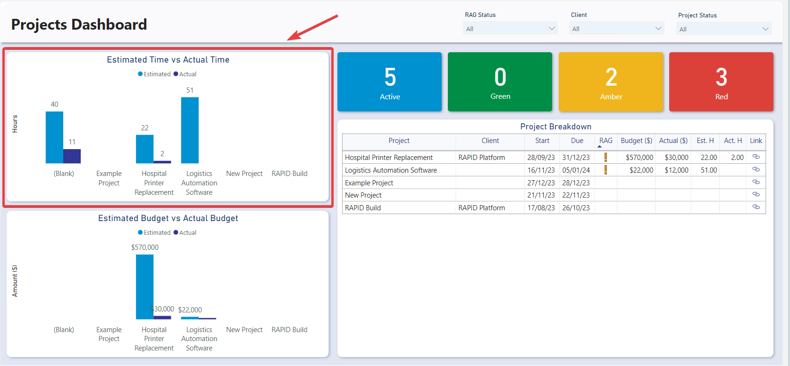
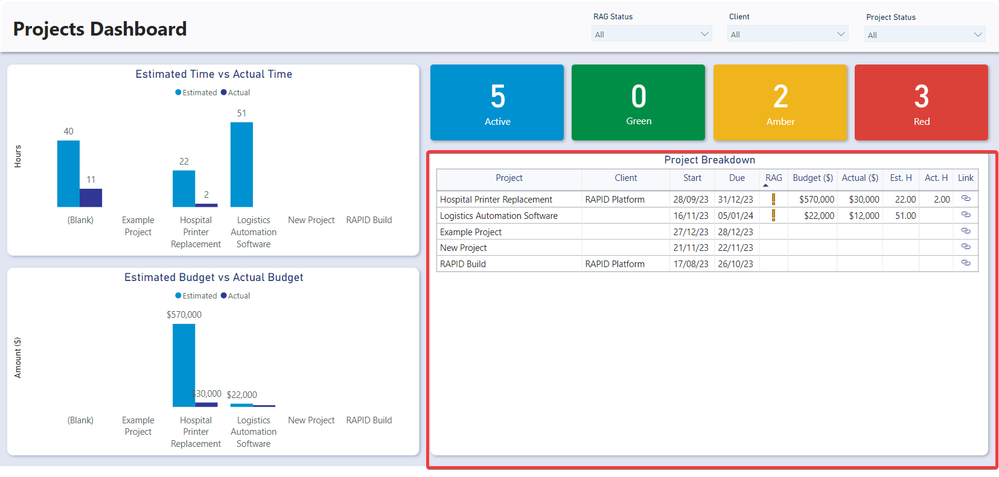

# Using the Projects Dashboard

### Overview

Two reports are linked to the project's module. The first is an item-level report that considers the specific project in which it is nested, reporting exclusively on that project. The second is a general projects report that offers insights across all projects within the organization.

### How to access the Projects Dashboard

1. Navigate to Projects &gt; Project Reporting  
    

### Using the Projects Dashboard

The Projects Dashboard is divided into four sections: slicers, charts, cards, and the projects table.

#### Slicers

Slicers provides the user with the ability to filter all of the visuals on the page by a specific attribute and can be found at the top of the page.

The Projects Dashboard can be “sliced” based on no attributes, one attribute, or multiple attributes. The attributes available to “slice” by are RAG Status, Client, and Project Status.

The RAG status in project management is a visual indicator used to communicate the overall health and progress of a project. The term "RAG" stands for Red, Amber (or Yellow), and Green, representing three colour codes that signify different levels of status:

Red = Project is overdue

Amber = Task within project is overdue

Green = Nothing is overdue

For example, you could use the slicers to filter down the visuals to Projects that are “Green” and associated with the client “Example Inc”.

#### Cards

The Cards section within the Projects Dashboard offers concise reference statistics. The values of these cards will change based on the slicers or if selections are made on Tasks table or charts.

The provided cards are as follows:

- Active – Indicates the number of active projects (Where the status is “Not Started” or “In Progress”.
- Green – Displays the number of projects where the project is not overdue and none of the sub tasks are overdue
- Amber – Displays the number of projects where the project is not overdue but at least one subtask is overdue
- Red – Displays the number of projects where the project is overdue.

#### Charts

##### Estimated Time vs Actual Time

The Estimated Time vs Actual Time visual shows a clustered column group for each Project. One column represents the sum of estimated time from all of that projects sub tasks. The second represents the sum time log hours against that project.

It is an interactive visual, allowing users to click on any of the status bars to filter the rest of the report by that specific status.

##### Estimated Budget vs Actual Budget

The Estimated Budget vs Actual Budget visual shows a clustered column group for each Project. One column represents the sum of estimated costs for all budgets against the project and second represents the sum of actual costs for all budgets against the project.

It is an interactive visual, allowing users to click on any of the status bars to filter the rest of the report by that specific status.

#### Projects Table

The Projects Table displays the Project Name, Client, Start date, Due date, Est. Hours, Act. Hours, Status, Overdue status, and a link to the rapid item.

It is an interactive visual, allowing users to click any task line and the report visuals will highlight or filter based on the selected employee.

