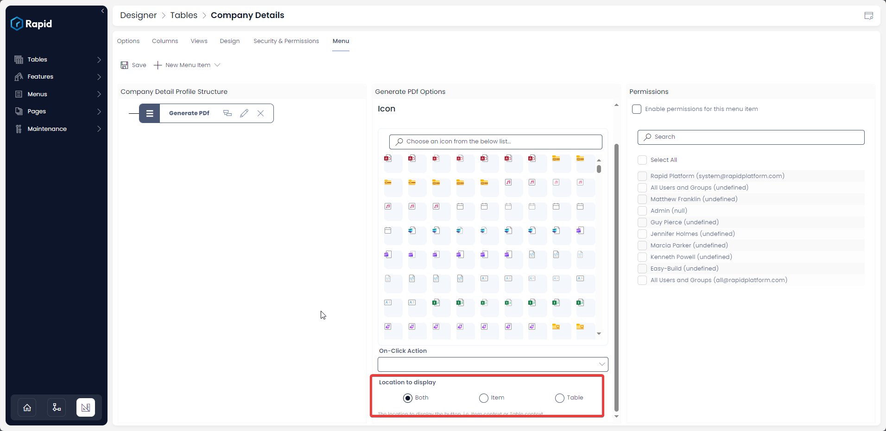
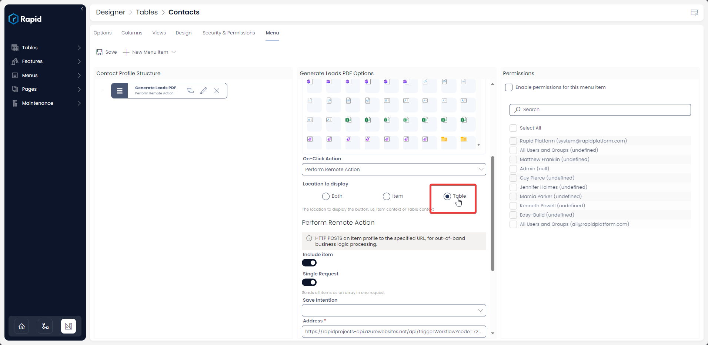
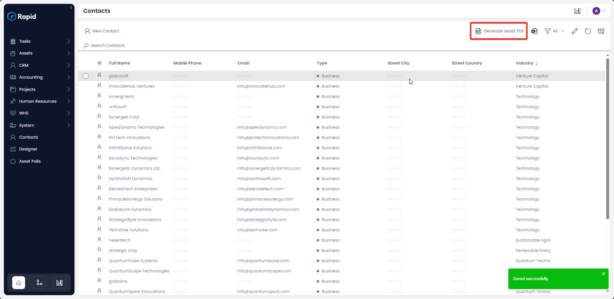
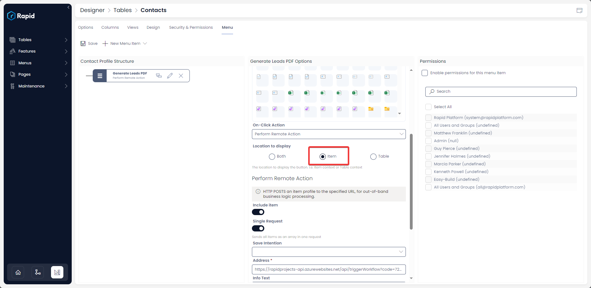
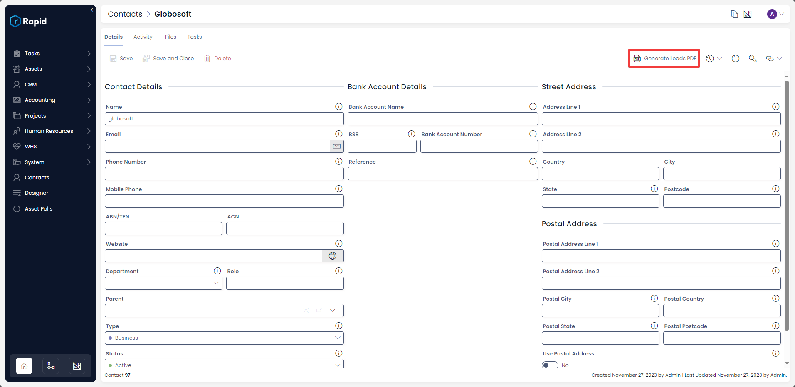

# What is Location to Display option in a Menu setup?

This is configurable on the ***[Command Bar](https://docs.rapidplatform.com/books/glossary/page/command-bar)*** menu type.

This option has three radio buttons:

- Table
- Item
- Both

The default option selected is **Both.**

As the button appears in the Explorer view of the data table, the system allows you to configure, whether you wish to have the button at the table level OR at the item level OR at both the levels.

If, for instance, you select *Table* in this option, then the button will appear on the table only. You can select multiple rows and then click the menu button for a bulk operation.

However, if you select *Item* in this option, then the button will appear only at the item level. You can select an item, go to its details view and then click the menu button, making it a single item operation.

##### Selecting Table

Selecting Location to display as "Table" will show the menu button on the table view as per the images below:

#####  

##### Selecting Item

Selecting Location to display as "Item" will show the menu button on the item view as per the images below:

##### Selecting Table

Selecting both will result in the menu button appearing on both the Table and the Item.

##### **Related articles**

**[Displaying text and icon on a menu button ](https://docs.rapidplatform.com/books/experiences/page/how-to-set-display-text-and-icon-for-a-menu-item "How to set display text and icon for a menu item?")**

**[Various types of On-Click Action](https://docs.rapidplatform.com/books/experiences/page/how-to-set-on-click-action-for-a-menu-item "How to set On-Click Action for a menu item?")**

**[Save Intention field](https://docs.rapidplatform.com/books/experiences/page/what-is-save-intention-option-in-a-menu-setup "What is Save Intention option in a Menu setup?")**

[**Giving permissions to users for menu buttons**](https://docs.rapidplatform.com/books/experiences/page/how-to-set-permissions-for-a-menu-button "How to set Permissions for a Menu button?")

*[**Back to Menu main page**](https://docs.rapidplatform.com/books/experiences/page/all-about-menus-in-dezigna "All about Menus in Dezigna")*