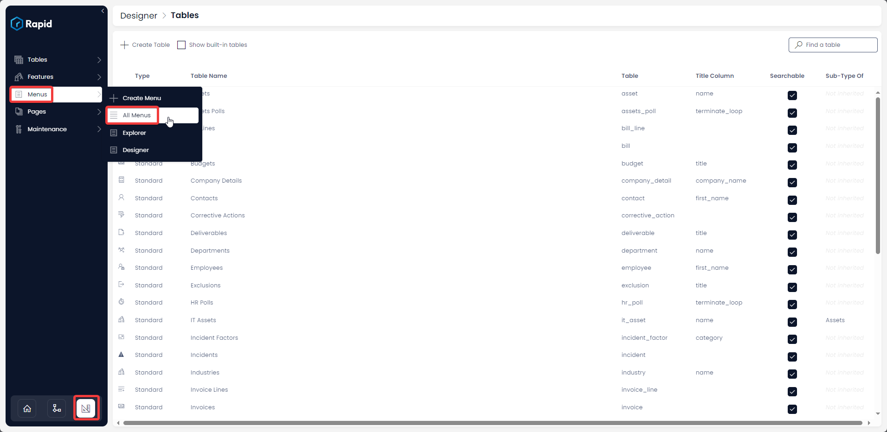
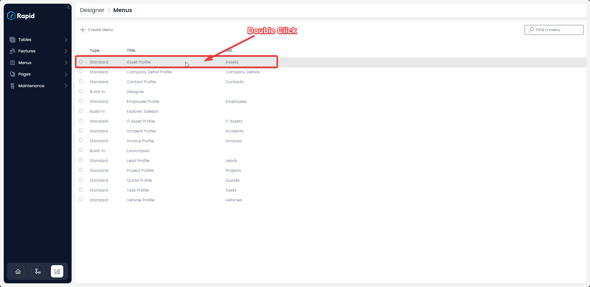
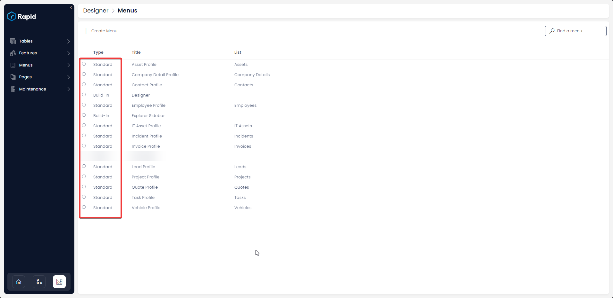
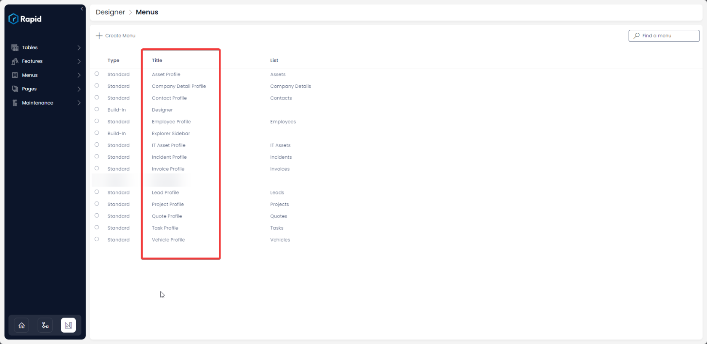
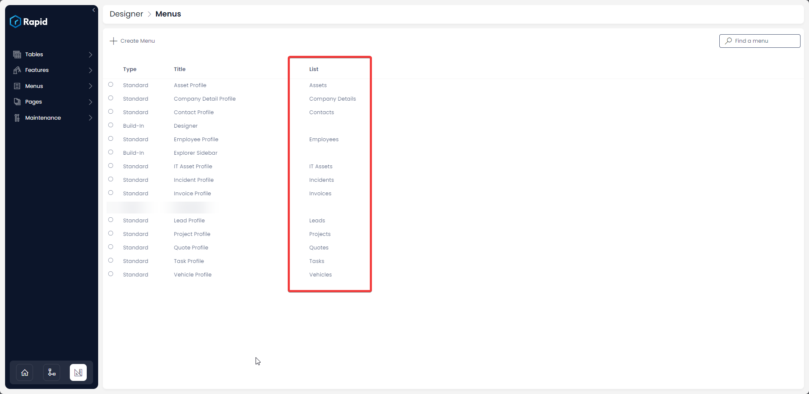

# Where to find a list of all Menus in the Rapid System?

This article relates to menus configured for both ***[Side Bar](https://docs.rapidplatform.com/books/glossary/page/sidebar)*** and ***[Command Bar](https://docs.rapidplatform.com/books/glossary/page/command-bar)*** menu types.

#### Overview

As system builders, we often work in teams. Different individuals may create various Command Bar and Side bar menus. There may be a need to view all created menus across the Rapid site. This can be easily achieved.

The system provides a centralized list of all menus.

#### Accessing the list of Menus

1. Navigate to Designer &gt; Menus &gt; All Menus  
    
2. (Optional) Double-Clicking on the Menu item will open it and enable you to edit it (To find out more about editing Menus see [How to configure a Menu Button in Command Bar](https://docs.rapidplatform.com/books/experiences/page/how-to-configure-a-menu-button-in-a-command-bar))  
    

#### Menu List Details

There are three columns displayed in the Menus List: Type, Title, List

##### Type Column:

The type of column has two possible options: **Built-In** and **Standard.**

Built-In types are the Sidebar menus that come preconfigured in a blank install of Rapid. These include the Explorer Side bar and Designer Sidebar. Both of which can be customized.

Standard types are any Command Bar menus that you have configured. On tables where you have not configured a Command Bar menu there will not be an entry.

##### Title Column:

The title column shows the name of the Menu. The Build-In menus have hard coded titles of: "Designer" and "Explorer Sidebar". While the Standard menus are system generated based on where the menu was created. For example, if you create a Command Bar menu on the Assets table the menu will be title: Asset Profile.

##### List Column:

The list column shows which list the menu is created on if relevant. If the **Command Bar** menu is created on the **Assets** list this column will shows **Assets**.

##### **Related article**

[How to create Menu buttons in command bar of a data table?](https://docs.rapidplatform.com/books/experiences/page/how-to-configure-a-menu-button-in-a-command-bar "How to configure a Menu button in a command bar?")

[***Go back to Menus main page***](https://docs.rapidplatform.com/books/experiences/page/all-about-menus-in-dezigna "All about Menus in Dezigna")