# Creating, Editing and Deleting Tasks

## Creating a Task from the Tasks List or Task Board
1. On the sidebar select Tasks > Task Portal
2. Select the “Task Board” or “Task List” tab

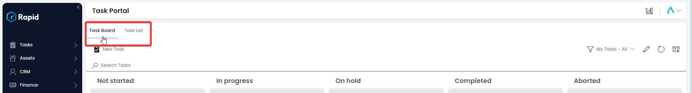

3. Click “New Task”

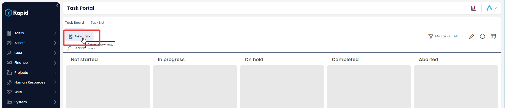

4. Enter the relevant details. Note: The “Assigned To” column will determine whose task list this will appear in. You can assign a task to a “Role” such as “WHS Team” and any members of that team will see the task in their task list on the “My Tasks” view.

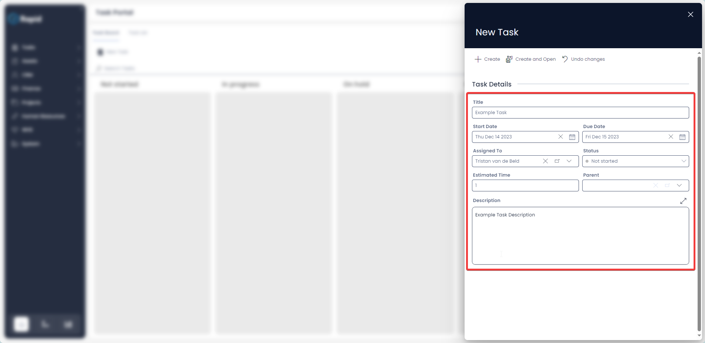

5. Click on “Create” or “Create and Open”

## Editing a Task from the Tasks List
1. On the sidebar select Tasks > Task Portal

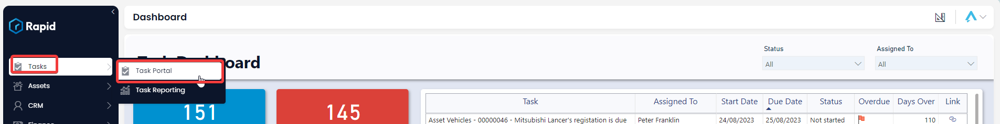

2. Select the “Task List” tab

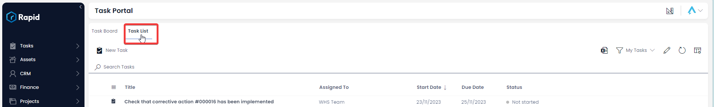

3. Click on the title of the task you wish to edit

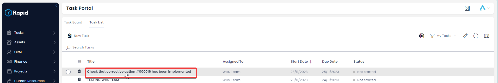

4. Edit any relevant fields on page as needed

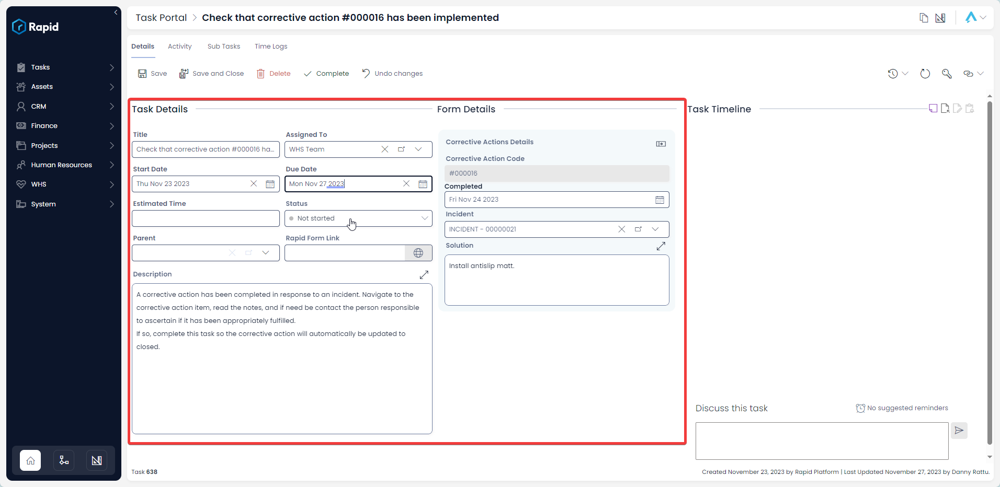

5. Once you have finished editing, click on Save or Save and Close

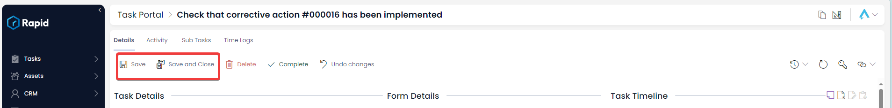

## Deletion
It is not recommended to delete a Task if it has been abandoned; instead, change its status to "Aborted".

However, if you need to delete a task due to incorrect data entry or a duplicate entry, you can do so in two ways: from the list or from the item page. Deleting from the list allows you to delete multiple Tasks at once.
 
### Deleting a Task from the Tasks List
1. On the sidebar select Tasks > Task Portal

2. Select the “Task List” tab

3. Select the tasks you wish to delete

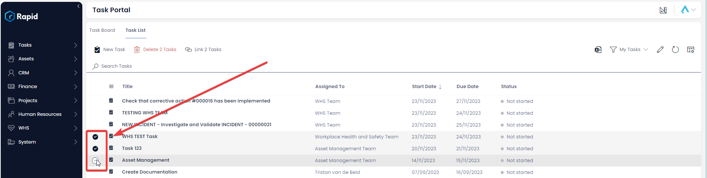

4. Click on the delete button

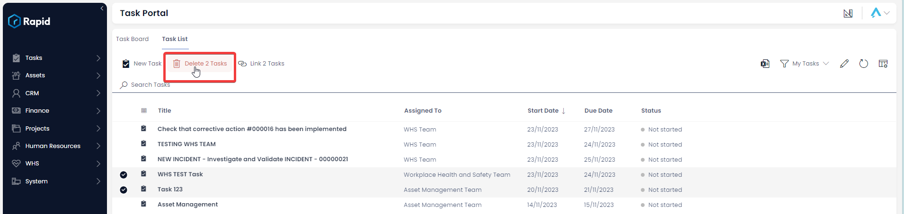

### Deleting a Task from the Task Page
1. On the sidebar select Tasks > Task Portal

2. Select the “Task List” tab

3. Click on the title of the task you wish to delete

4. Click on the delete button

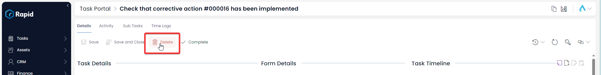
