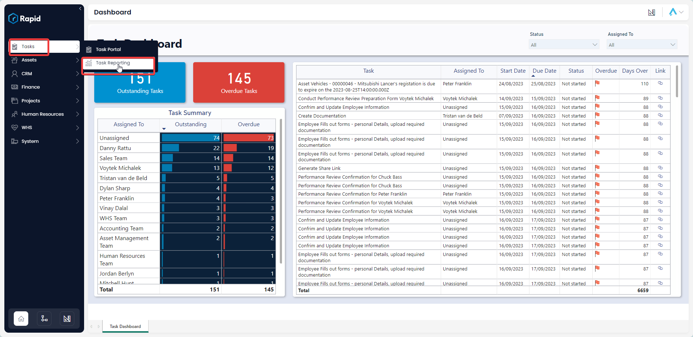
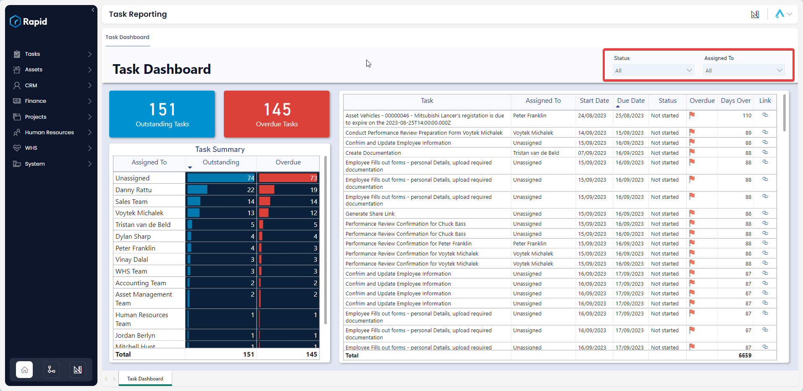
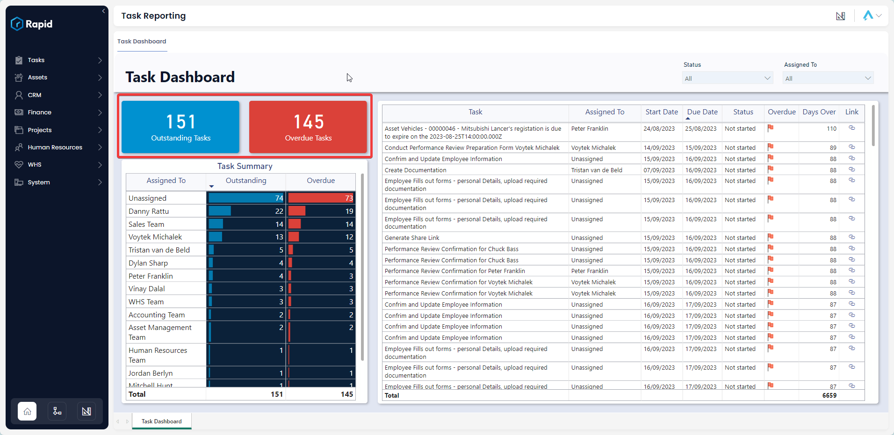
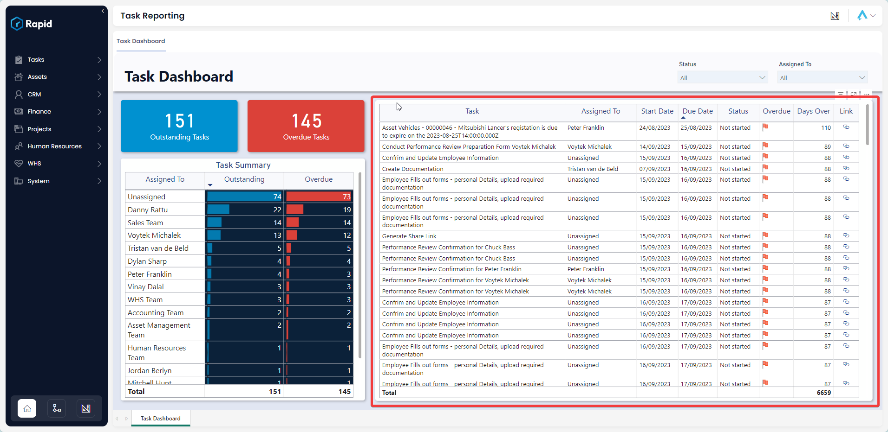

# Task Reporting

The Tasks module includes a pivotal report known as the Task Dashboard. This report grants stakeholders the capability to view tasks based on the assigned user or their status, offering comprehensive oversight at both organizational and employee levels regarding task statuses

## Task Dashboard
### Accessing the Task Dashboard
On the Explorer sidebar click on Tasks > Task Reporting

The Task Dashboard is divided into four sections: slicers, cards, and the Task Table.

### Slicers
Slicers provides the user with the ability to filter all of the visuals on the page by a specific attribute and can be found at the top of the page.

The Tasks Dashboard can be “sliced” based on no attributes, one attribute, or multiple attributes. The attributes available to “slice” by are Status and Assigned To.

For example, you could use the slicers to filter down the visuals to Tasks that are assigned to “John Doe” with a status of “Not Started”.

### Cards
The Cards section within the Invoices and Bills report offers concise reference statistics. The values of these cards will change based on the slicers or if selections are made on tables or charts.

The provided cards are as follows:
 
- Outstanding Tasks – Displays the number of tasks that are “Not Started” or “In Progress”
- Overdue Tasks – Displays the number of tasks that are “Not Started” or “In Progress” and have passed their “Due Date”

### Task Table
The Task Table displays the Task, Assigned To, Start Date , Due date, Status, Overdue (Red Flag = Overdue, Green Flag = On Track), Days Over, and link to the rapid item.

It is an interactive visual, allowing users to click any bill line and the report visuals will highlight or filter based on the selected bill.
