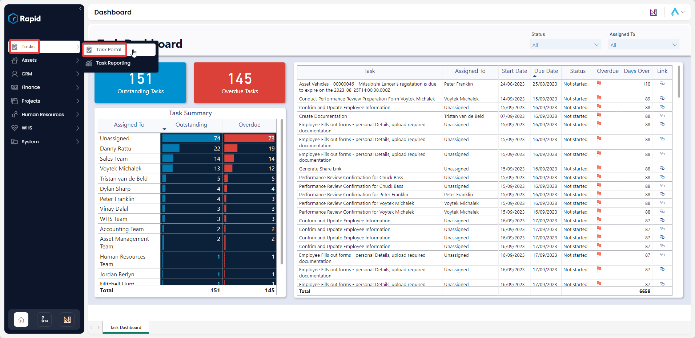
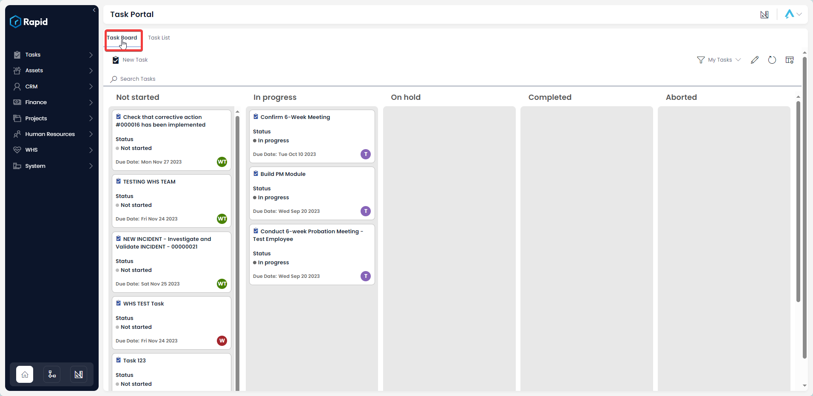
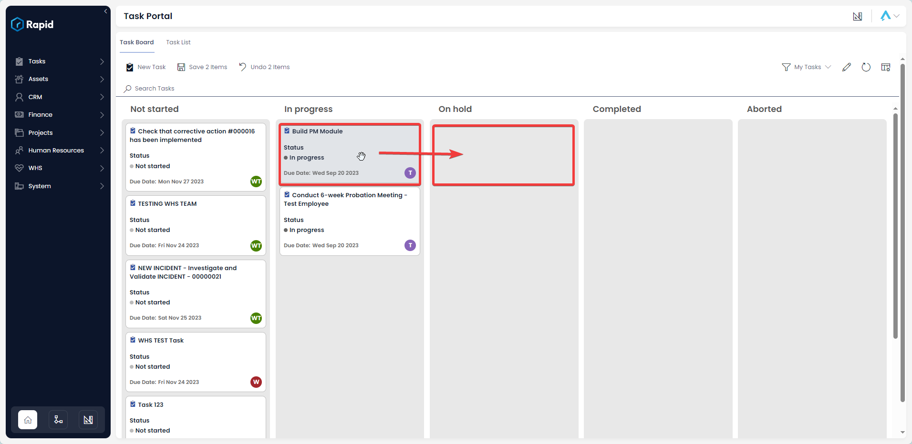
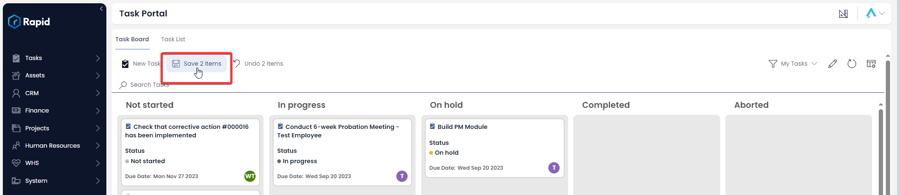
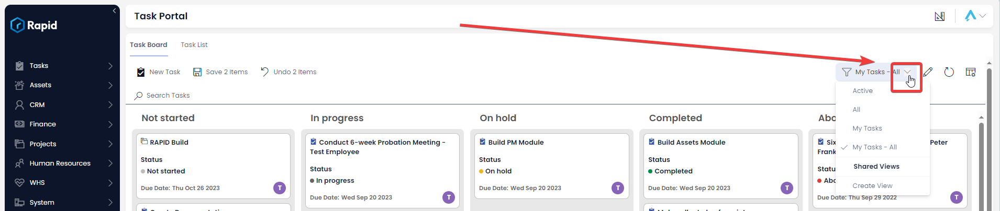
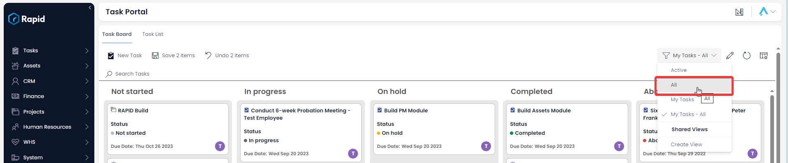
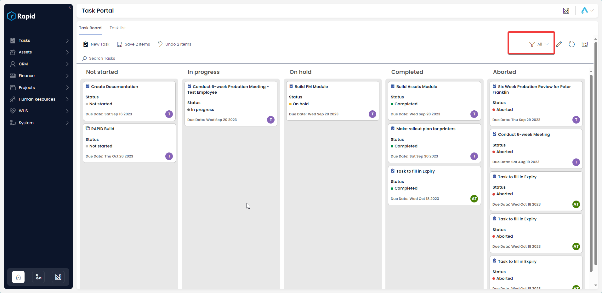
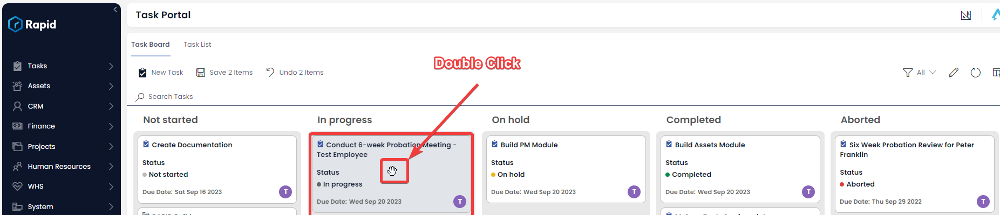
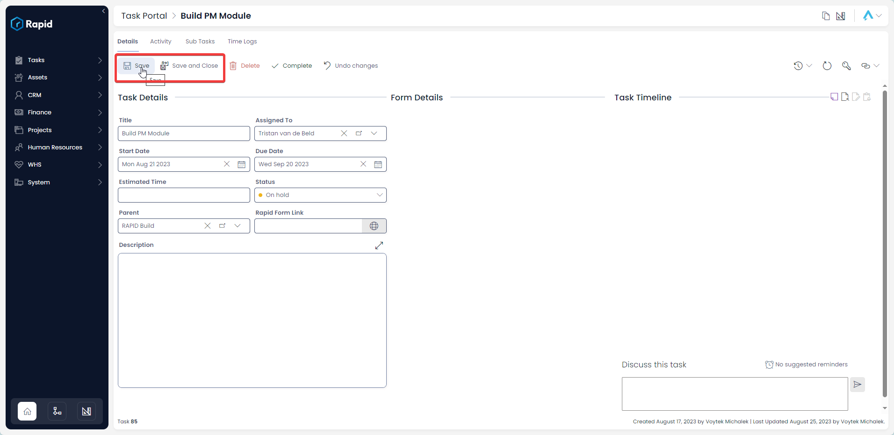

# Using the Tasks Board
## Overview
The task board is a great way to visualise the status of each of the project’s sub-tasks. It also provides the user the ability to easily move tasks between each of the status fields which will automatically update the status of that task. Moreover, the “view” can be changed to show tasks on the task board that are only your tasks or “All” tasks depending if you want visibility of your responsibilities or the tasks from the project as a whole.

## Accessing the Task Board
1. On the sidebar select Tasks > Task Portal

2. Select the "Taks Board" tab

## Moving Items between status categories

1. On the sidebar select Tasks > Task Portal

2. Select the “Task Board” tab

3. Click and drag the task between columns (this will update the status of the task from the column it started on to the column you “drop” it in)

4. Press Save

## Changing the View
The default view on the Task Board is the “My Tasks – All” view which shows all tasks assigned to the user or a group the user is a part of. This view can be changed to the “All” view to show all tasks in the project irrespective of who it is assigned to. To do this follow the steps below.

1. On the sidebar select Tasks > Task Portal

2. Select the “Task Board” tab

3. Click on the dropdown in the upper right corner above the task board which says “My Tasks – All”

4. From the list of view select the “All” view

5. The tasks board now shows all tasks in the project. The same steps can be used to revert the view back to “My Tasks – All”

## Editing a Task from the Task Board
1. On the sidebar select Tasks > Task Portal

2. Select the “Task Board” tab

3. Double-click on the Task Card OR Click on the Task Title you wish to edit

4. Edit any relevant fields on the item page as needed

5. Once you have finished editing, click on Save or Save and Close

