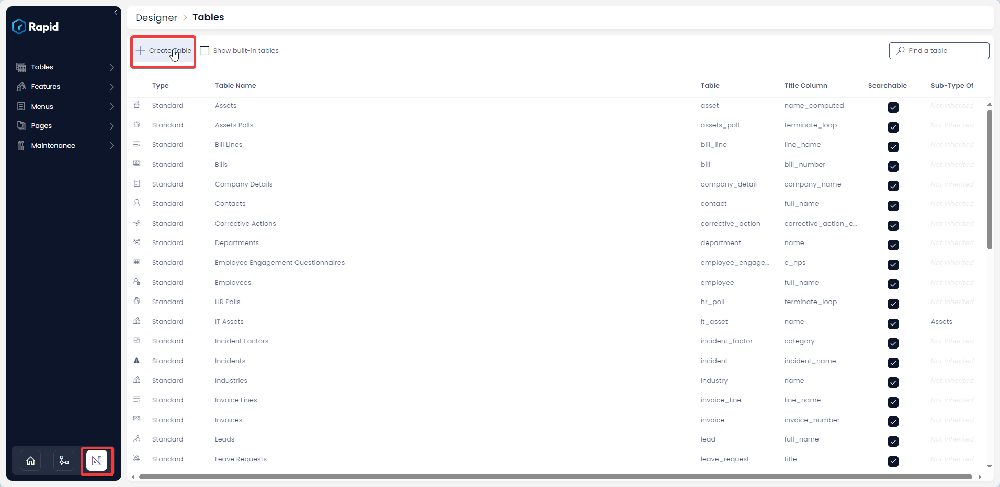
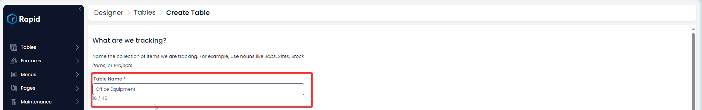
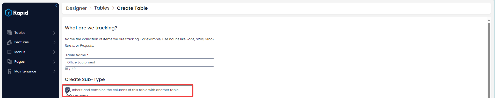
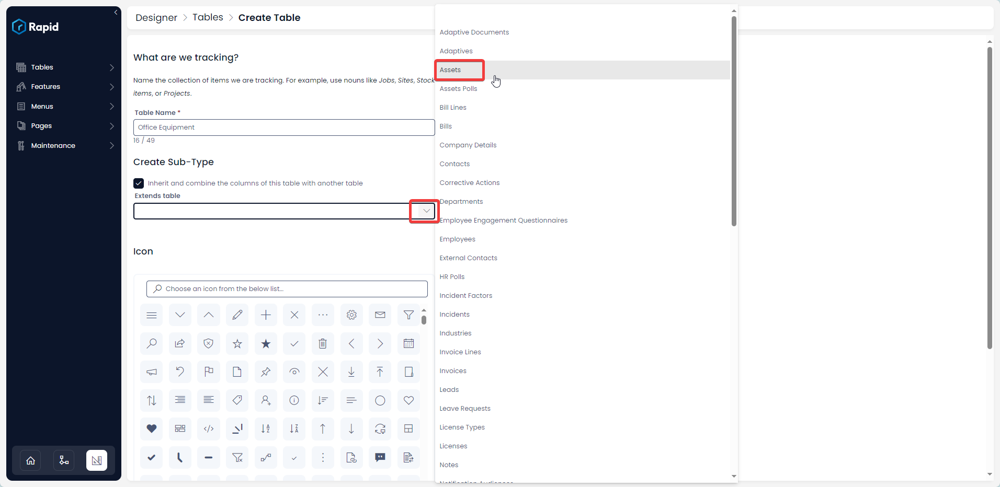
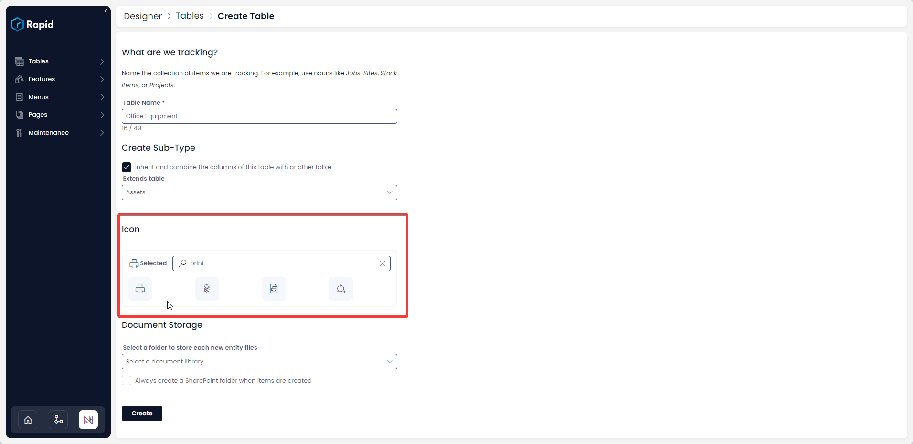
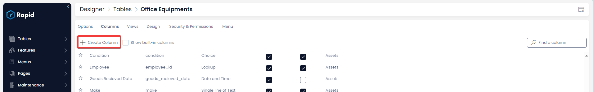
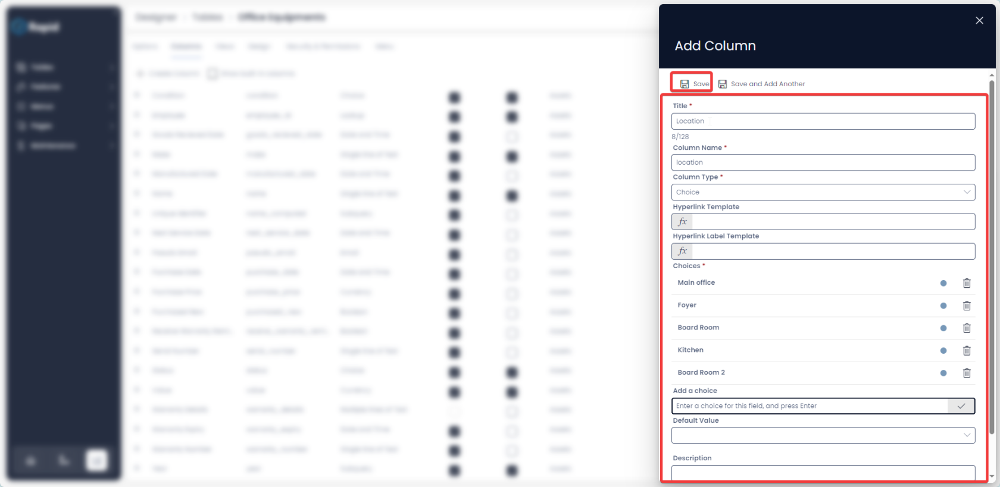

# Creating a New Asset Subtype

If you wish to create an additional asset subtype alongside "IT Assets" or "Vehicles," it is entirely possible. A subtype allows you to create a table with all the columns of the Assets table

### How to Create an Assets Subtype

1. Select Designer &gt; Create Table  

    

2. Enter a table name  

    

3. Check the **Create Sub-Type** checkbox  

    

4. Click the **Extends Table** dropdown and select **Assets**

    

5. Choose an appropriate icon  

    

6. OPTIONAL: If you want to store files against these items select a document storage. This will connect to your sharepoint
7. Press Create 

    

8. Add relevant columns to the table for fields you want to capture additional data. In this example we will add a choice field called location which will state which room the equipment is located. For more information on creating columns and column types see the following documentation on [Creating Columns](/docs/Rapid/4-Keyper%20Manual/2-Designer/1-Tables/5-Table%20Configuration%20Guides/how-to-add-columns-to-a-data-table/how-to-add-columns-to-a-data-table.md)

    1. Press create column 

        

    2. Enter the relevant details and press save  

        

    3. Add your columns to the form by clicking the Design Tab (For more information on how to add all the fields in a more structured way see the following documentation on [Pages](/docs/Rapid/4-Keyper%20Manual/2-Designer/2-Pages/1-all-about-pages-in-designer.md)

    4. Press Save
    
    5. Add your new table to the explorer sidebar (to see more details on how to do this see [Customizing the Sidebar](/docs/Rapid/4-Keyper%20Manual/2-Designer/3-Menus/1-Setting%20up%20your%20sidebar/1-Setting%20up%20your%20sidebar.md))