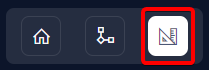

# Creating a New Asset Subtype

It is possible to create an additional asset subtype alongside "IT Assets" or "Vehicles". A subtype allows you to create a table with all the columns of the Assets table.

## How to Create an Assets Subtype

1. Select the **Designer** button at the bottom of the [Sidebar](</docs/Rapid/3-User Manual/glossary/glossary.md#sidebar>).

2. Press the **+ Create Table** button in the [Command Bar](</docs/Rapid/3-User Manual/glossary/glossary.md#command-bar>)

3. Enter a table name

4. Check the **Create Sub-Type** checkbox
5. Click the **Extends Table** dropdown and select **Assets** (or type your selection into the field instead)

6. Choose an appropriate icon

7. If you want to store files against these items, then you should select document storage location. This will connect to your site's sharepoint.

8. Press **Create**

![A screenshot depicting the "Document Storage" and "Create" buttons at the bottom of the create table page. In this example, the user has not selected any document storage, so the field simply reads: "Select a document library". The "Always create a SharePoint folder" checkbox has also been left unchecked. At the bottom of the screen is a navy button with white text that reads: "Create". The screenshot is annotated with a red box to highlight that the user must press this button in order to create the table.](<Create Table Create Button.png>)

9. Add any relevant columns to the table for the additional data you wish to capture. In this example we will add a choice field called *Location*. This data represents where the equipment is located. For more information on creating columns and column types see the following documentation on [Creating Columns](/docs/Rapid/4-Keyper%20Manual/2-Designer/1-Tables/5-Table%20Configuration%20Guides/how-to-add-columns-to-a-data-table/how-to-add-columns-to-a-data-table.md).

:::note[Adding Columns]
This process is briefly explained at the end of this article.
:::

10. Press **Save**
    
11. Add your new table to the **Explorer Sidebar** (to see more details on how to do this see [Customising the Sidebar](/docs/Rapid/4-Keyper%20Manual/2-Designer/3-Menus/1-Setting%20up%20your%20sidebar/1-Setting%20up%20your%20sidebar.md))

## Adding New Columns to a Subtype

1. While viewing a table in [Designer](</docs/Rapid/3-User Manual/3-Designer/1-what-is-designer/1-what-is-designer.md>), press the **Columns** tab in the **Tab Strip**

1. Press **+ Create Column**

2. Enter the relevant details

3. Press **Save** or **Save and Add Another**

![A screenshot depicting a user who is creating a column titled "Location". The screenshot depicts the "Add Column" create screen that appears after the user clicks the "Create Column" button in designer. Each of the following fields has data entered: "Title: Location", "Column Name: location", "Column Type: Choice". In the "Choices" section, the following choices have been added: "Office", "Warehouse", and "Storage Facility". The screenshot is annotated with a red box at the top of the "Add Column" create screen, to highlight the importance and location of the "Save" and "Save and Add Another" buttons.](<Create Column Screen.png>)