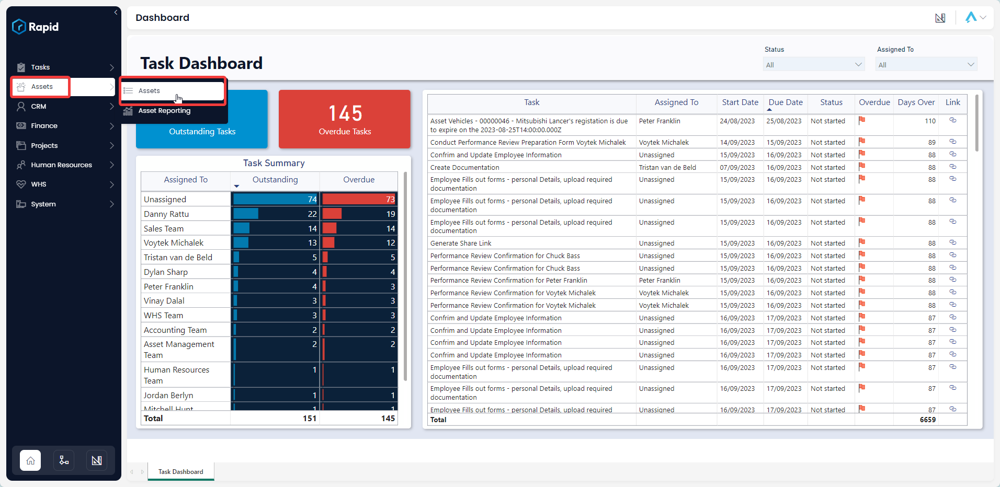
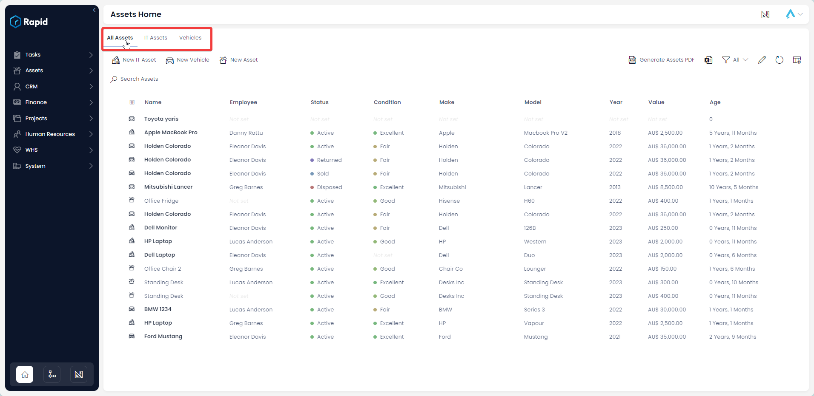
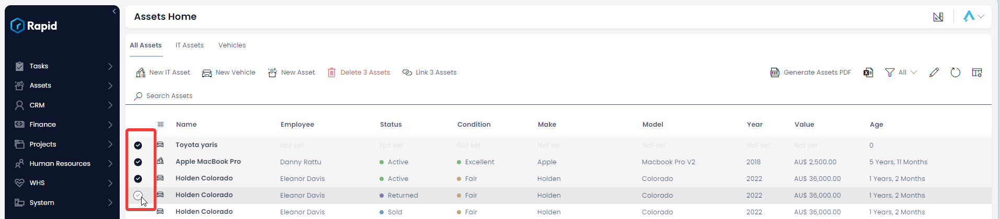
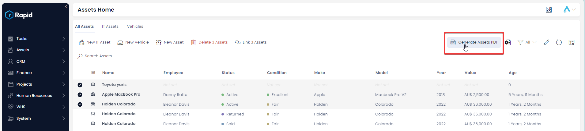
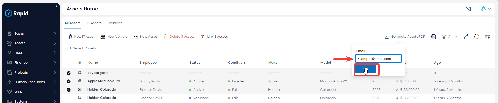

# Generating an Assets, IT Assets, or Vehicles List PDF Report

On the *Base Assets* list there is a feature that allows you to generate a PDF list of selected assets. This PDF list serves as a printer-friendly or email-friendly version of your asset list, which can be provided to a broker or used for stocktaking.

### How to generate a PDF list of selected Assets

1. Navigate to the Assets page by clicking on **Assets** &gt; **Assets** in the explorer side bar.  

    

2. Select the relevant tab of what you want to generate a report of (Assets, IT Assets, or Vehicles)  

    

3. Select the Assets, IT assets, or Vehicles you wish to be included in the report. 

    1. This can be done by pressing the “Tick” next to each asset OR

    2. This can be done by clicking and dragging to select multiple. 

        

4. In the top right of the page, press the **Generate Assets PDF** command bar button  

    

5. Enter the email address you want to send the PDF to, and click **Submit**.  

    
    
6. After approx. 10 – 30 seconds you will receive an email with a link to the generated Assets, IT Assets, or Vehicles PDF.