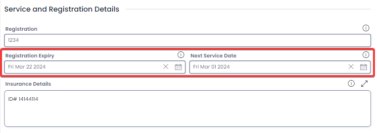
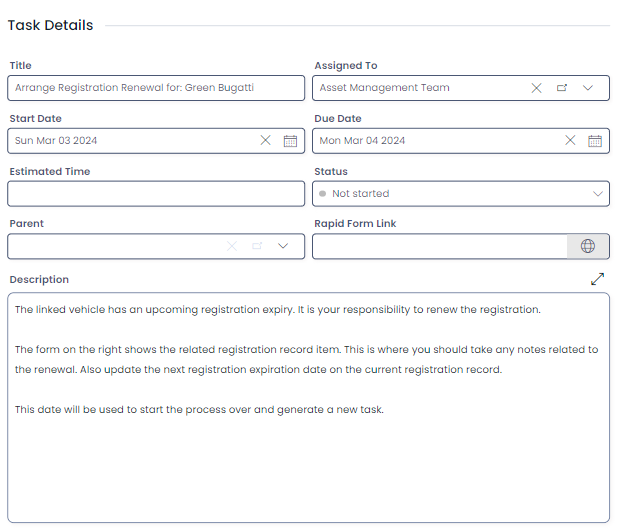

# Registration Expiry and Service Reminders

Built into the Asset’s module is a feature that automatically assigns user tasks for an upcoming service date, or registration expiry. This ensures that assets are properly maintained, and their registrations remain up-to-date.

To receive reminders for a service date or registration expiry, simply ensure that the "Next Service Date" or "Registration Expiry" fields on the asset are filled with a future date.

 

The reminder task will be generated one month prior to the date selected in the fields labelled "Next Service Date" or "Registration Expiry". The reminder task will be assigned to the "Asset Management Group". Any user who is a member of that group will receive the task: e.g. "Renew Registration for Vehicle 000001".

 