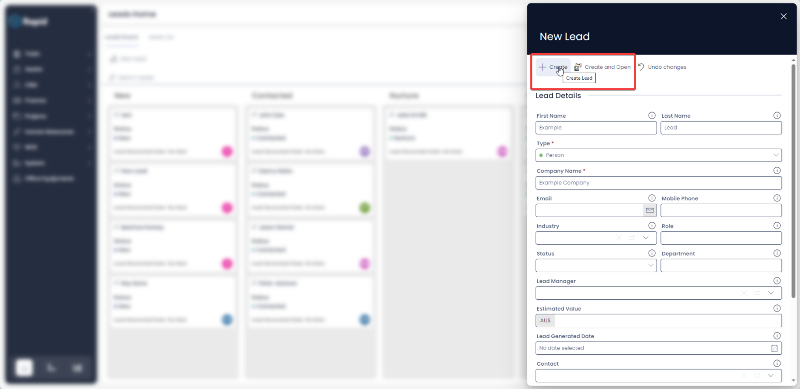
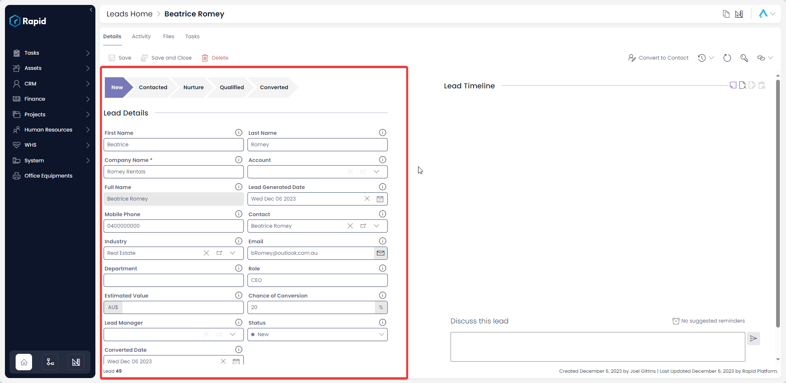
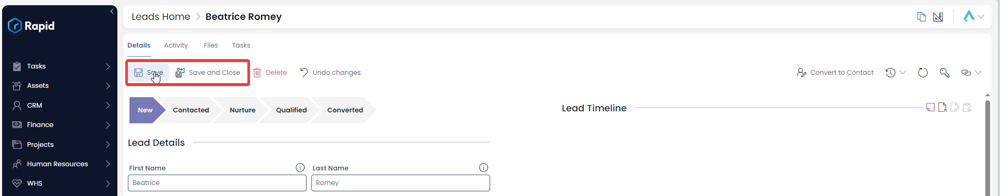
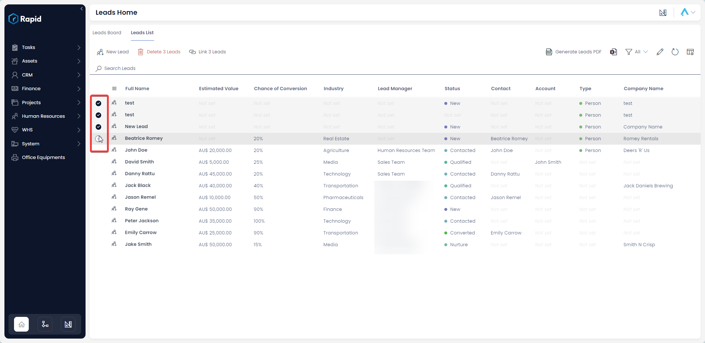
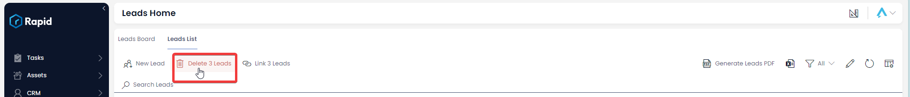
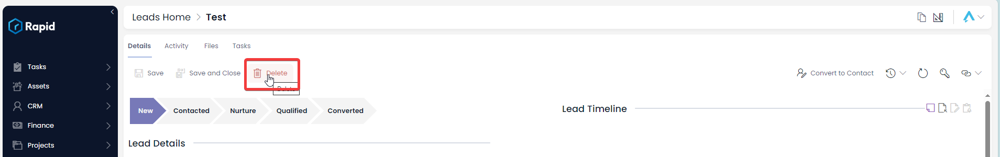

# Creating, Editing, and Deleting a Lead

### Overview

In Customer Relationship Management (CRM), a "lead" refers to a person or entity that has shown interest in a company's products or services but has not yet progressed to become a customer.

### How to create a New Lead

1. In Explorer select CRM &gt; Leads  

    

2. Select either the **Board** or **List** tabs, then click **New Lead**  

    

3. Enter all relevant details  
    
    1. For all reporting features to work the following fields are required: **First Name**, **Lead Manager**, **Estimated Value**, **Probability of Success** and **Estimated Close Date**.

        

4. Click on **Create** or **Create and Open**. 

    

### How to edit a Lead

1. In Explorer select CRM &gt; Leads  

    

2. Click on the **List** tab  

    

3. Open the **Lead** you wish to edit. (Locate the **Lead** either by scrolling through the list or using the search bar). 

    

4. Edit any relevant fields on the **Lead Details** page as needed.  

    

5. Once you have finished editing, click on **Save** or **Save and Close**.  

    

### Deleting Leads

It is not recommended to delete a lead if it is lost; instead, change its status to **Lost**. This way, you can maintain a list of all your leads and determine a conversion rate.

However, if you need to delete a lead due to incorrect data entry or a duplicate entry, you can do so in two ways: from the list or from the item page. Deleting from the list allows you to delete multiple leads at once.

#### How to delete multiple Leads at once

1. In Explorer select CRM &gt; Leads  

    

2. Click on the **List** tab  

    

3. Select the Leads you want to delete  

    

4. Click on the **Delete X Leads** button. 

    

#### How to delete a single Lead from the Leads page

1. In Explorer select CRM &gt; Leads  

    

2. Click on the **List** tab  

    

3. Open the Lead you wish to delete (Find the lead either by scrolling through the list or using the search bar)  

    

4. Press **Delete** 

    