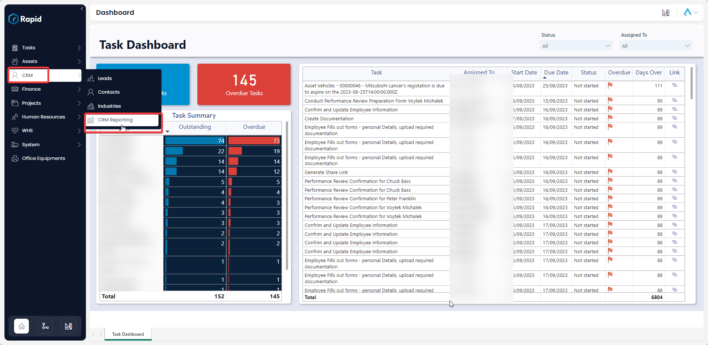
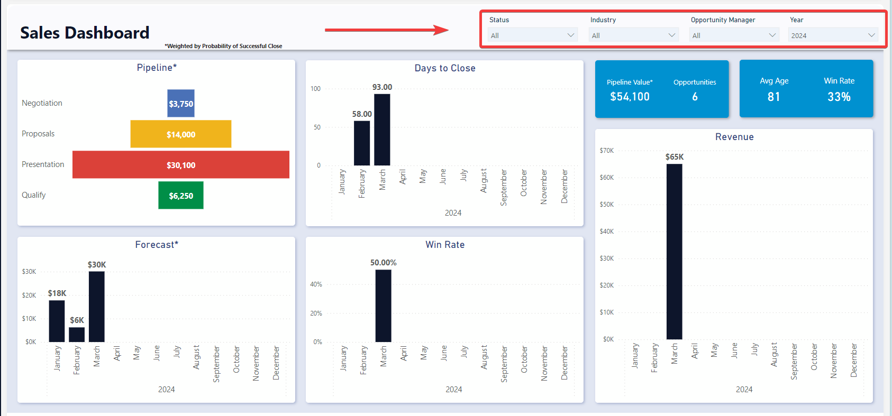
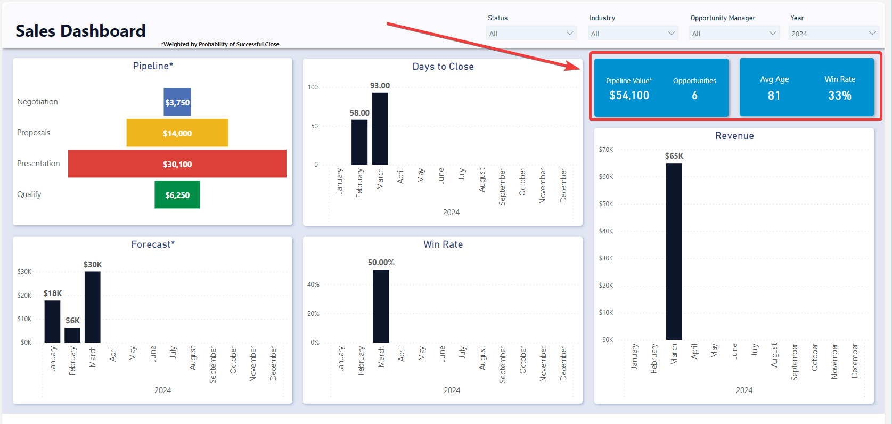
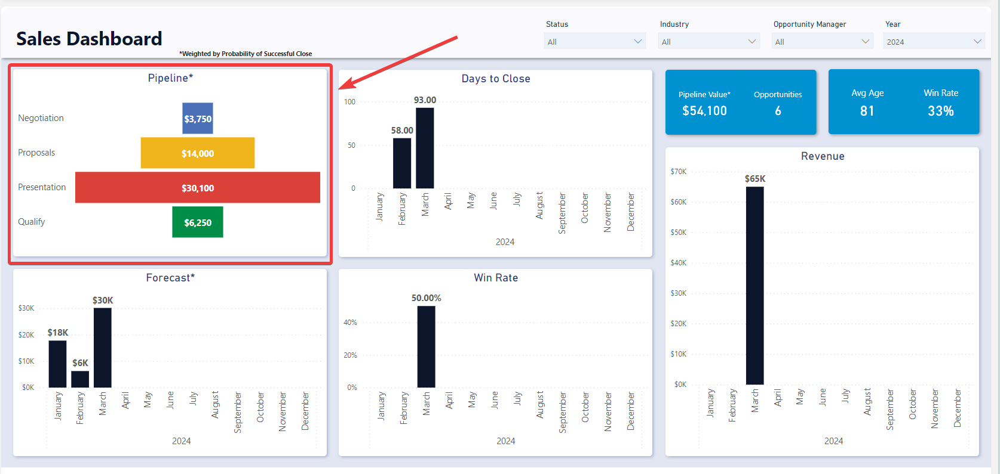
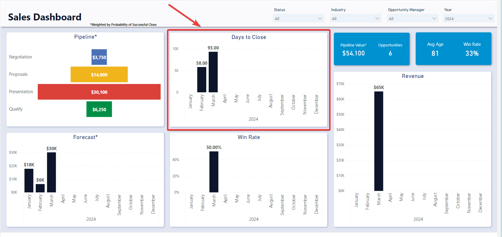
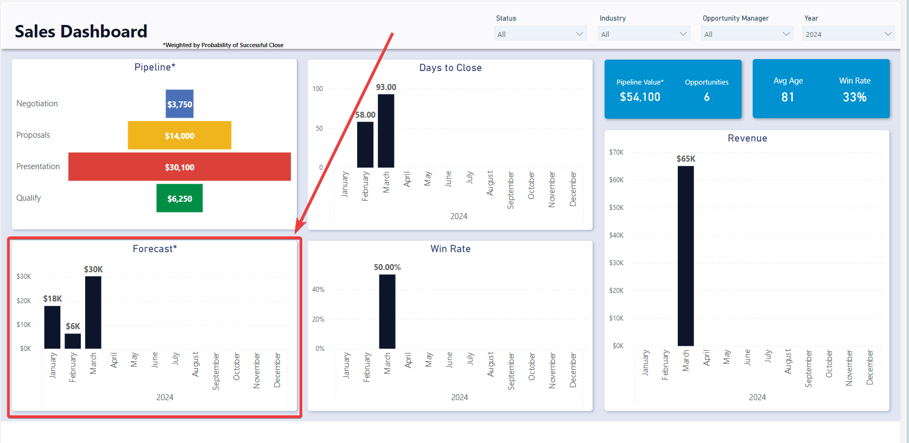
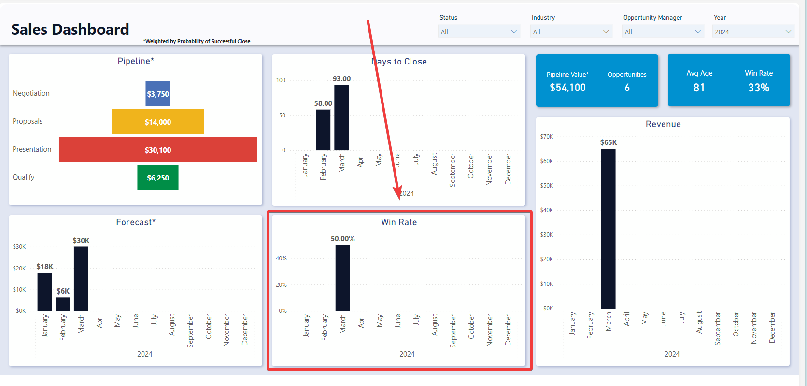
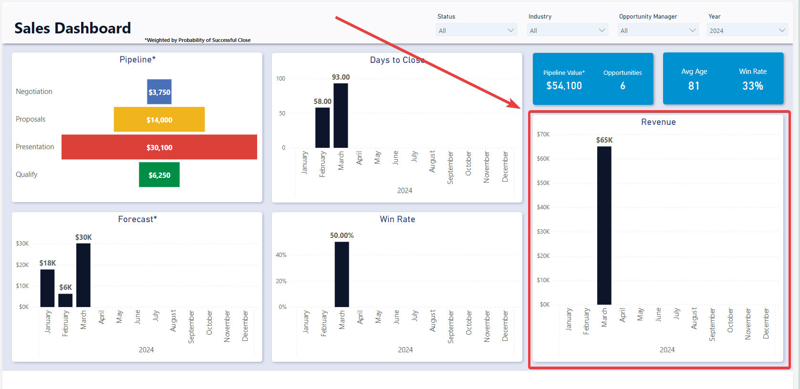

# Sales Dashboard

### Overview

The **Sales Dashboard** provides users with a snapshot of the current state of their sales pipeline. It provides information on the Win Rate, Days to Close, Forecast, Pipeline Value, and Revenue.

### How to access the Sales Dashboard

1. Navigate to CRM > CRM Reporting. 

    

### Using the Sales Dashboard

The Sales Dashboard offers users an insightful overview of their sales and opportunities, organized into three distinct sections: Slicers, Cards, and Graphs.

#### Slicers

Slicers provides the user with the ability to filter all of the visuals on the page by a specific attribute and can be found at the top of the page.

The Sales Dashboard can be “sliced” based on no attributes, one attribute, or multiple attributes. The attributes available to “slice” by are Status, Industry, Opportunity Manager, and Date. Each of which can be edited on the Opportunity or related Account item.

For example, you could use the slicers to filter down the visuals to opportunities that have a status of **Presentation** that are in the **Agriculture** industry and are from **this** **year**.

#### Cards

The Cards section within the Sales Dashboard offers concise reference statistics. The values of these cards will change based on the slicers or if selections are made on graphs.

The provided cards are as follows:

- Pipeline Value – Indicates the sum of all estimated opportunity values weighted by their probability of success.
- Opportunities - The number of open opportunities, meaning they are not Closed Won or Closed Lost
- Avg Age - The average age of opportunities that are Closed Won or Closed Lost. In other words, the average time to close.
- Win Rate - The proportion of Closed Won opportunities as a percentage of all closed opportunities.

#### Graphs

The sales dashboard is comprised of 5 different graphs: Pipeline, Days to Close, Forecast, Win Rate, and Revenue. Each of which are described below. All the visuals below can be clicked on to filter the rest of the report by that specific element in the visual.

##### Pipeline

The Pipeline visual shows the weighted value of each of the pipeline stages. This gives an indication of at what stage the majority of the value is sitting. It can be found in the top left of the Sales Dashboard.

##### Days to Close

The Days to Close visual shows the average Number of days from Opportunity creation to Opportunity closed. This is irrespective of whether it was closed won or closed lost.

##### Forecast

The Forecast visual shows the weighted estimated values of future opportunities by estimated closed date. This provides an indication of the potential revenue and cashflow that could occur if the opportunities are closed at the estimated chance of success rate.

##### Win Rate

The Win Rate visual shows the proportion of Closed Won opportunities of all Closed opportunities through time. This can be used to assess the organizational performance or individual performance of Opportunity Managers.

##### Revenue

The revenue graph shows the total value of Closed Won opportunities through time.

