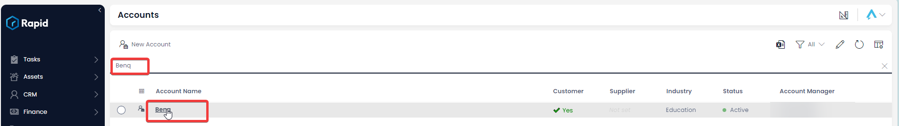

# Creating, Updating, and Deleting an Account

### Overview

Accounts represent the various businesses that your organisation interacts with, whether a supplier or customer.

### How to Create an Account

Accounts can be created in two ways. The first is through the Lead conversion button, where it will automatically be created with the relevant lead details (More information on this method can be found here: [Converting a Lead](../Leads/converting-a-lead/converting-a-lead.md)). The second way, like many other tables is through the table list page and those steps can be found below.

1. In Explorer select CRM &gt; Accounts  
    
2. Select **New Account** 
    
3. Enter all of the relevant details  
    
4. Press **Create** or ****Create and Open**** 

### How to Edit an Account

1. In Explorer select CRM &gt; Accounts  
    
2. Open the **Account** you wish to edit. (Locate the **Account** either by scrolling through the list or using the search bar).  
    
3. Edit any relevant fields on the **Account** page as needed  
    
4. Once you have finished editing, click on **Save** or **Save and Close**.  
    

### Deleting Accounts

It is not recommended to delete an **Account** instead change its status to **Inactive**. This way, you can maintain a list of all your accounts, and reinstate them as **Active** if they come back as a customer or supplier.

However, if you need to delete an **Account** due to incorrect data entry or a duplicate entry, you can do so in two ways: from the list or from the item page. Deleting from the list allows you to delete multiple **Accounts** at once.

#### How to delete multiple accounts at once

1. In Explorer select CRM &gt; Accounts  
    
2. Select the Accounts you want to delete  
    *Accounts selected image
3. Click on the **Delete X Accounts** button  
    

#### How to delete a single Account from the Accounts page

1. In Explorer select CRM &gt; Accounts  
    
2. Open the **Account** you wish to delete. (Locate the **Account** either by scrolling through the list or using the search bar).  
    *Open an account image
3. Press **Delete** 