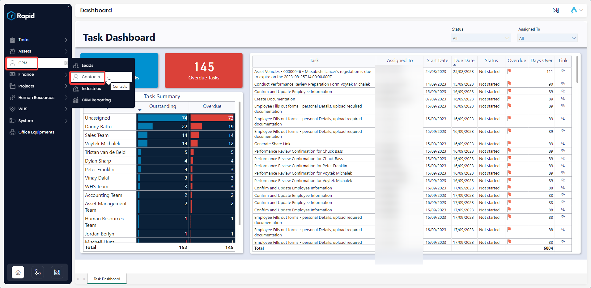
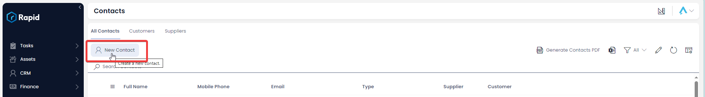
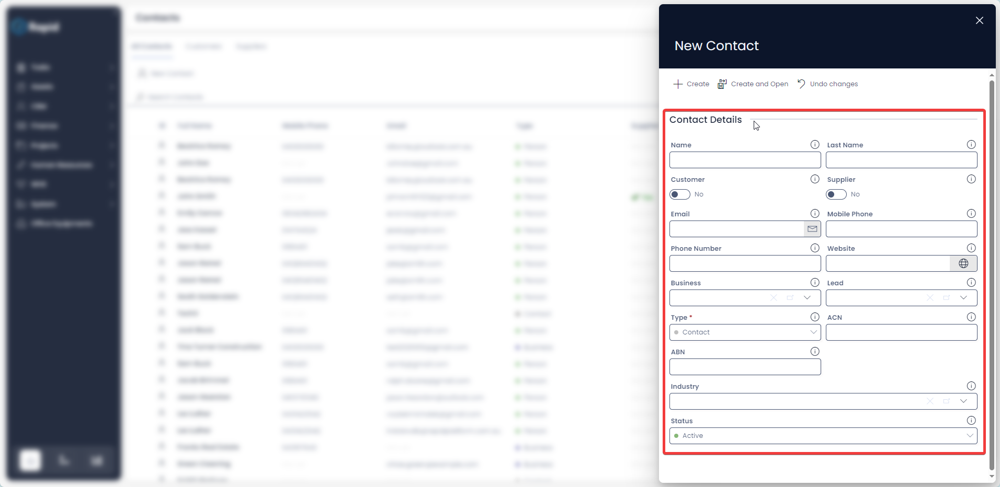
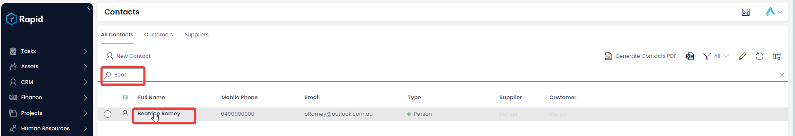
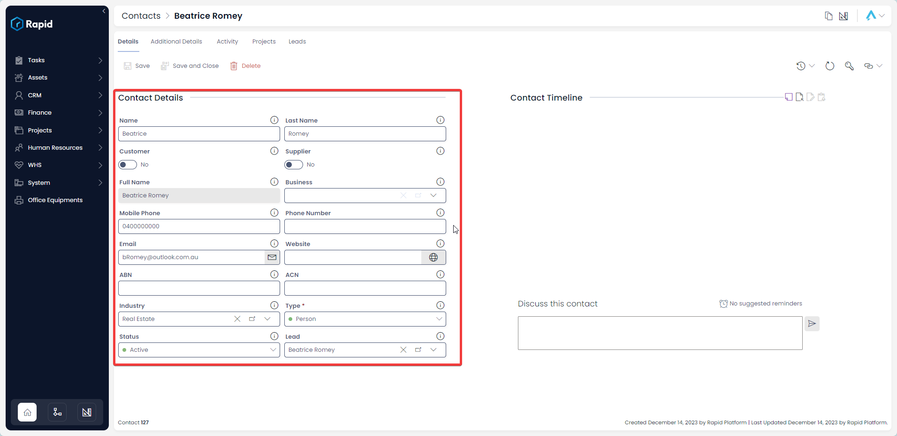
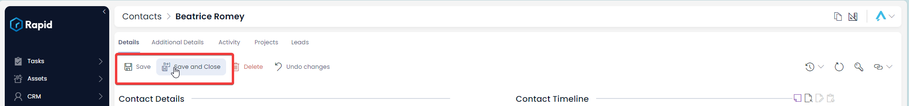
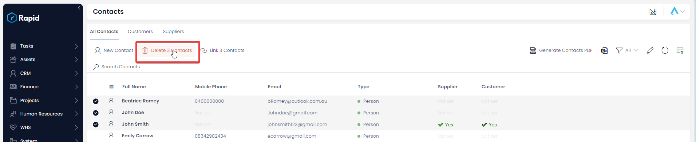
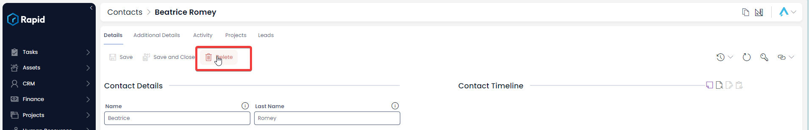

# Creating, Editing, and Deleting a Contact

### Overview

Contacts can be created without an associated lead. This is done in the same way as any list item is created. See the general “Creating, Updating, and Deleting” items documentation.

### How to create a new contact item

1. Navigate to the Contacts table. CRM &gt; Contacts .  
    
2. Click on **New Contact**.  
    
3. Enter all relevant details 
    1. For all features to work the following fields are required: Type, Category, Name (if type Business), or Name and Last Name (if type Person)  
        
4. Click on **Create** or ****Create and Open**** 

### How to edit a contact

1. Navigate to the Contacts table. CRM &gt; Contacts .  
    
2. Open the contact you wish to edit. (Find the contact by either scrolling through the list or using the search bar)  
    
3. Edit the relevant details as needed  
    
4. Press **Save** or ****Save and Close**** 

### Deleting Contacts

It is not recommended to delete a contact if no longer active; instead, change its status to **Archived**" This way, you can maintain a list of all your Contacts, and always reinstate a contact to **Active** if needed.

However, if you need to delete a contact due to incorrect data entry or a duplicate entry, you can do so in two ways: from the list or from the item page. Deleting from the list allows you to delete multiple assets at once.

#### How to delete multiple contacts from the contacts list

1. Navigate to the Contacts table. CRM &gt; Contacts .  
    
2. Select the contacts you wish to delete.  
    
3. Click on the **Delete X Contacts** button.  
    

#### How to delete a single contact form the contact item page

1. Navigate to the Contacts table. CRM &gt; Contacts .  
    
2. Open the contact you wish to edit. (Find the contact by either scrolling through the list or using the search bar)  
    
3. Press the **Delete** button  
    