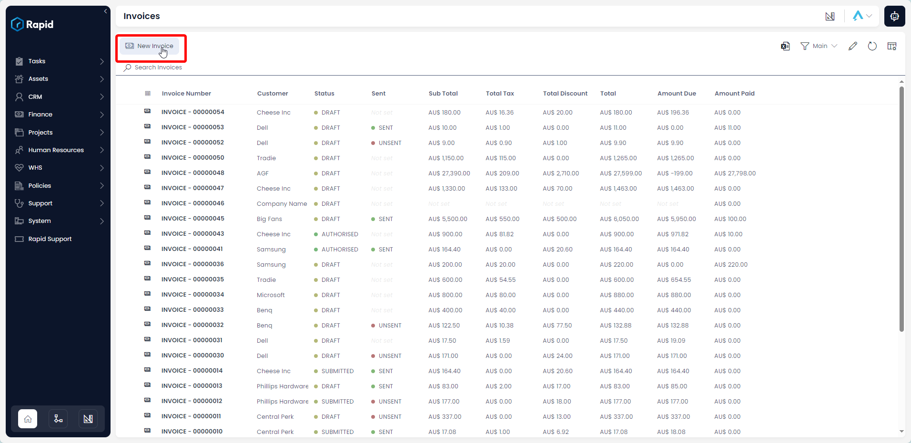
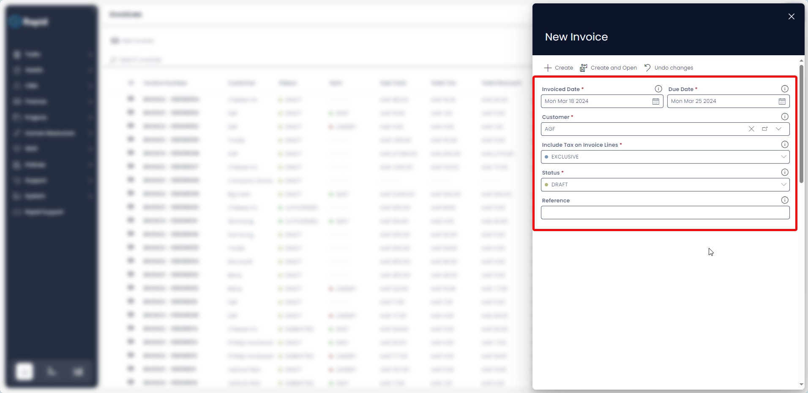
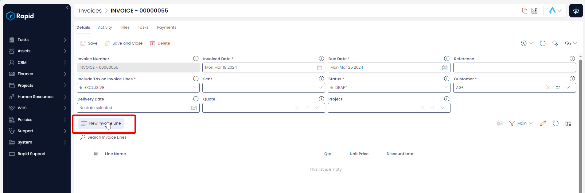
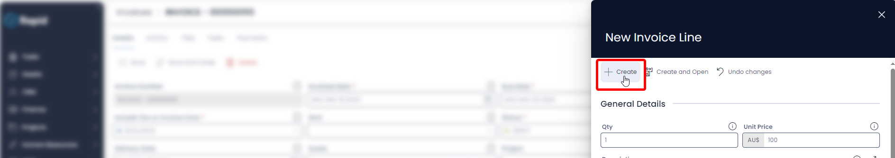
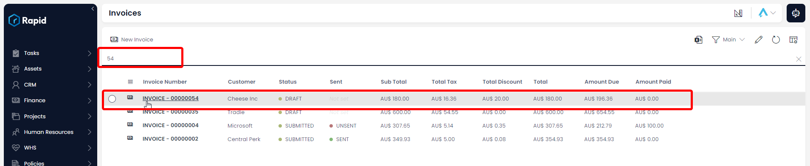
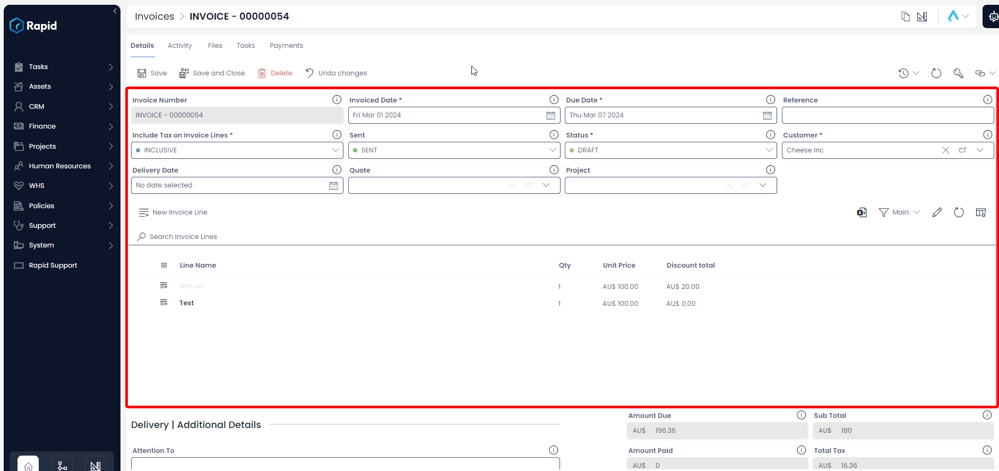
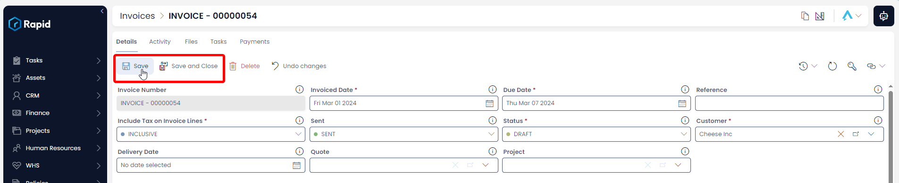

# Creating, Editing, and Deleting Invoices

The Accounts module can add payments against an invoice or bill. This allows you track how much is still owed against each of those items. To create a payment record against an invoice follow the steps below.

## Creating an Invoice

1. Navigate to the **Finance** &gt; **Invoices**  

2. Locate the invoice you wish to add a payment against either by scrolling through the list or using the search bar.  

3. Enter all relevant details  

:::note[Require Fields]    
The following fields are required: Invoiced Date, Due Date, Customer, and Include Tax on Invoice Lines  
:::

4. Click on **+ Create** or **Create and Open**.  

5. Halfway down the page Click **New Invoice Line** (This is where you add all the individual line items) 

6. Enter all relevant details 
    
:::note[Invoice Lines]
- The following fields are required: *Qty* and *Unit* Price
- By default, there is a 10% Tax rate on invoice items to account for GST, this can be changed to no tax (NA), a fixed tax amount (Fixed), or a fixed tax amount per unit (Fixed per Qty) by adjusting the choice in the Tax Category Field.
- A discount can be applied on each line item as a fixed amount (Discount Amount) or as a percentage (Discount Percentage)  
:::

7. Click **Create**  

8. Follow steps 5 – 7 for each additional invoice line you wish to create.

## Editing an Invoice

1. Navigate to the **Finance** &gt; **Invoices**  

2. Open the invoice you wish to edit either by scrolling through the list or using the search bar.  

3. Edit any relevant fields on the invoice page as needed. 

:::note[Editing Invoice Lines]
To edit an **Invoice Line**, click on its title, edit the any relevant fields, and then press **Save and Close**
:::

4. Once you have finished editing press **Save** or **Save and Close**

## Deleting an Invoice

It is not recommended to delete an Invoice instead, change its status to "VOIDED." This way you can maintain a record of all Invoices.

However, if you need to delete an Invoice due to incorrect data entry or a duplicate entry, you can do so as described below.

1. Navigate to the **Finance** &gt; **Invoices**  

2. Select the **Invoices** you wish to delete  

3. Press **Delete X Invoices**

