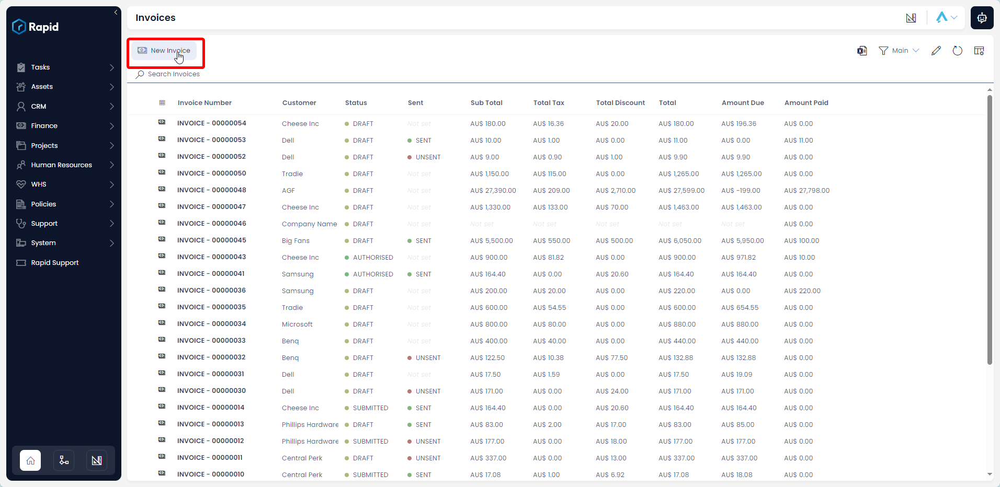
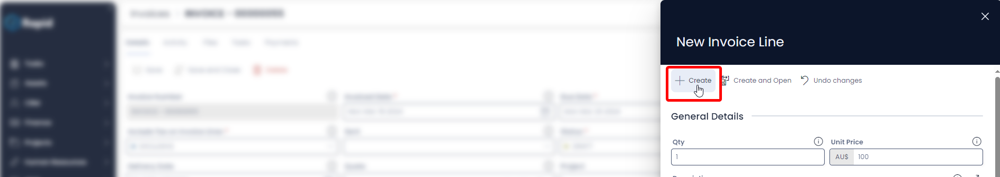
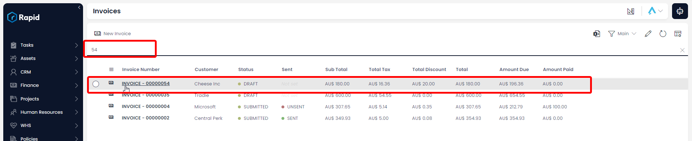

# Creating, Editing, and Deleting a Payment Record Against an Invoice

The Accounts module can add payments against an invoice or bill. This allows you track how much is still owed against each of those items. To create a payment record against an invoice follow the steps below.

## Create a Payment Item Against an Invoice

1. Navigate to the **Finance** > **Invoices**  

2. Locate the invoice you wish to add a payment against either by scrolling through the list or using the search bar.  

3. Enter all relevant details  

:::note[Require Fields]    
The following fields are required: Invoiced Date, Due Date, Customer, and Include Tax on Invoice Lines  
:::

4. Click on **+ Create** or **Create and Open**.  

5. Halfway down the page Click **New Invoice Line** (This is where you add all the individual line items) 

6. Enter all relevant details 
    
:::note[Invoice Lines]
- The following fields are required: *Qty* and *Unit* Price
- By default, there is a 10% Tax rate on invoice items to account for GST, this can be changed to no tax (NA), a fixed tax amount (Fixed), or a fixed tax amount per unit (Fixed per Qty) by adjusting the choice in the Tax Category Field.
- A discount can be applied on each line item as a fixed amount (Discount Amount) or as a percentage (Discount Percentage)  
:::

7. Click **Create**  

8. Follow steps 5 – 7 for each additional invoice line you wish to create.

## Editing an Invoice

1. Navigate to the **Finance** > **Invoices**  

2. Open the invoice you wish to edit either by scrolling through the list or using the search bar.  

3. Edit any relevant fields on the invoice page as needed. 

:::note[Editing Invoice Lines]
To edit an **Invoice Line**, click on its title, edit the any relevant fields, and then press **Save and Close**
:::

4. Once you have finished editing press **Save** or **Save and Close**

## Deleting an Invoice

It is not recommended to delete an Invoice instead, change its status to "VOIDED." This way you can maintain a record of all Invoices.

However, if you need to delete an Invoice due to incorrect data entry or a duplicate entry, you can do so as described below.

1. Navigate to the **Finance** > **Invoices**  

2. Select the invoices you wish to delete  

3. Press **Delete X Invoices**

