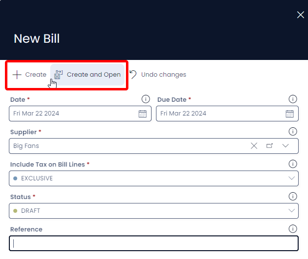
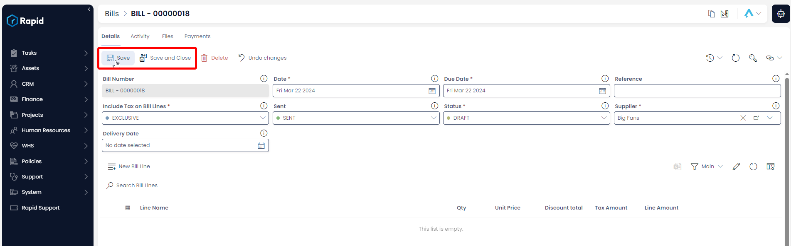

# Creating, Editing, and Deleting Bills

The **Finance** module includes the ability to create and manage bills. Along with the ability to apply payments to the bills.

## Creating a Quote

1. Navigate to the **Finance** > **Bills**  

2. Click on **New Bill**.  

3. Enter all relevant details  
    
:::note[Required Fields]
The following fields are required: *Date*, *Customer*, *Include Tax on Bill Lines*, and *Status*  
:::

4. Click on **+ Create** or **Create and Open**.  

5. Halfway down the page click **New Bill Line**. *(This is where you add all the individual line items).*

6. Enter all relevant details 

:::note[Bill Lines]
- The following fields are required: *Qty* and *Unit Price*
- By default, there is a 10% Tax rate on Bill lines to account for GST, this can be changed to no tax (*NA*), a fixed tax amount (*Fixed*), or a fixed tax amount per unit (*Fixed per Qty*) by adjusting the choice in the Tax Category Field.
- A discount can be applied on each line item as a fixed amount (*Discount Amount*) or as a percentage (*Discount Percentage*)
:::

7. Click **+ Create** or **Create and Open**  

8. Follow steps 5 – 7 for each additional bill line you wish to create.

### Editing a Bill

1. Navigate to the **Finance** > **Bills**  

2. Open the bill you wish to edit either by scrolling through the list or using the search bar.  

3. Edit any relevant fields on the bill page as needed. 

:::note[Editing Bill Lines]
If you wish to edit the bill lines simply find the bill line you wish to edit. Click on the title, edit the any relevant fields, and then press **Save and Close**.
:::

4. Once you have finished editing press **Save** or **Save and Close**

## Deleting a Bill

It is not recommended to delete a bill instead, change its status to **VOIDED**. This way you can maintain a record of all Bills.

However, if you need to delete a Bill due to incorrect data entry or a duplicate entry, you can do so as described below.

1. Navigate to the **Finance** > **Bills**  

2. Select the bills you wish to delete by pressing their selection circles, or clicking and dragging across multiple rows

3. Press **Delete X Bills**

