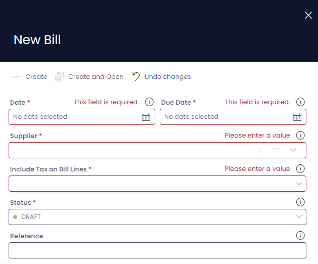
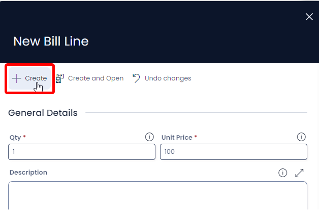
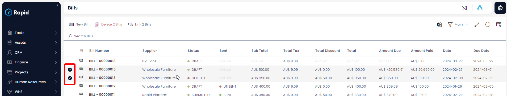
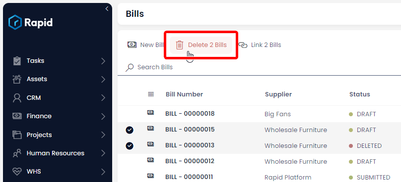

# Creating, Editing, and Deleting Bills

### Overview

The Accounts module includes the ability to create and manage bills. Along with the ability to apply payments to the bills.

### How to create a Quote

1. Navigate to the **Finance** > **Bills**  

    

2. Click on **New Bill**.  

    

3. Enter all relevant details  
    
    1. The following fields are required: Date, Customer, Include Tax on Bill Lines, and Status  

        

4. Click on **Create and Open**.  

    

5. Halfway down the page Click **New Bill Line** (This is where you add all the individual line items) 

    

6. Enter all relevant details 
    1. The following fields are required: Qty and Unit Price
    2. By default, there is a 10% Tax rate on Bill lines to account for GST, this can be changed to no tax (NA), a fixed tax amount (Fixed), or a fixed tax amount per unit (Fixed per Qty) by adjusting the choice in the Tax Category Field.
    3. A discount can be applied on each line item as a fixed amount (Discount Amount) or as a percentage (Discount Percentage)  

        

7. Click **Create**  

    

8. Follow steps 5 – 7 for each additional bill line you wish to create.

### How to Edit a Bill

1. Navigate to the **Finance** > **Bills**  

    

2. Open the bill you wish to edit either by scrolling through the list or using the search bar.  

    

3. Edit any relevant fields on the bill page as needed. 
    1. If you wish to edit the bill lines simply find the bill line you wish to edit, click on the title, edit the any relevant fields, press save and close 

        

4. Once you have finished editing press **Save** or **Save and Close**

     

### How to Delete a Bill

It is not recommended to delete a bill instead, change its status to **VOIDED**. This way you can maintain a record of all Bills.

However, if you need to delete a Bill due to incorrect data entry or a duplicate entry, you can do so as described below.

1. Navigate to the **Finance** > **Bills**  

    

2. Select the bills you wish to delete  

    

3. Press **Delete X Bills**

    