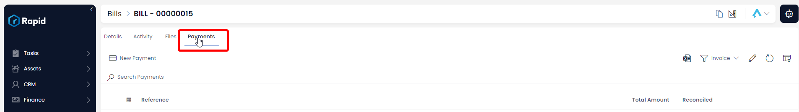
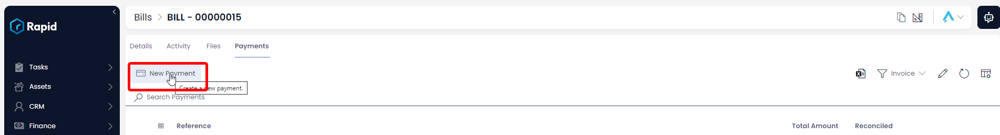
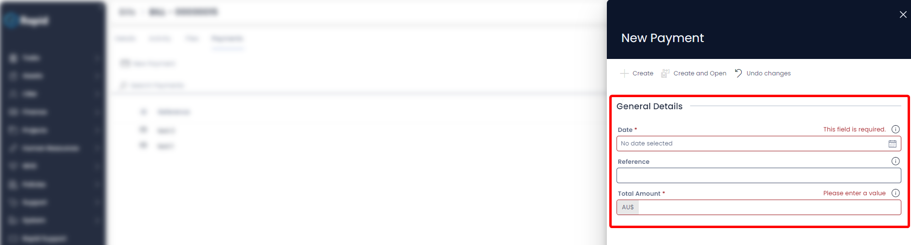
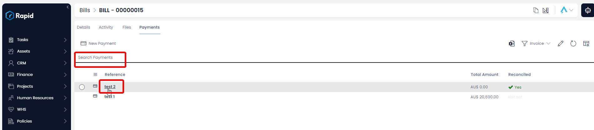
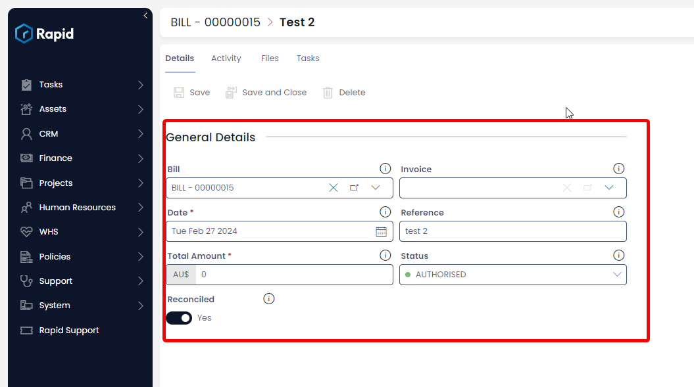
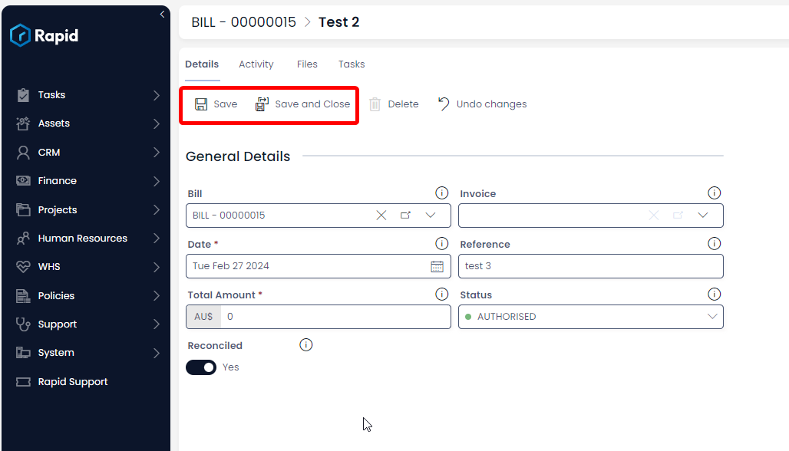
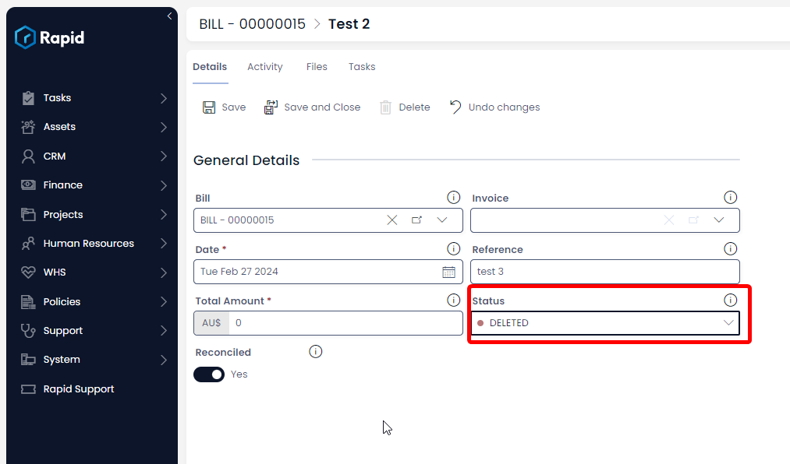

# Creating, Editing, and Deleting a Payment Record Against an Bill

### Overview

The Accounts module can add payments against an invoice or bill. This allows you track how much is still owed against each of those items. To create a payment record against an invoice follow the steps below.

### How to create a Payment Item Against a Bill

1. Navigate to the **Finance** > **Bills**  

    

2.	Locate the Bill you wish to add a payment against either by scrolling through the list or using the search bar.  

    

3. Click on the **Payments** tab

    

4. Click on **New Payment**.  

    

5. Enter all relevant details
    1. The following fields are required: **Date** and **Total Amount** Due
    
6. Click on **Create** or **Create and Open**

### How to Edit a Payment Item Against a Bill

1. Navigate to the **Finance** > **Bills**  

    

2.	Locate the bill you wish to add a payment against either by scrolling through the list or using the search bar.  

    

3. Click on the **Payments** tab

    
4. Find and open the payment you wish to edit
    
5. Edit any relevant fields on the payment page as needed
    
6. Once finished editing press **Save** or **Save & Close**
    

### How to Delete a Payment Item Against a Bill

Deleting a payment works differently than deleting other items in Rapid as we only offer the ability to “soft” delete these items. This means the record is retained in the system but the status is changed to “DELETED”. Follow the steps below to do so.

1. Navigate to the **Finance** > **Bills**  

    

2.	Locate the bill you wish to add a payment against either by scrolling through the list or using the search bar.  

   

3. Click on the **Payments** tab

    

4. Find and open the payment you wish to Delete

    

5. Change the status of the payment to **DELETED**

    

6. Once finished editing press **Save** or **Save & Close**
    