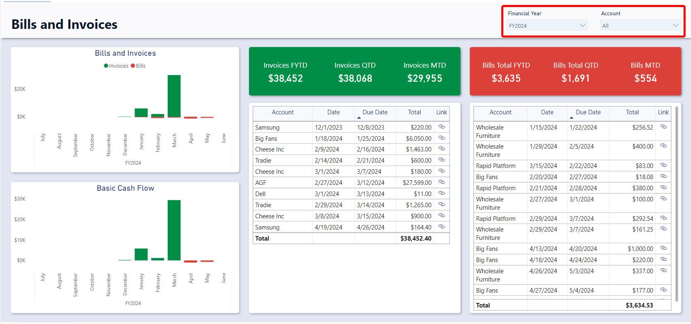
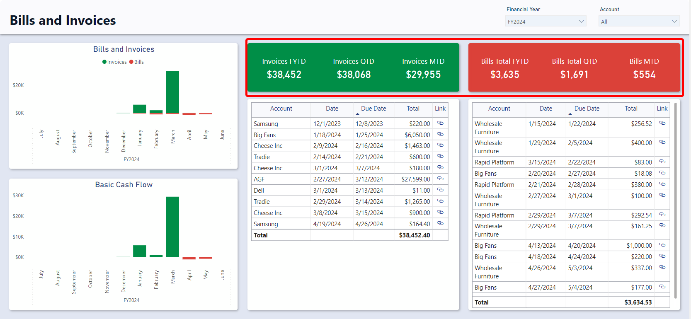
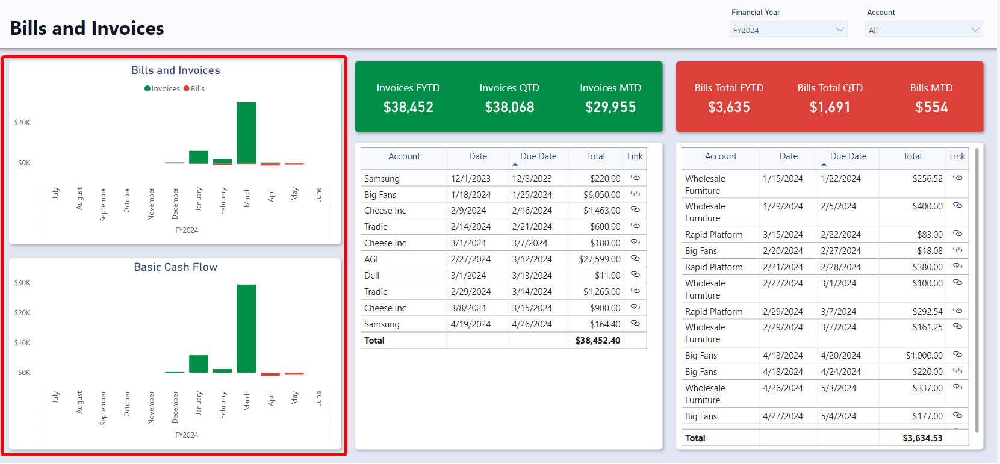
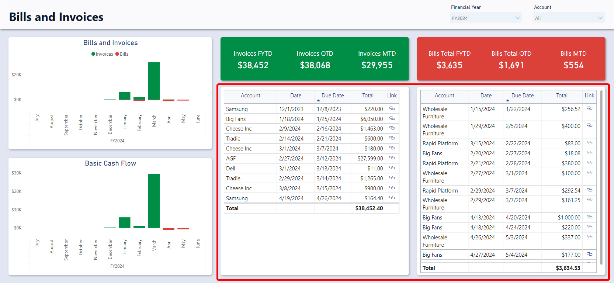

# Bills and Invoices Report

## Accessing the Bills and Invoices Report
1. Navigate to the **Finance** &gt; **Finance Report**
2. Select the **Bills and Invoices** tab

## Sections
The Bills and Invoices report is divided into four sections: **Slicers**, **Charts**, **Cards**, and **Tables**

### Slicers
Slicer provides the user with the ability to filter all visuals on the page by a specific attribute and can be found at the top of the page.

The Bills and Invoices report can be *Sliced* based on no attributes, one attribute, or multiple attributes. The attributes available to *Slice* by are **Financial Year** and **Account** (The account that the bill or invoice lookup to).

By default, the report is sliced by the current financial year.

For example, you could use the slicers to filter down the visuals to Bills and Invoices that relate to the *Example Company* Account for the 2022 Financial year.

### Cards
The Cards section within the Invoices and Bills report offers concise reference statistics. 

The values of these cards will change based on the slicers or if selections are made on tables or charts.
The provided cards are as follows: 
- Bills Card
    - Bills Total FYTD – Displays the sum of all bill totals for the current financial year to date.
    - Bills Total QTD - Displays the sum of all bill totals for the current quarter to date.
    - Bills Total MTD - Displays the sum of all bill totals for the current month to date.
- Invoices Card
    - Invoices Total FYTD – Displays the sum of all invoice totals for the current financial year to date.
    - Invoices Total QTD - Displays the sum of all invoice totals for the current quarter to date.
    - Invoice Total MTD - Displays the sum of all invoice totals for the current month to date.

**Note**: If you change the financial year from the current one to a past one, each card will display the sum of bill/invoice totals for the last period of that financial year. For instance, if the current date is November of the 2024 financial year and you slice the report by the 2023 financial year, the Month to date cards will show the total for June (the last month) of the 2023 financial year.

### Charts

#### Bills and Invoices
The Bills and Invoices visual shows the total Bills and Total invoices for each month. The Bill totals will generally be negative and as such are represented by a red column while the Invoice total are generally positive and represented by a green column. 

It is an interactive visual, allowing users to click on of the “Month” bars to slice the rest of the report by that month.

The dates for this visual are based off the Bill and Invoice Due Dates.

#### Profit & Loss
This chart shows the difference between the Bills Total and Invoices Total for each month. In months where bills had a higher value than invoices the bar will be negative and vice versa.

It is an interactive visual, allowing users to click on of the “Month” bars to slice the rest of the report by that month.

The dates for this visual are based off the Bill and Invoice Due Dates.

### Tables

#### Bills Table
The Bills Table (Left) displays the Account, Date, Due Date , Due date, Total, and link to the rapid item.

It is an interactive visual, allowing users to click any bill line and the report visuals will highlight or filter based on the selected bill.

#### Invoices Table
The Invoices Table (Right) displays the Account, Date, Due Date , Due date, Total, and link to the rapid item. 

It is an interactive visual, allowing users to click any bill line and the report visuals will highlight or filter based on the selected bill. 
