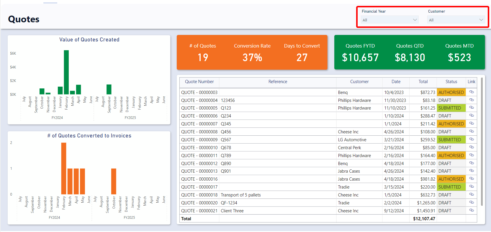
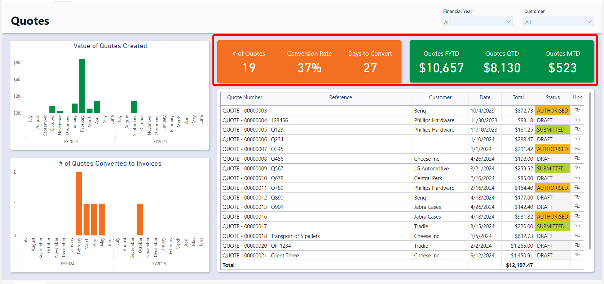
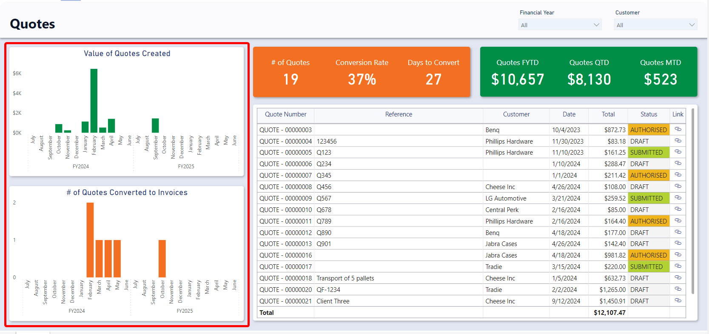
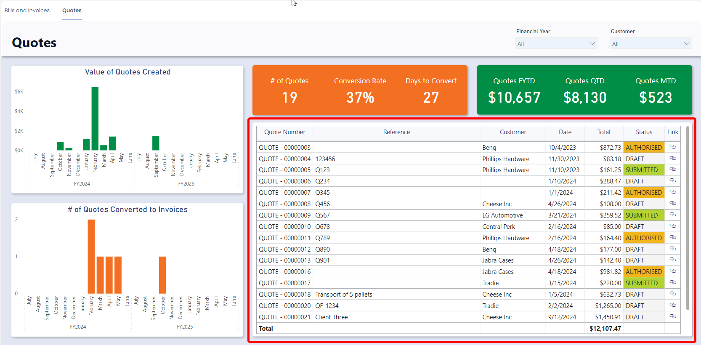

# Quotes Report

## Accessing the Quotes Report
1. Navigate to the **Finance** &gt; **Finance Report**
2. Select the **Quotes** tab

## Sections
The Quotes report is divided into four sections: **Slicers**, **Charts**, **Cards**, and **Tables**

### Slicers
Slicers provides the user with the ability to filter all of the visuals on the page by a specific attribute and can be found at the top of the page. 

The Quotes report can be “sliced” based on no attributes, one attribute, or multiple attributes. The attributes available to “slice” by are *Financial Year* and *Customer* (Customer that the Quote looks up to).

By default, the report is sliced by the current financial year.

For example, you could use the slicers to filter down the visuals to Quotes that relate to the “Example Company” Customer for the 2022 Financial Year.

### Cards
The Cards section within the Quotes report offers concise reference statistics. The values of these cards will change based on the slicers or if selections are made on tables or charts.

The provided cards are as follows: 
- **Conversion**
    - *Number of Quotes* – Displays the count quotes.
    - *Conversion Rate* – Displays the number of converted quotes divided by the total quotes as a percentage.
    - *Days to Convert* - Displays the average number of days from the quote date to the converted date.
- **Quotes To Date Statistics**
    - *Quotes FYTD* – Displays the sum of all quote totals for the current financial year to date.
    - *Quotes QTD* - Displays the sum of all quote totals for the current quarter to date.
    - *Quotes MTD* - Displays the sum of all quote totals for the current month to date.

:::[Note:] If you change the financial year from the current one to a past one, each of the “Quotes To Date Statistics” will display the sum of quote totals for the last period of that financial year. For instance, if the current date is November of the 2024 financial year and you slice the report by the 2023 financial year, the Month to date cards will show the total for June (the last month) of the 2023 financial year.
:::

### Charts

#### **Value of Quotes Created**
This visual shows the total value of *Quotes* by month based on their *Date* field. It is an interactive visual, allowing users to click on of the “Month” bars to slice the rest of the report by that month.

#### **# of Quotes Converted to Invoices**
This visual shows the *count of Quotes by month* that have a converted date. There positioning along the timeline is based on their *Converted Date* field. It is an interactive visual, allowing users to click on of the *Month* bars to slice the rest of the report by that month.

### Tables

The Quotes Table displays the *Quote Number, Reference, Customer, Date, Total, Status*, and *Link* to the Rapid item. It is an interactive visual, allowing users to click any bill line and the report visuals will highlight or filter based on the selected quote.
 
