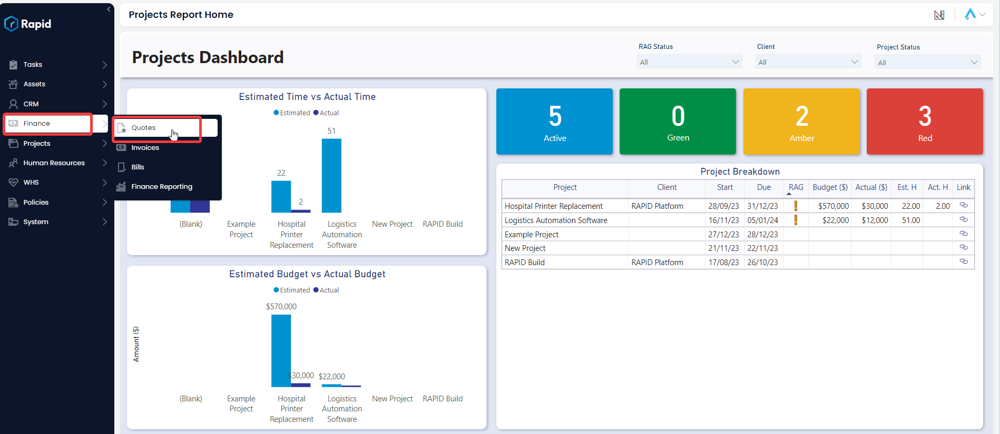
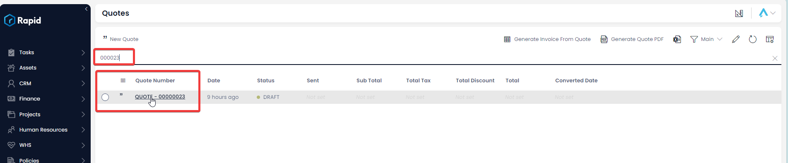
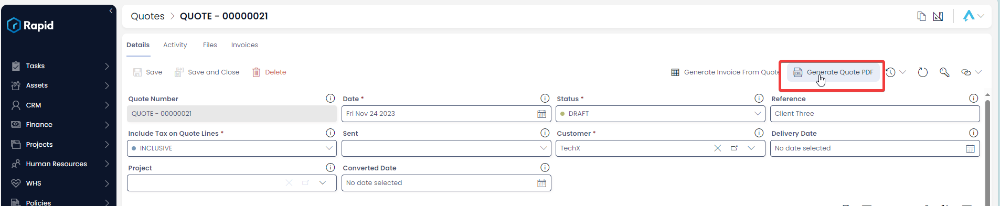
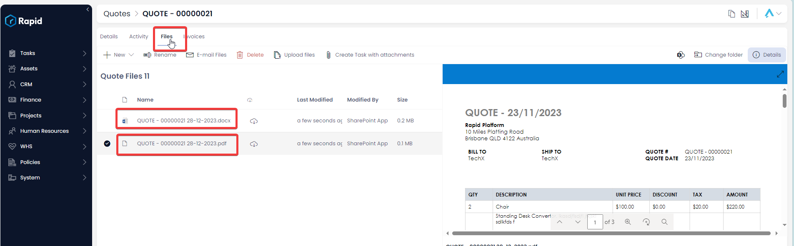

# Generating a Quote PDF

## Overview

As part of the Finance module comes the ability to automatically generate a Quote PDF (and word document) from the Rapid item. This is useful as it allows you to easily send this PDF to clients for acceptance.

## How to Generate a Quotes PDF

Follow the steps below to generate and access the Quote PDF (and Word Document).

1. Navigate to the **Finance** &gt; **Quotes**  
    
2. Open the quote you wish to generate a PDF of either by scrolling through the list or using the search bar.  
    
3. Click the “Generate Quote PDF” menu button located in the top right of the page and wait for the green “Work Executed Successfully” notification  
    
4. Navigate to the files tab. Both the word and pdf files will be here. To access the pdf, double click it.  
    