# Creating, Editing, and Deleting Projects

### Overview

Projects, unlike most other lists, contain subitems. This means when creating, editing and deleting you will also need to create, edit, and delete these subitems. This page will show you how to do so.

### How to Create a Project (along with Objectives, Deliver, Risks, Exclusions, and Budgets)

##### How to create the Project Item

1. Click on Projects &gt; Projects 

    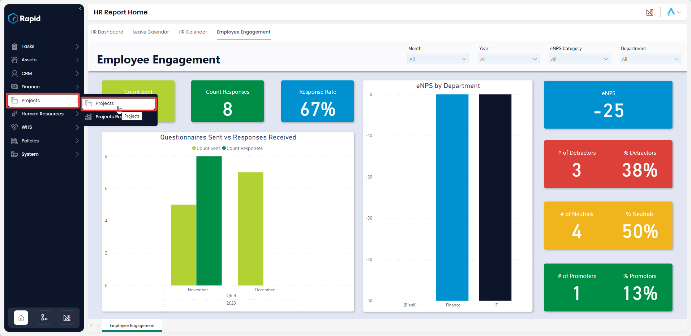

2. Click on "New Project".  

    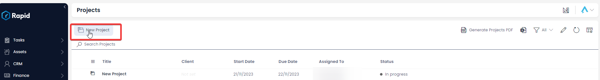

3. Enter all relevant details  

    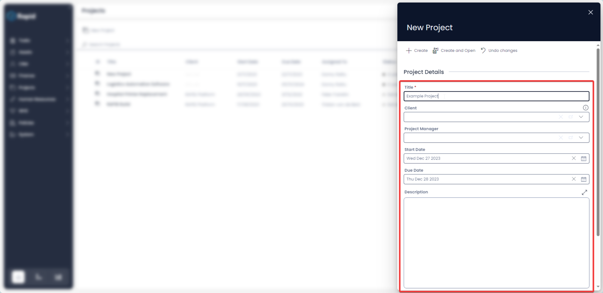

4. Click ****Create and Open**** 
    
    

##### How to create Objectives, Deliverables, Risks, Exclusions, and Budgets within a Project

1. Enter the Project you want to nest these under
2. Click on the **Scoping** tab  

    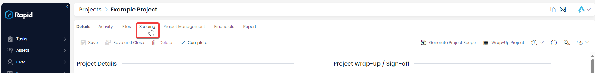

3. Click on the **Objectives** or **Deliverables** or **Risks** or **Exclusions** or **Budgets** tab  

    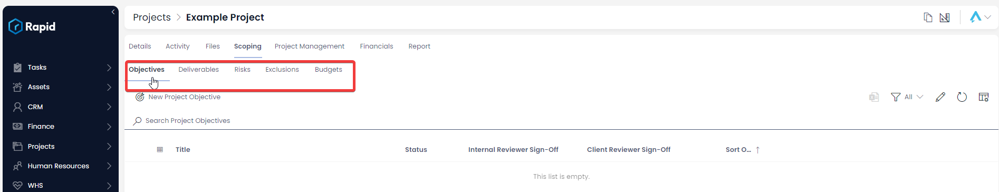

4. Click ****New X**** 

    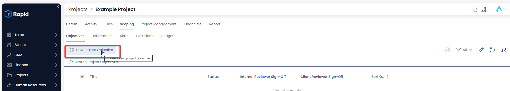

5. Enter all of the relevant details and press **Create** 

    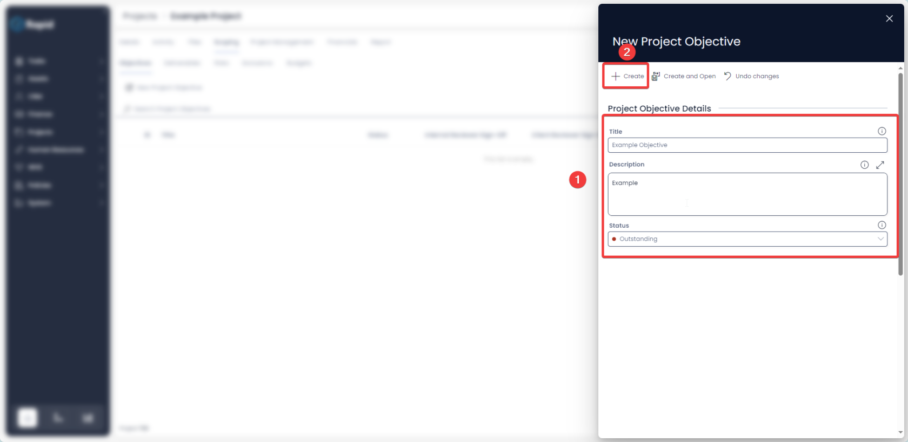

### How to Edit a Project (along with the Objectives, Deliverables, Risks, Exclusions, and Budgets)

#### How to edit the Project Item

1. Click on Projects &gt; Projects  

    

2. Open the desired Project. Locate the project you wish to edit either by scrolling through the list or using the search bar.

    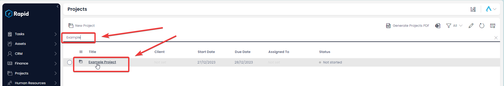

3. Edit any relevant fields on the project page as needed. 

    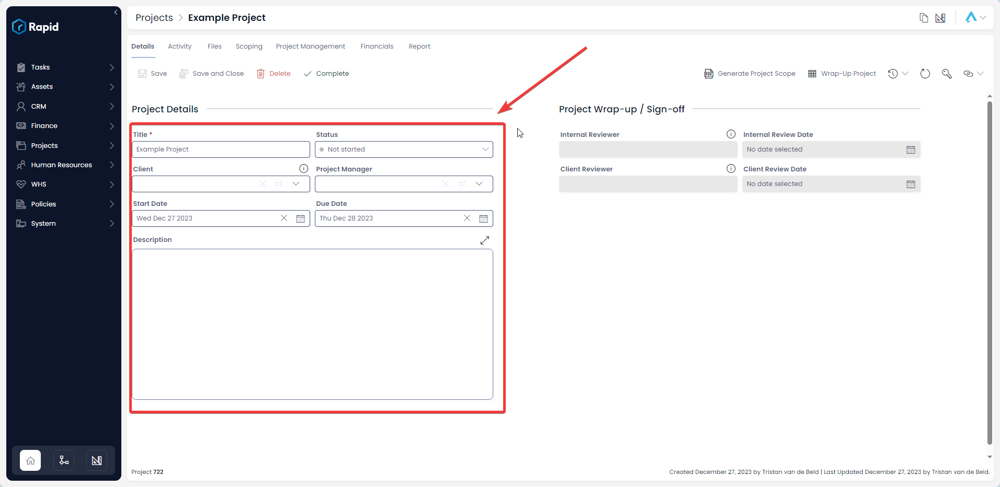

4. Press **Save** 

    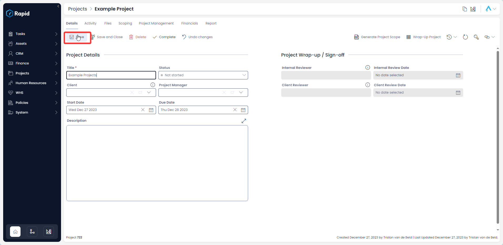

#### How to Edit a Project's Objectives, Deliverables, Risks, Exclusions, and Budgets

1. Click on Projects &gt; Projects  

    

2. Open the desired Project. Locate the project you wish to edit either by scrolling through the list or using the search bar.  

    

3. Click on the **Scoping** tab  

    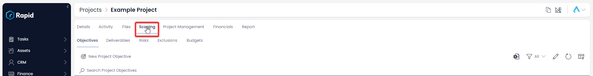

4. Click on the **Objectives** or **Deliverables** or **Risks** or **Exclusions** or **Budgets** tab.  

    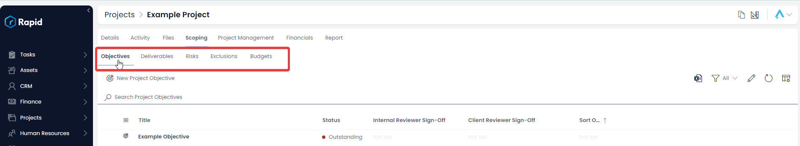

5. Click on the title of the **Objective**, **Deliverable**, **Risk**, **Exclusions**, or **Budget** you wish to edit.  

    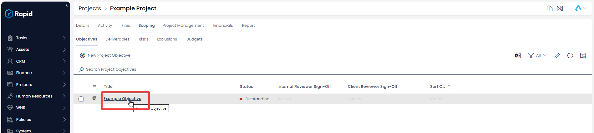

6. Edit any relevant fields on the sub item page as needed. 

    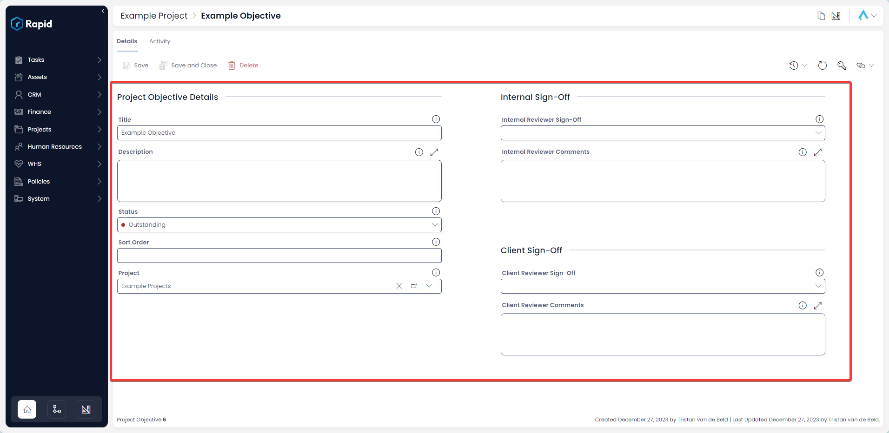

7. Once you have finished editing, click on **Save**.  

    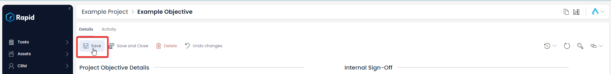

### How to Edit a Project (along with the Objectives, Deliverables, Risks, Exclusions, and Budgets)

It is not recommended to delete a project instead, change its status to "Aborted". This way you can maintain a record of all projects.

However, if you need to delete a project due to incorrect data entry or a duplicate entry, you can do so.

However, deleting the project will not delete the subitems (Objectives, Deliverables, Risks, and Budgets) that are part of that project. If you wish to delete the sub-items along with the Project follow the steps below.

#### How to delete a Projects Sub-Items (Objectives, Deliverables, Risks, Exclusions, and Budgets)

1. Click on Projects &gt; Projects  

    

2. Open the desired Project. Locate the project you wish to edit either by scrolling through the list or using the search bar. 

    

3. Click on the **Scoping** tab  

    

4. Click on the **Objectives** or **Deliverables** or **Risks** or **Exclusions** or **Budgets** tab.  

    

5. Select the Objectives or **Deliverables** or **Risks** or **Exclusions** or **Budgets** you wish to **delete**
    
    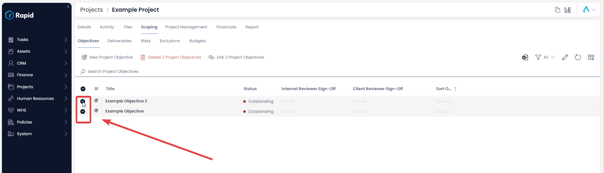

6. Press the **Delete X Sub-Items** 

    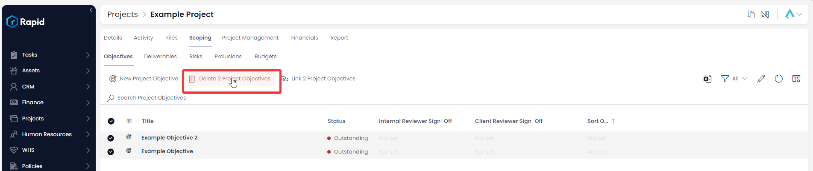

#### How to Delete a Project Item

1. Click on Projects &gt; Projects  

    

2. Open the desired Project. Locate the project you wish to delete either by scrolling through the list or using the search bar.

    
    
3. Press **Delete**.  

    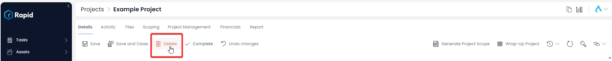