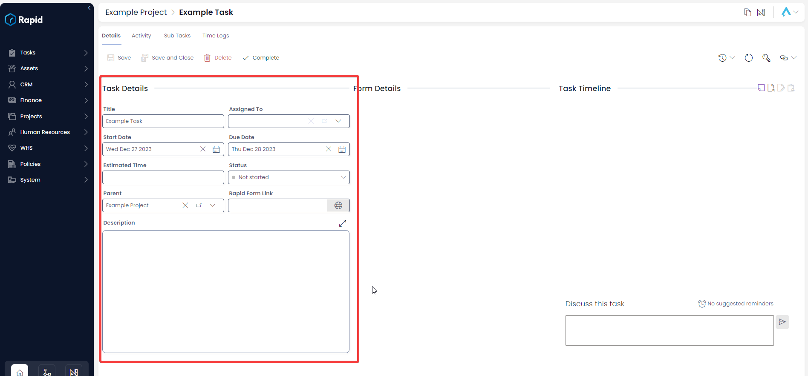
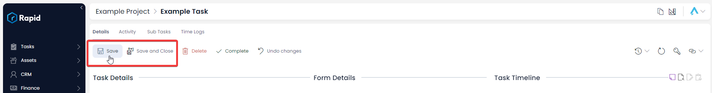

# Creating and Editing Tasks Within a Project

### Overview

All projects must incorporate a list of tasks, outlining the activities necessary for achieving project objectives. It is essential to regularly update the tasks list throughout the project's lifecycle to maintain an accurate record of completed and outstanding tasks.

Both the tasks board and Gantt chart accurately represent the data from the project's task list, providing visual insights into task progress and timelines.

There are three ways to create tasks in the context of a project: form the tasks list, from the tasks board, and from the Gantt Chart.

### How to create a task from a Project tasks list, task board, or Gantt Chart

1. Navigate to Projects &gt; Projects  
    
2. Open the Project you wish to create child tasks in. (Find the project by scrolling through the list or using the search bar)  
    
3. Click on the **Project Management** tab  
    
4. Click on the **Task List** or **Task Board** or **Gantt** tab  
    
5. Click **New** ****Task**** 
    
6. Enter the relevant details 
    1. Note that the **Start Date** and **Due Date** is what the Gantt Chart uses to display the task.
    2. The **Assigned To** column will determine whose task list this will appear in. You can assign a task to a **Role** such as **WHS Team** and any members of that team will see the task in their task list on the **My Tasks** view.  
        
7. Click on **Create** or ****Create and Open**** 
        

### How to edit a Task from within a Project

1. Navigate to Projects &gt; Projects  
    
2. Open the Project you wish to create child tasks in. (Find the project by scrolling through the list or using the search bar)  
     
3. Click on the **Project Management** tab  
    
4. Click on the **Task List** or **Task Board** or **Gantt** tab  
    
5. Open the Task you wish to edit. (Find the task by scrolling through the list or using the search bar) 
    1. If the task is not assigned to you make sure you change the view from **My Tasks** to **All**  
        
6. Edit any relevant fields of the sub task as required  
    
7. Press **Save** or **Save and Close** 