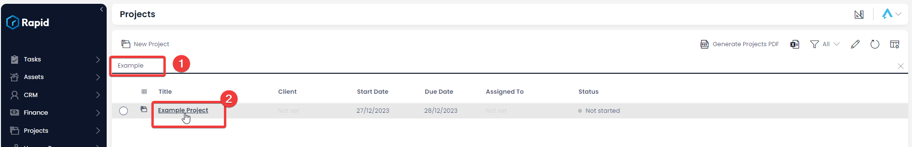

# Project Wrap-Up / Sign-Off Process

### Overview

The Project Management module incorporates a streamlined Project Wrap-Up / Sign-Off Process. This process enables internal and external stakeholders to individually approve each project deliverable and objective while seamlessly providing feedback. This mechanism ensures that projects achieve their intended goals and establishes a documented communication channel between internal and external reviewers.

The process is triggered manually from within the project item you which to “Wrap-Up” as described below.

### How to trigger the Wrap-Up Project Process

1. Navigate to Projects &gt; Projects  
    
2. Open the Project you wish to wrap-up. (Find the project by scrolling through the list or using the search bar)  
    
3. Click the "Wrap-Up Project" menu button located in the top right corner.  
    
4. Select the internal reviewer, client reviewer and then click “Ok”  
    

After triggering the process, the following will occur:

1. **Internal Review of Objectives and Deliverables:** The internal reviewer will receive an email containing a link to a form for reviewing each objective and deliverable. They can assess the objectives and deliverables as "Outstanding," "Accomplished," or "Partially Accomplished." They can also provide comments on each item.
2. **Client Review of Objectives and Deliverables:** Following the internal review, an email will be sent to the client's email address containing a form that outlines each objective and deliverable. The client will follow a similar process, evaluating each item as "Incomplete," "Complete," or "Partially Complete." They can also offer comments.
3. **Generate Wrap up Document:** A wrap up document will then be generated containing the internal reviewer’s and client reviewer’s comments. A sharelink to this document will be emailed to both parties for easy access.