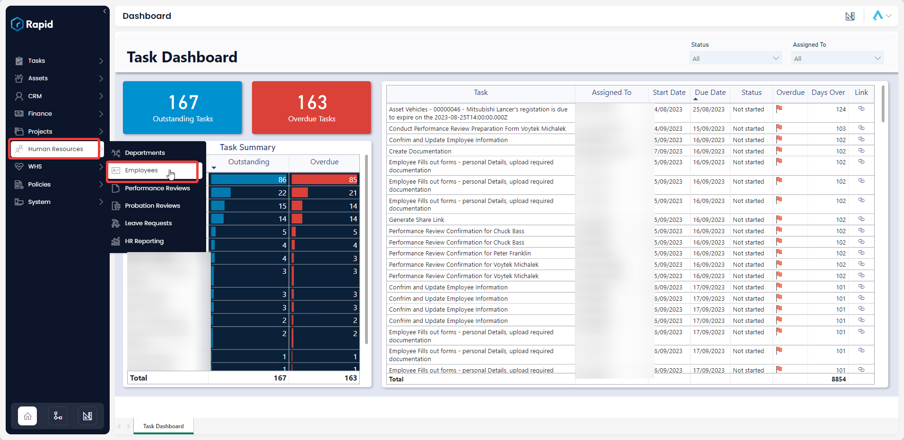
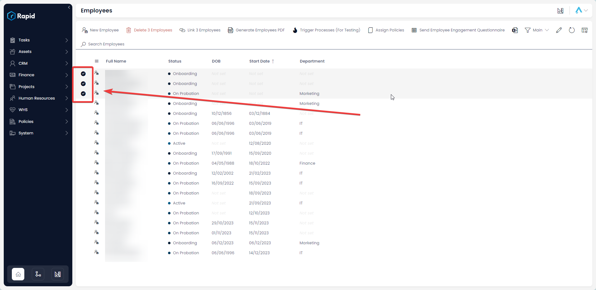
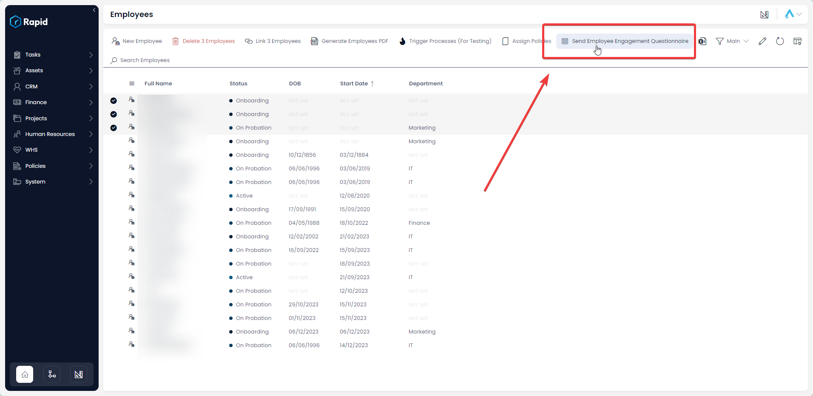

# Employee Engagement Process (eNPS Questionnaire)

### Overview

As part of Rapid Standard comes a questionnaire process to be able to get regular feedback from employees and calculate an employee Net Promotor Score (eNPS).

This is a method of quantifying employee loyalty and satisfaction and is gathered by asking one simple question: “On a scale of 0 to 10, how likely are you to recommend this company as a good place to work to your friends or families”. From this question the percentage of “detractors”(those who answer 0 to 6), “neutrals” (those who answer 7 or 8), and “promotors” (those who answer 9 or 10) are calculated.

Finally, the eNPS is calculated by subtracting the percentage of detracts from promotors. This results in a score between -100 and 100. A good eNPS score depends on the industry and the context, but generally, scores between 10 and 30 are considered good, while scores between 50 and 70 are considered excellent.

### How to send out the eNPS Questionnaires

1. Navigate to Human Resources &gt; Employees  
    
2. Select the employees you wish for the questionnaire to be sent to  
    
3. Press the “Send Employee Engagement Questionnaire”  
    

### Additional Details

This will send an email with a link to a form to each selected employees. Employee responses to this form will be anonymous. There are only two questions on the form:

1. Select your department (Employees are required to select which department they are from this helps to produce a eNPS score by department and the organisation as a whole)
2. On a scale of 0 to 10, how likely are you to recommend this company as a good place to work to your friends or families (This is used to calculate the eNPS score)

See the “Using the Employee Engagement Dashboard” section to see how to view the aggregated results of the questionnaires.