# Creating, Editing, and Deleting Policies

### How to create a new Policy

1. Navigate to Policies > Policies  

    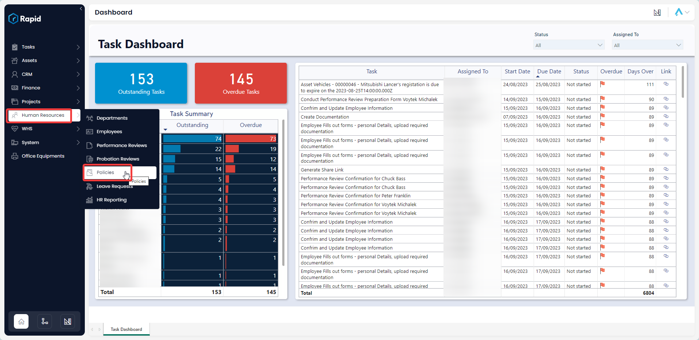

2. Select **New Policy** 

    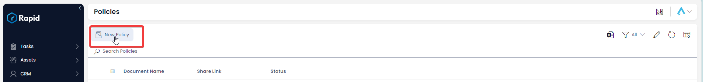

3. Enter the relevant details  

    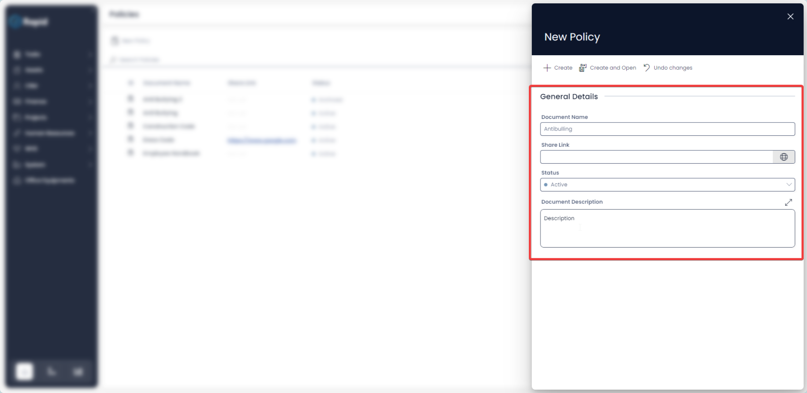

4. Press **Create and Open** 

    

5. Click on the Policy Embedded File and upload your policy document. (This step is required if you want a Sharelink to the policy to be sent out)  

    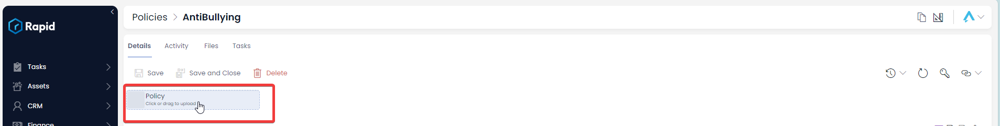

6. Press **Save** or **Save and Close**

### How to Edit a Policy

1. Navigate to Human Resources > Policies 

    

2. Open the desired policy. (Locate the policy by either scrolling through the list or using the search bar)  

    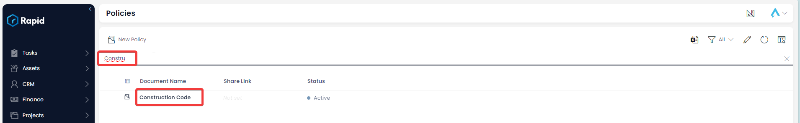

3. Edit the desired fields  

    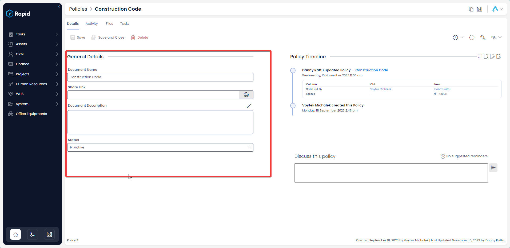

4. Press **Save** or **Save and Close** 

    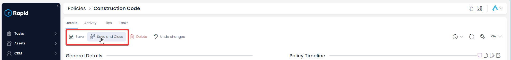

### How to delete a policy

It is not recommended to delete a policy instead, change its status to "Archived." This way you can maintain a record of past and current policies.

However, if you need to delete a policy due to incorrect data entry or a duplicate entry, you can do so in two ways: from the list or from the item page. Deleting from the list allows you to delete multiple policies at once.

#### Deleting multiple Policies from the policy list

1. Navigate to Human Resources > Policies  

    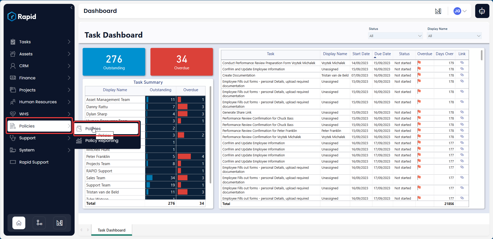

2. Select the policies you wish to delete  

    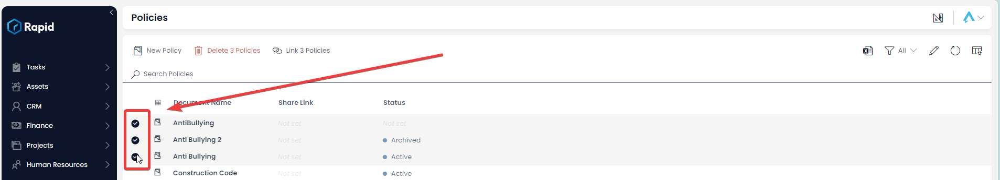

3. Press **Delete X Policies** 

    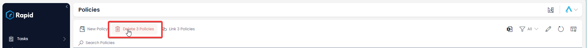

#### How to delete a single policy from the policy page

1. Navigate to Human Resources > Policies 

    

2. Open the desired policy. (Locate the policy by either scrolling through the list or using the search bar)  

    

3. Press **Delete** 

    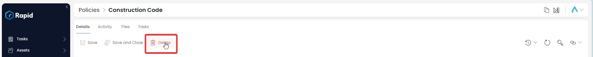