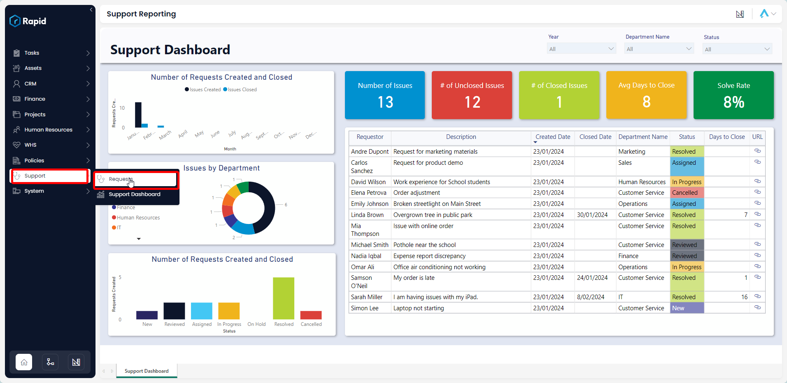

# Creating, Editing, and Deleting Requests
## Creating a Request via the adaptive form
Requests are designed to be created using the adaptive form which can be distributed through your website, emails, QR code or which ever methods suits your organisation.
1.	Navigate to Support > Request form
2.	Fill in the details as described in the form
3.	Press submit

## Creating a Request via Explorer (Not Recommended)
Alternatively you may want to create a request using explorer. This could be a more useful way for internal employees with access to the Rapid system to create requests. 
1.	Navigate to Support > Requests

2.	Click on "New Request".

3.	Enter all relevant details
4.	Click on Create.

## Editing
The original request fields are set to Read only to maintain the integrity of the data. However, it is possible to edit the fields that pertain to managing and fulfilling the request. To do so follow the steps below
1.	Navigate to Support > Requests

2.	Locate the request  you wish to edit either by scrolling through the list or using the search bar.

3.	Click on the request title to open it.
4.	Edit any relevant fields on the policy page as needed.
5.	Once you have finished editing, click on Save.

## Deleting
It is not recommended to delete a request instead, change its status to "Cancelled". Keeping in mind that changing the status will send an email to the original requestor.  
However, if you need to delete a request due to incorrect data entry or a duplicate entry, you can do so in two ways: from the list or from the item page. Deleting from the list allows you to delete multiple assets at once.

### Deleting from the list:
1.	Navigate to Support > Requests

2.	Select the requests you wish to delete.
3.	Click on the delete button.
### Deleting from the request page:
1.	Navigate to Support > Requests

2.	Open the individual request you wish to delete.
3.	Click on the delete button.

