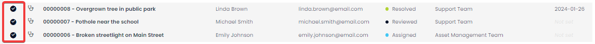

# Creating, Editing, and Deleting Requests

## Creating a Request via the Adaptive Form
Requests can be created using the adaptive form. This form can be distributed through your website, emails, via QR code, or whichever method suits your organisation.
1.	Navigate to **Support** > **Request** form
2.	Fill in the details as described in the form
3.	Press **Submit**

## Creating a Request via Explorer (Not Recommended)
Alternatively, you may want to create a request using Explorer. This could be a more useful way for internal employees with access to the Rapid system to create requests. 
1.	Navigate to **Support** > **Requests**

2.	Click on **New Request**

3.	Enter all relevant details
4.	Click on **Create**

## Editing
The original request fields are set to read-only. However, it is possible to edit the fields that pertain to managing and fulfilling the request. To do so, follow the steps below:
1.	Navigate to **Support** > **Requests**

2.	Locate the request you wish to edit, either by scrolling through the list or using the search bar.

3.	Click on the request title to open it.
4.	Edit any relevant fields on the policy page as needed.
5.	Once you have finished editing, click on **Save**.

## Deleting
It is not recommended to delete a request. Instead, change its status to "Cancelled".

Please note that changing the status will send an email to the original requestor.

If you need to delete a request (due to incorrect data entry or a duplicate entry), you can do so in two ways: from the list or from the item page. Deleting from the list allows you to delete multiple assets at once.

### Deleting from the list
1.	Navigate to **Support** > **Requests**

2.	Select the requests you wish to delete.

3.	Click on the **Delete** button.

### Deleting from the request page
1.	Navigate to **Support** > **Requests**

2.	Open the individual request you wish to delete.

3.	Click on the **Delete** button.

