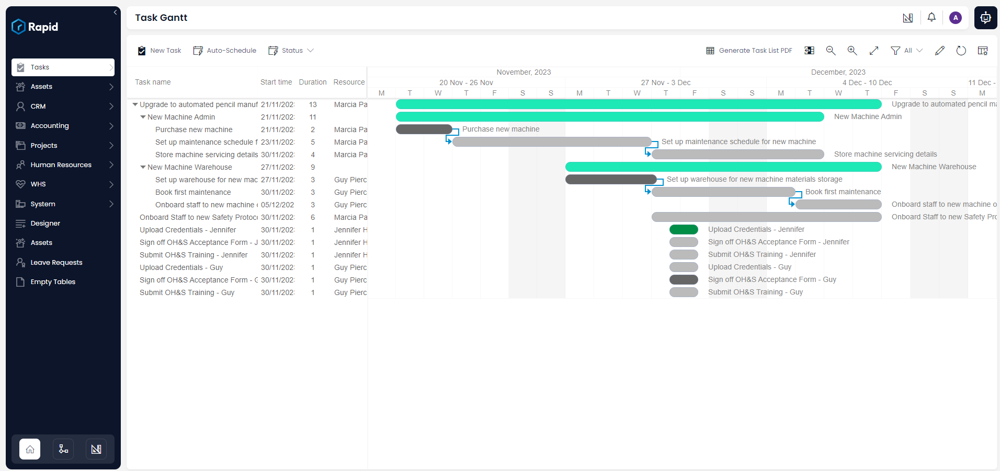
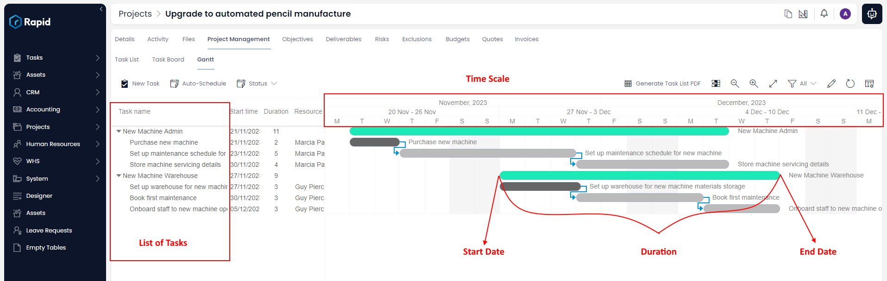
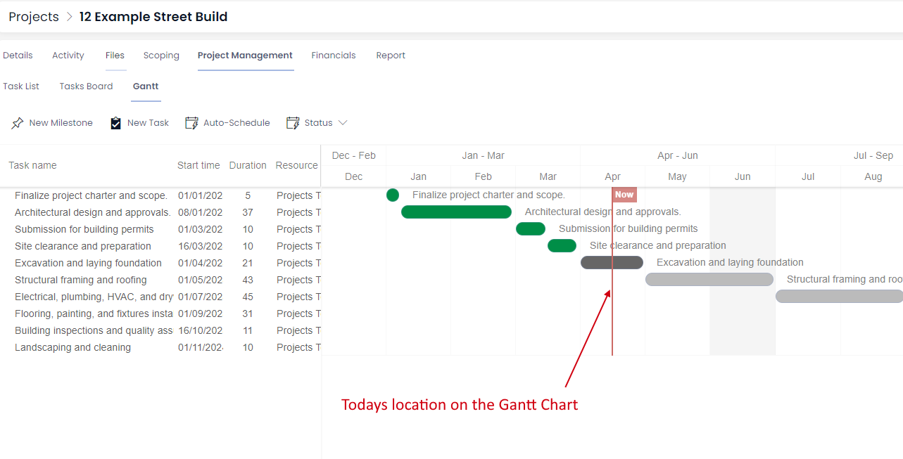
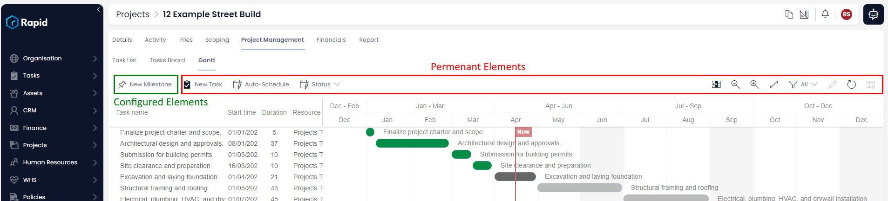

# Gantt Basics

Gantt charts are essentially a visualization tool for data in context to time. As long as items have a start and end date they can be viewed in relation to each other in time.

Gantt charts can act as an easy way to move through a set of items to investigate. You can glance through the item progress, dependencies among items, etc.

Finally, Gantt charts provide convenient tools to manipulate items so that you can do bulk editing. The goal is to be able to manage a collection of items.
 
## Gantt Chart in RAPID Platform

RAPID Platforms allows you to visualise tasks in a Gantt Chart. Tasks are the unit of activities in a process. Essentially, each task has a start date and an end date, therefore, it qualifies to be represented in a Gantt Chart.

This is what a simple Gantt Chart may look like in RAPID Platform

## Understanding the Gantt Chart

On the left of the chart is a list of the tasks and along the top is a suitable time scale.

Each activity is represented by a bar; the position and length of the bar reflects the start date, duration and end date of the activity.

Next to the list of tasks, there are three columns:

- Start time - provides the start date of the activity.
- Duration - indicates the duration in days between start date and end date.
- Resource - displays the title of the resource to whom the task is assigned to.

The above is a Gantt Chart for a Project. The green bars depict Phases in the project and the blue ones indicate various tasks under each phase. Being a very simplistic case, this illustration has one task per phase.

The Gantt Chart shows the current date with a vertical line labelled "**Now**". Based on the current system time, the vertical line will move through the date column from left to right. For example - the below image depicts April 15th. More zoomed in Gantt charts will display greater levels of fidelity.

## Some key points:

- The tasks are arranged based on ascending order of the Start Date.
- Due Date or End Date of a task can never be less than its Start Date.
- The colour of the bar for the Task is based on the Status of the Task.
- The parent can have multiple tasks under it.
- The start of a parent is the Start Date of the earliest task, while the end of the parent is the End Date of the latest Task.
- The colour of the parent bar does not change.
- The calculation of duration respects the working days. Therefore, a task starting on Friday and ending on subsequent Monday would show duration as 2 days.

## Benefits of Gantt Chart

A Gantt Chart helps us interpret the following information:

- What the various tasks are?
- When each task begins and ends?
- How long each task is scheduled to last?
- Where tasks overlap with other activities, and by how much?
- What are the dependencies among tasks?

## The Command bar for Gantt Chart

****

The command bar for a Gantt Chart is made up of:

**Configured elements** - these are configured by the admin, as to what new sub-types of tasks can be created from within the Gantt Chart. In the image above - Client Tasks, Milestones and Phases are enabled for new creation.

**Permanent elements** - these are always present in a Gantt Chart. The permanent elements include creating new tasks, updating status, zoom level, table views etc.

## Interacting with Gantt Chart

[**Gantt chart configuration**](/docs/Rapid/3-Keyper%20Manual/2-Designer/2-Pages/3-Components/gantt-chart/gantt-chart.md "How to configure the Page - The Gantt Chart Component?") can assist you in defining:

1. On which data will the Gantt Chart be prepared?
2. Where will the Gantt Chart appear?
3. What will be the default features like Zoom level, Table views etc.?
4. What can be created from a Gantt Chart? (eg - New Phase, New Milestone etc.)

To view how to configure Gantt Chart, please view [**this resource**](/docs/Rapid/3-Keyper%20Manual/2-Designer/2-Pages/3-Components/gantt-chart/gantt-chart.md "How to configure the Page - The Gantt Chart Component?").