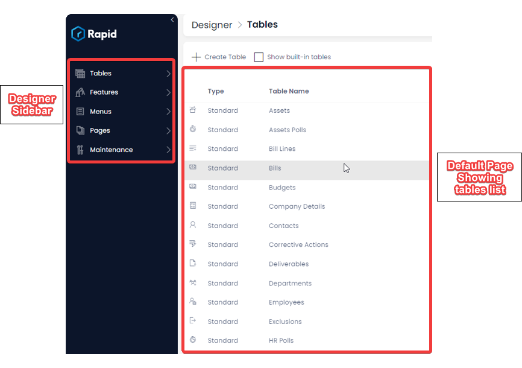
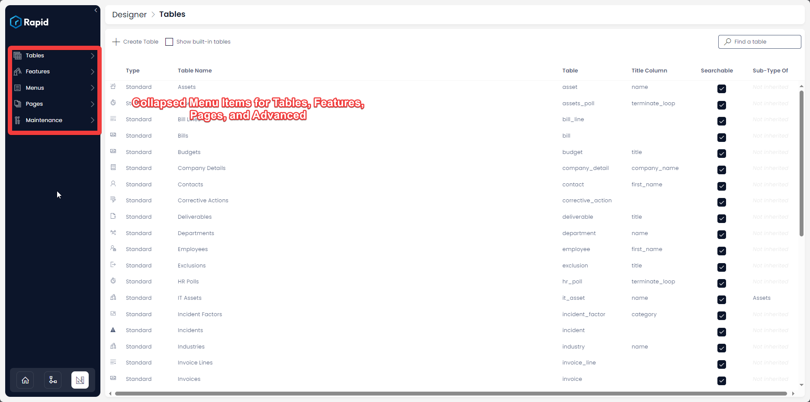

# How to access Designer

**Welcome to Designer -** This application allows you to create your business [database tables](</docs/Rapid/2-User Manual/glossary/glossary.md#data-table> "Data Table") and organise your Rapid Platform site according to your business needs.

In this guide, we will take a quick look at some of the important functions that you can perform using Designer in Rapid Platform.

:::info[Caution]
The **Designer** application is not suitable for users who do not have permission to edit, create, or delete the data structure of their organisation's Rapid site. **Designer** is an application that will usually be used by key persons (Keypers) who are responsible for building the functionality of a Rapid site.
:::

**To access *Designer*:**

- Click on the Designer icon in the bottom left of the screen
      
    <iframe allowfullscreen="allowfullscreen" frameborder="0" height="420" src="https://www.youtube.com/embed/Poycv1xhmIk?si=71gpRmg2XrnuycxA" title="YouTube video player" width="750"></iframe>

As the Designer Window opens up, it will be by default on the tables page.

This is what the **Designer** screen looks like. The blue coloured left column is called the Designer [Sidebar](</docs/Rapid/2-User Manual/glossary/glossary.md#sidebar> "Sidebar"). The white portion lists the existing database tables.

For a newly created site, there would be no list of tables.

Please note the Designer Sidebar has collapsed design options titled - Tables, Features, Menus, Pages, Advanced.

These represent the key functions of Designer and houses all the design options in your site.

To begin with **Designer**, there are four key sections to understand.

:::info[Caution]
Note that the following links will navigate you away from the **User Manual** and to the **Keyper Manual** instead.
:::

- [Tables](/docs/Rapid/3-Keyper%20Manual/2-Designer/1-Tables/1-all-about-tables-in-designer/1-all-about-tables-in-designer.md "All about Tables in Designer")
- [Features](/docs/Rapid/3-Keyper%20Manual/2-Designer/8-Administration/feature-access-control/feature-access-control.md "All about Feature Control in Designer")
- [Menus](/docs/Rapid/3-Keyper%20Manual/2-Designer/3-Menus/3-Menus.md "All about Menus in Designer")
- [Pages](/docs/Rapid/3-Keyper%20Manual/2-Designer/2-Pages/1-all-about-pages-in-designer.md "All about Pages in Designer")