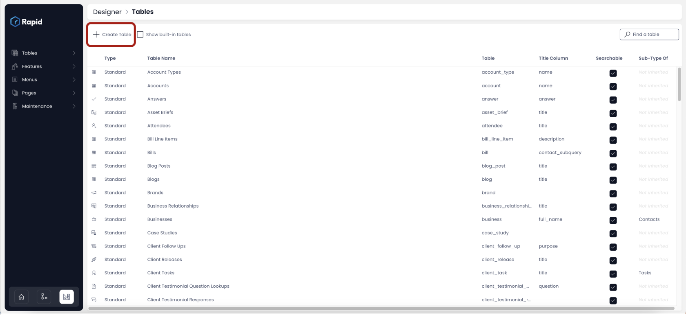
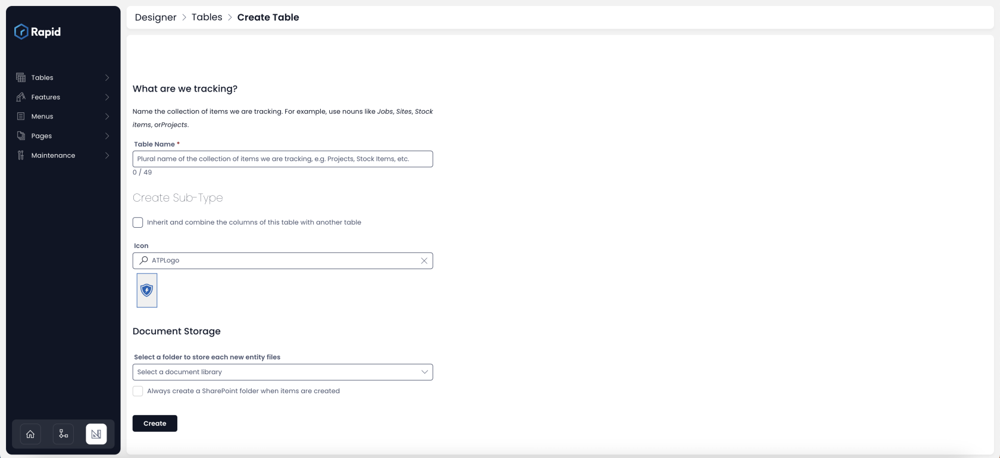
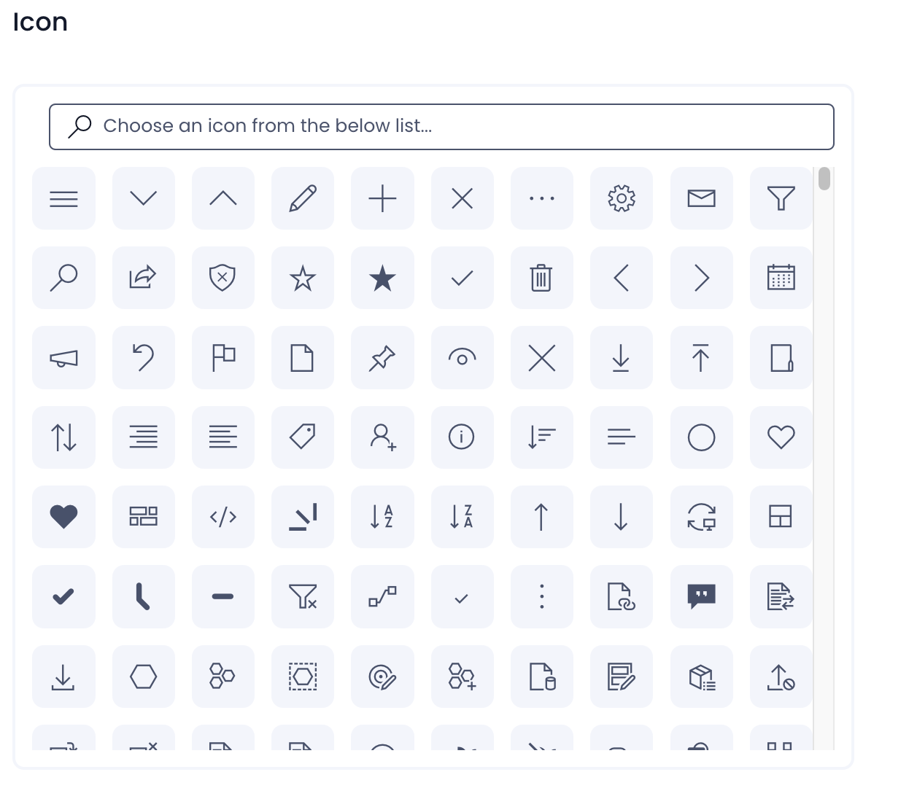
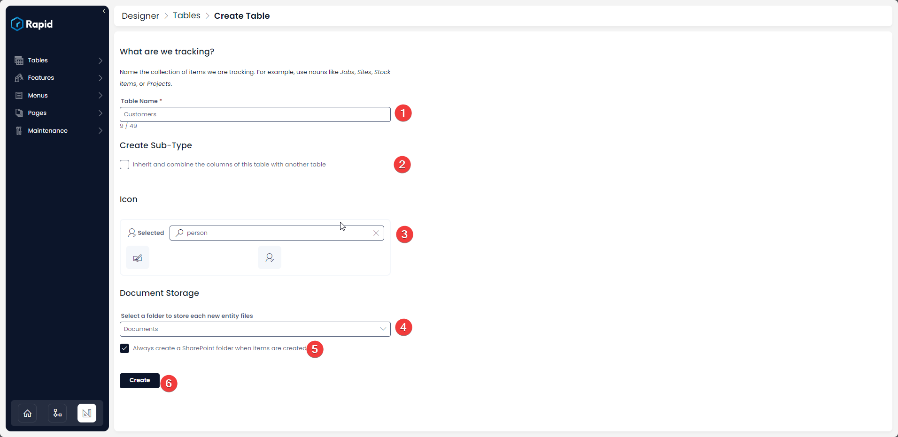

# Creating Tables

Creating a data table is among the primary and most critical tasks for a system designer. It is important to define a table with the correct field names and types.

As you know each table is made up of rows and columns.

So we have three [keywords ](</docs/Rapid/2-User Manual/glossary/glossary.md#table-items-and-columns> "Table items and columns")here:

- Table
- Columns
- Rows (known as items)

The Designer tool will enable you to define a table and create columns. As other users interact with your defined table, they will fill-out the data in the rows of the table.

It is very easy to create a new table in Rapid Platform.

To create a new table consider the following steps:

1. Go to Designer Window
2. Click Create Table button on the top

3. As you click on Create Table button, a window to define primary table data opens up.

4. Here you can fill out:
    1. **The Table Name** - This is the title of the table as provided by you. The system always takes the name as a Plural. For example - if you write the table name as "Customer", the system will automatically take the name as "Customers". If the name already exists in the system, you will be prompted the same.
    2. **Whether this table inherits properties from existing table** - If this option is checked, then you can select a table from the list of existing ones. In such a case, all the columns of the selected existing table are copied to this new table. You new table will be called as the [Sub-Type](</docs/Rapid/2-User Manual/glossary/glossary.md#inherit-tables> "Inherit Table / Sub-Type Of") of the table from which it inherits properties.
    3. **Select an icon** - This is the visual identifier of the table and its records. You can search and select the icon that most closely represents your table.
    
    4. **Document storage library** - This defines the SharePoint document library where artifacts / files related to table records will be stored.
    5. **Select whether a new SharePoint folder should be created for each item -** This can be useful when dealing with certain type of business data, where you may also search / refer data manually. For example - if you have created a *Customer* table, then you may want each customer data to be saved in different folders. On the other hand, imagine all of the customer data in a single SharePoint Folder. This impacts organisation of data.
    6. **Press Create** 
    
        

This will create a new table in Rapid Platform.

Please refer to the below video for illustration.

<iframe allowfullscreen="allowfullscreen" frameborder="0" height="420" src="https://www.youtube.com/embed/oktuKVhF7Og?si=HbdiSTwt7__rs-Nl" title="YouTube video player" width="750"></iframe>

[How to add a new column to a table?](../5-Table%20Configuration%20Guides/how-to-add-columns-to-a-data-table/how-to-add-columns-to-a-data-table.md "How to add columns to a data table?")

[How to view / update table options of an existing table in Designer?](../5-Table%20Configuration%20Guides/how-to-view-update-table-options-of-a-table/how-to-view-update-table-options-of-a-table.md "How to view / update table options of an existing table in Designer?")

