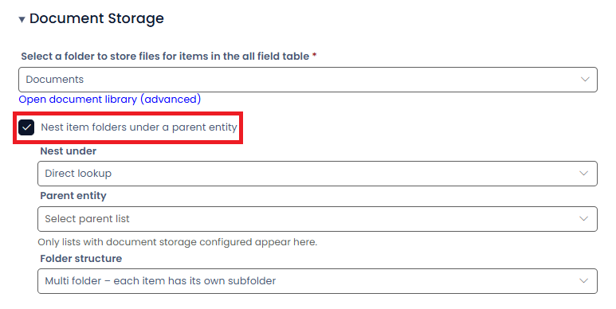
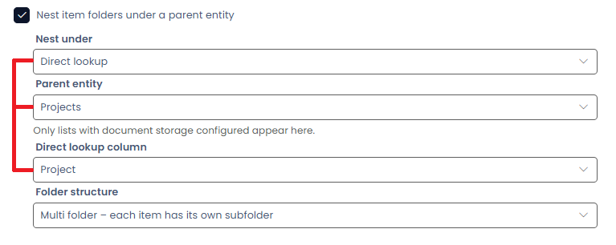
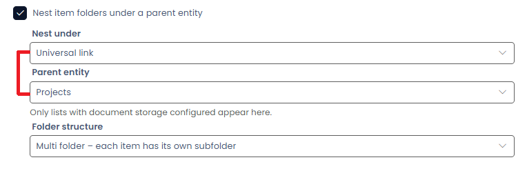

# How to set up Folder Nesting

Folder Nesting controls how item folders for one table are organised under the folders of another table in document storage.

This feature allows document folders created for items in a **child table** to be placed inside folders belonging to items in a **parent table**, creating a hierarchical document structure.

---

## Overview

When **document storage** is enabled on a table, each item can have an associated folder where uploaded files are stored.

Folder Nesting allows these folders to be organised under the folders of another table's items.

Without Folder Nesting, each table maintains its own independent folder structure.

With Folder Nesting enabled, item folders from one table are placed inside the folders of a related parent table.

**Example**

A system may contain:

* a **Projects** table
* a **Quotes** table

When Folder Nesting is configured, folders created for **Quotes** items can be stored inside the corresponding **Project** item folder.

This keeps documents related to the same project grouped together within document storage.

---

## Availability

Folder Nesting can only be configured when the following conditions are met:

* The table has **document storage enabled**.
* Document storage is not disabled for the entity.
* The table is **not system managed**.

Only tables that also have document storage enabled and are not system managed are available as potential **parent tables**.

---

## Enabling Folder Nesting

1. Open the table in **Designer**.
2. Navigate to the **Document Storage** section.
3. Enable **Nest item folders under a parent entity**.

Once enabled, additional configuration options become available that determine how parent folders are resolved and how child folders are created.

---

## Parent Resolution

The **Nest under** option defines how the system determines the parent item whose folder will contain the child folder.

Two resolution methods are supported.

### Direct lookup

Use **Direct lookup** when the child table contains a lookup column that directly references the parent table.

Configuration requires:

* Selecting the **parent table**
* Selecting the **lookup column** that links the child item to the parent item

The lookup value determines which parent folder the child item folder will be created within.

---

### Universal link

Use **Universal link** when the relationship between the tables is defined through **Universal Link configuration** rather than a direct lookup column.

Configuration requires:

* Selecting the **parent table**

The relationship between items is resolved using the configured Universal Link rules.

No lookup column selection is required.

---

## Parent Table Selection

The **Parent entity** setting defines which table will contain the folders for this table's items.

Only tables that meet the following conditions are available:

* Document storage is configured
* The table is not system managed

If no tables appear in the list, there are currently no valid parent tables available for nesting.

---

## Direct Lookup Column

When **Nest under** is set to **Direct lookup**, the **Direct lookup column** option becomes available.

This column must:

* Exist on the current table
* Be a lookup column
* Reference the selected parent table

Only lookup columns that reference the selected parent table are shown in the selection list.

---

## Folder Structure

The **Folder structure** setting determines how folders are created under each parent item.

| Option                                             | Behaviour                                                                        |
| -------------------------------------------------- | -------------------------------------------------------------------------------- |
| **Single folder – all items share one folder**     | All items linked to the same parent share a single folder under the parent item. |
| **Multi folder – each item has its own subfolder** | Each item receives its own folder under the parent item's folder.                |

The appropriate option depends on whether documents should be shared across related items or isolated per item.

---

## Troubleshooting

### Folder Nesting options are not visible

Ensure that **document storage is enabled** for the table.

Folder Nesting configuration is not available for tables without document storage.

---

### Parent entity list is empty

Only tables that meet the following criteria are available:

* Document storage enabled
* Not system managed

If no tables satisfy these requirements, the parent list will be empty.

---

### Direct lookup column option does not appear

Verify the following:

* **Nest under** is set to **Direct lookup**
* A **parent table** has been selected
* The table contains at least one lookup column referencing the selected parent table
