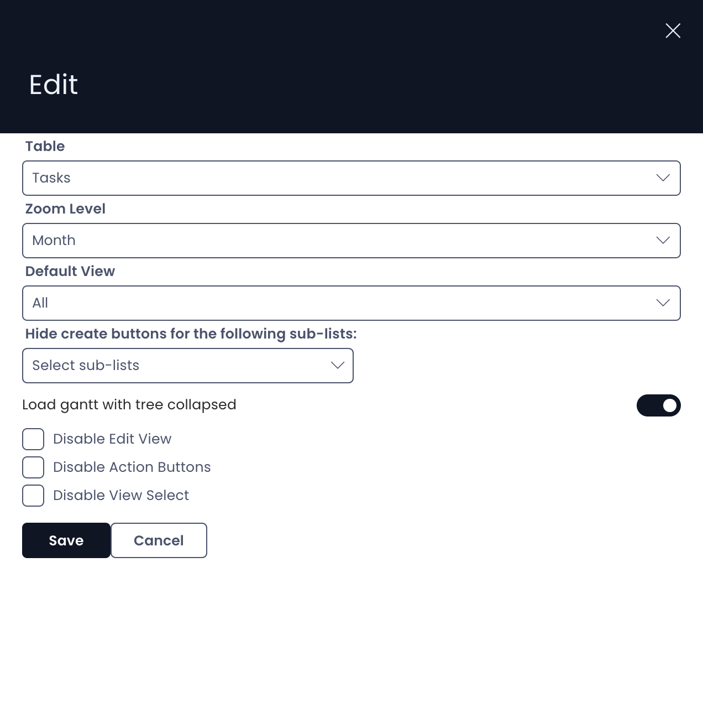
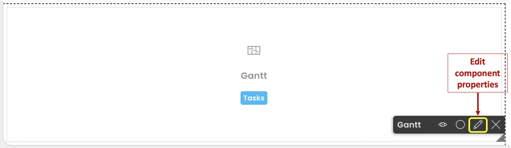

# How to configure / update component properties

## Properties of a component

Each component allows you to configure a set of properties. These properties define the behaviour of the component in Explorer.

For example :

A Counter component will allow you to define which table you wish to select and the Table View.

Whereas a Gantt Chart component will allow you to select other relevant options (shown below).

## How to access the "Configure" Properties panel

Every component has an options panel, usually found at the top center of the componant (for some componants the options can be found at the top oir bottom right). Look for the pencil icon. As you click on this icon, the Configuration panel will open for the component on the right side.

## Related articles

[How to set a component to be visible / hidden on the 'Item Details' and 'Create' screens?](/docs/Rapid/3-Keyper%20Manual/2-Designer/2-Pages/5-how-to-guides/how-to-hide-components-on-breakpoints/how-to-hide-components-on-breakpoints.md "How to set a component to be visible / hidden on the 'Item Details' and 'Create' screens?")

[How to delete a component from a Layout / Page?](/docs/Rapid/3-Keyper%20Manual/2-Designer/2-Pages/3-Components/2-configuring-components/2-configuring-components.md "How to delete a component from a Layout / Page?")

[How to delete a Layout from a Page?](/docs/Rapid/3-Keyper%20Manual/2-Designer/2-Pages/5-how-to-guides/how-to-delete-a-layout-from-a-page/how-to-delete-a-layout-from-a-page.md "How to delete a Layout from a Page?")
