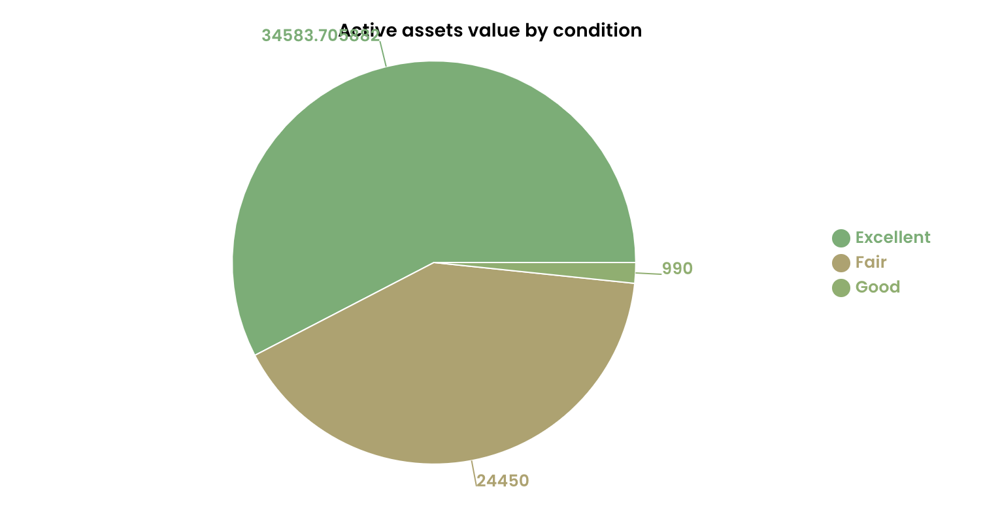
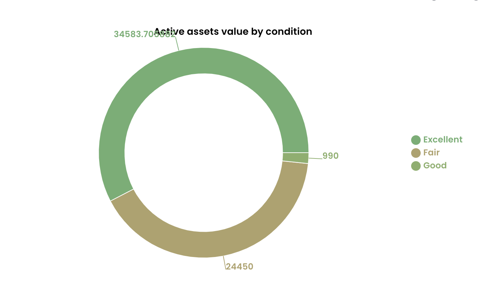
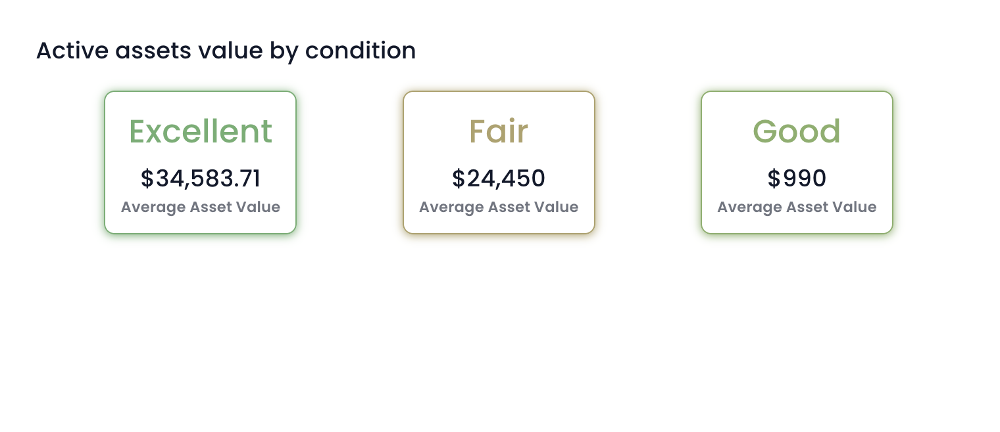

# Visual

The **Visual** component (introduced in <a href="https://docs.rapidplatform.com/changelog/2024/05/05/2024-05-05-1.40.0%20-%20Rapid%20Platform/1.40.0%20-%20Rapid%20Platform" target="_blank">Update 1.40.0</a>) enables simple 2D chart visualisations.

:::note[Example]
Imagine a Project Manager trying to analyse the distribution of project tasks statuses (completed, in-progress and pending for start) from table data. It would be with a simple pie chart. Isn't it!

OR

Imagine yourself as a finance manager, trying to crunch numbers analysing changes in pattern of average asset values for a particular type of asset across the last two financial years. A bar graph can be such a life saver!
:::

## Adding the Visualisation Component in Designer

To add a visualisation component:

1. Navigate to your desired table in **Designer**.
2. Go to the **Design tab** and select the page where you want to add the visualisation.
3. Open the **Add a Component** panel on the layout / page by clicking the + icon.
4. In the **Add a Component** panel, scroll down to the **Visualisation** section.
5. Click **Visual** to add the component to the layout / page

### Tab Strip

If you are adding a visual component to the list page, it is a good practice to first add a Tab Strip and then add Visual component to a separate tab. This way the user can view the list and the visualisation based on specific need.

If adding the Visual component on a page along with other components, it is important that the width and height of the component is kept large enough, so as to accommodate visual information properly.

### Configuring Visual Components

To configure this component, please consider the following points:

1. Once the component is added to the page, it appears red in colour. This indicates that the component is not configured correctly yet
2. Click on **Edit** (pencil icon). A panel to edit the component preferences will open

3. Configure the component
4. **Save the page** for the configuration to take effect

Below is a description of each field of the **Visual** component edit preferences panel.

| Label | Title | Description |
| --- | --- | --- |
| a. | **Part of module** | This is a dropdown field. It has the list of all the modules available for your site. If your component belongs to a specific module, you can select the same in this field. |
| b. | **Type of chart** | Here you can select the nature of chart in which you want to display information. There are four options available at present: *Pie, Doughnut, Bar, and Counter*. Please note, you can select only one of these types. Although this field is not mandatory at present, you need to select a type to meaningfully configure the component. |
| c. | **Title** | This is the title of your chart. It appears on the component in Designer and above the chart in Explorer. Although this field is not mandatory, however, it is a good practice to provide an appropriate title to your chart, so that it assists everyone in interpreting the information better. |
| d. | **Table** | This is a dropdown field. Clicking on this field will open a list of all tables present in the site. Select your desired table from this list. Please note this is a mandatory field. |
| e. | **View** | Based on the Table selected, all the eligible Views appear in this dropdown list. Select the View of your choice here. The name of the selected View will also appear on your component in Designer. |
| f. | **Group By Field** | Here you can define independent variable - the group or category for which the value needs to be plotted. This is a dropdown field. Clicking on this field will open up the list of all the columns of the selected table (except those of Multi-lookup type). The column title appears with its type mentioned in brackets. Click your desired table column as independent variable. |
| g. | **Add Aggregate button** | Click this button to add the dependent variable. As you click this button a set of three fields will appear in this section. |

:::info[Note]
Every 2D chart is based on a minimum of two variables.

First is the independent variable. The independent variable defines the group or category for which the chart is plotted.

The second is the dependent variable. It defines what value to plot for each state of independent variable (ie. each group or category).

For example - A chart can be plotted to depict average $ value of all assets by asset condition. Here, condition of asset is independent variable which defines the group or category. Condition can be Excellent, Good, Fair or Not Working.

The chart will plot dependent variable - average $ value - for each state of independent variable ie. of each group or category.
:::

### Adding Aggregate Fields

| Label | Title | Description |
| --- | --- | --- |
| g. | **Add Aggregate button** | Click this button to add the dependent variable. As you click this button a set of three fields will appear in this section. |

:::note[Note]
The aggregate section allows you define the dependent variable for the chart. It is important to note that you need to define at least one dependent variable for all chart types.

However, you can define more dependent variables for Bar chart and Counter types.The Pie and Doughnut charts work with only one dependent variable.

With every click on Add Aggregate button, a new set of fields will appear, allowing you to configure more dependent variables.
:::

| Label | Title | Description |
| --- | --- | --- |
| i. | **Draggable Icon** | In case when there are multiple aggregates (dependent) variables defined, this allows you to arrange the variables in correct order. By click and drag on this icon you can reorder the variables up and down in the list of multiple aggregate variables. |
| ii. | **Name** | You can type the name of the aggregate (dependent) variable here. It appears in the chart in Explorer. |
| iii. | **Field** | This is a dropdown field. As you click on this field a list of all columns of the table (as selected in d. above) will appear. Again, the multi-lookup types do not feature in this list. You can select the desired column as your dependent variable. Please note this is a mandatory field. |
| iv. | **Type** | The type field provides the function operator based on which the value of the selected aggregate variable is calibrated. This is a dropdown field. There can be six options: *Count, Sum, Average, Minimum, and Maximum*. This is a **mandatory** field and cannot be left blank. |
| v. | **Bin** | Click on the bin icon to delete the aggregate variable. |

:::note[Note]
You can select multiple aggregates if desired:

:::

## Visual Component Appearance

A successfully configured component appears white, while a component not configured properly shall appear in red background.

It provides the following information.

1. The **type** of chart selected
2. **Title** of the chart
3. The configured **View** of the table selected

It is important that the choices of variables and configuration are meaningful. For example - if you select a Single line of text type of aggregate variable and ask the system to calibrate its average, then such a combination does not return any meaningful value.

In such cases, the component will break and it will not load / render on the Explorer page.

Sample of charts with one aggregate variable

| Pie Chart	| Doughnut Chart |
| --- | --- |
|  |  |

| Bar Chart | Counter |
| --- | --- |
|  |  |

### Sample of charts with two aggregate variables

| Bar chart	| Counter |
| --- | --- |
| | |