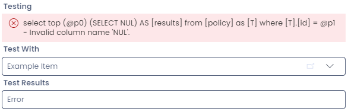

# SQL Columns & Fields

There are two different columns that can perform calculations on your database and present them within Rapid Explorer: **Computed** and **Subqueries**. Both of these columns will appear as greyed-out fields in Rapid Explorer, and cannot have their data edited in Explorer.

Both of these fields utilise **SQL Server**.


## Computed

Computed columns are used to perform math or combine data using only information from the table that the column is on. This is great for doing simple math and concatenations.

When querying computed columns in SQL they WILL appear when accessing the table directly.

```sql
-- Computed columns exist on the database, and can be accessed directly using SQL.
SELECT computed_column
FROM dbo.[table]
```

## Subqueries

Subqueries are similar to computed columns in that that they can perform math and concatenations. However, they can also use information from *other* tables. The information on a subquery field is *not* stored in the database but is rather calculated when you load that table. 

Because subquery columns are not stored in the database:
- They cannot be referenced directly on the table when using SQL
- You cannot reference the output of a subquery field within another subquery field.

```sql
-- This is produce an error, because a subquery column does not exist in the database.
SELECT subquery
FROM dbo.[table]
```

Subquery fields are 'baked' into views they are a part of, so it is possible to fetch and reference their values in a reporting environment. This is not recommended when trying to reference from another subquery due to performance and instability concerns.

## Configuring SQL Fields

Both **Computed** and **Subquery** fields can be created and edited like a usual column in Designer.


### Query Code

Below the warning to the user, there is a text field with a green outline for entering your SQL code. Rapid Platform uses [T-SQL from Microsoft](https://learn.microsoft.com/en-us/sql/t-sql/language-reference?view=sql-server-ver16). In the upper right corner, a status message indicates that the query is working correctly.


This field is required, and you will be unable to create the column without a working query entered.


### Display Subquery Value As

Here, you can display the result of the subquery so that is appears as another column type. For example, if your output is expected to be a dollar value, you can configure this field to appear as a **currency field** when displaying its result.


### Test With

Before saving your query, you can test what the output of the field will be by selecting a sample item from the table. In the **Test With** column, select an item, and then the output of the current code will display in the **Test Results** field.

If there is an error with your code, the **Test Results** field will display the word "Error" and display a warning message under the **Testing** header.



:::warning[Warning]
If any field in a **Computed** and **Subquery** produces an error, then all fields will produce an error in order to prevent a crash. In some circumstances, items that contain an errored field may no longer display in Explorer.

If you notice a table is suddenly empty or missing data, first check that the **View** you are using is correct. If the issue persists, check any **Computed** or **Subquery** fields by testing them using the "Test With" field when editing the relevant column in Designer.

If an error is being generated, then either correct or handle for the issue, save your changes, and then check Explorer again. The items should now be visible again.
:::

### Test Results

If a query is written correctly, and is tested on an item, then the **Test Results** field will now show the expected output for that particular item's field in Explorer.

![In this example, the user has entered the following query: "SELECT CONCAT(t.[document_name], ' - ', t.[status])". This takes the document_name column, adds a hyphen with spacing, and then displays the status of the item afterwards. In the Test Results, the field reads: "Example Item - Active", which means this is what the field will display in Explorer.](query_working.png)

In the example above, we take the column **document_name** and concatenate it with the **status** column, and include a hyphen between the column results.

Therefore, **subqueries** can create unique **title** columns, because they can select and concatenate data from other columns. Please note that **computed** columns cannot be set as a title column.

## Further Reading

- [Common subquery patterns](</docs/Rapid/Keyper%20Manual/Designer/SQL/Common-SQL-Patterns/>) discusses common uses for subquery fields
- You can also learn [how to troubleshoot SQL fields](</docs/Rapid/Keyper%20Manual/Designer/SQL/Troubleshooting>)