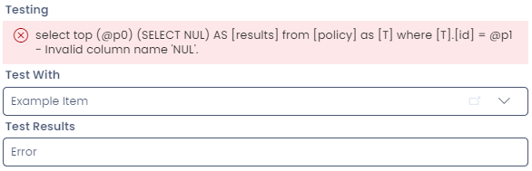

# Troubleshooting

Let's unpack an error message from a **Computed** or **Subquery** field in Designer. Note that the actual error message is at the very end of the red box alert.



So, in the example above, the error message displays all of the code (including Rapid's framework SQL code), followed by the error message `- Invalid column name 'NUL'.` This troubleshooting page will include common error messages and how to troubleshoot them, as well as discuss how to troubleshoot empty error messages.

## The SQL Framework

The error message above reveals the hidden structure of the SQL fields, and the exact SQL query that is running. Because a **Computed** or **Subquery** field can only contain a single value, Rapid wraps any queries entered into these fields like so:

```sql
SELECT top (@p0)
    (
        -- Your code that is saved in the "Query Code" field appears here.
    ) AS [results]
FROM
    [
        -- Rapid automatically adds the table that contains your SQL column here.
    ] as [T]
WHERE
    [T].[id] = @p1
```

For this reason, the following code **is valid** when entered into a **computed** or **subquery** field, even though it omits important commands such as `SELECT` or `FROM`.

```sql
CONCAT('My ID is ', t.[id])
-- This code is valid, because Rapid wraps it in the framework seen above.
-- If you are accessing information from other tables, you will need to include the usual SELECT and FROM statements.
```

We should keep this context in mind when examining the following common issues and errors that can occur:

## Common Errors

- [Invalid object name](</docs/Rapid/Keyper%20Manual/Designer/SQL/Errors/invalid-object-name>)
- [Invalid column name](</docs/Rapid/Keyper%20Manual/Designer/SQL/Errors/invalid-column-name>)
- [Incorrect syntax near](</docs/Rapid/Keyper%20Manual/Designer/SQL/Errors/incorrect-syntax-near>)
- [Subquery returned more than 1 value](</docs/Rapid/Keyper%20Manual/Designer/SQL/Errors/subquery-returned>)
- My query displays an error, but the [test field doesn't work](</docs/Rapid/Keyper%20Manual/Designer/SQL/Errors/test-does-not-work>)
- [My query displays an empty error message](</docs/Rapid/Keyper%20Manual/Designer/SQL/Errors/empty-error-message>)


## Further Reading

- [Common subquery patterns](</docs/Rapid/Keyper%20Manual/Designer/SQL/Common-SQL-Patterns/>) discusses common uses for subquery fields
- You can learn about the [differences between subquery and computed fields](</docs/Rapid/Keyper%20Manual/Designer/SQL/SQL%20Fields>)