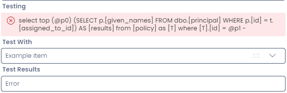

# Error: ""

### Issue:

You may see an error message that only contains your query code, and doesn't provide any additional error message, like so:



### Cause:

Running code in a **computed** field can result in empty error messages, if the code is attempting to access another table.

### Example:

The following code would cause a **computed** field to break, as it is attempting to access data on another table.

```sql
-- This code will break a COMPUTED field.
-- It refers to data on another table.
SELECT a.[start_date]
FROM dbo.[asset] AS a
WHERE a.[id] = t.[id]
```

You can learn more about the differences between **computed** and **subquery** fields by reading the [SQL Fields docs](</docs/Rapid/Keyper%20Manual/Designer/SQL/SQL%20Fields>).

### Solution 1: Alter the code

If the code can be edited so that it doesn't reference another table, this would be an ideal solution. In most situations, however, you may need to delete the **computed** field and create a **subquery** field instead.

### Solution 2: Remove the field

Convert the computed field to a subquery:

1. Copy your code from the **Query Code** box into a text editor
2. Delete the **computed** field using the delete button at the top of the side panel
3. Create a new **subquery** column
4. Paste your code from the **computed** field
5. Test the code using the test section at the bottom of the side panel