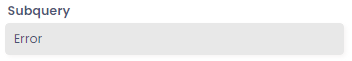
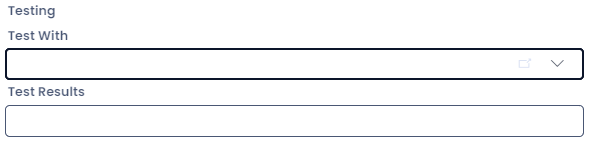

# Error: "Test Field Does Not Work"

### Issue:

You may see a **subquery** field display an error message like so:

But when you open the column in **Designer** and attempt to test it, no error appears, or the "Test With" field remains blank.

### Cause:

Most likely, this **subquery** was built on the **parent** table. However, it has now been inherited by a **subtype** table, where the subquery has now broken due to being unable to reference a column on the parent table.

### Solution 1: Remove the field

We can remove the offending **subquery** field from the parent table, or if possible build a **computed** field on the parent that will not break on **subtype** tables.

### Solution 2: Build a dedicated field for the child table

Create a new subquery field on the **subtype** table, which correctly references the parent table's column. You can then remove this errored column from any pages and views.

You can learn about how to build a subquery that correct references a subtype's **parent** table by reading  [Error: Invalid Column Name](</docs/Rapid/Keyper%20Manual/Designer/SQL/Errors/invalid-column-name/>) doc, specifically the **Solution 2** section.