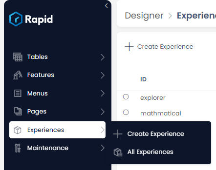
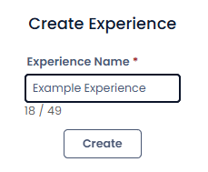
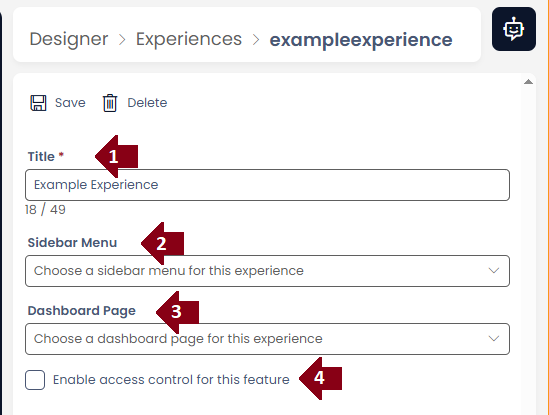

# Explorer Experiences

Sometimes one menu in Explorer just isn't enough. For larger sites, or businesses with more isolated teams all working on the one site, it can be handy to have more dedicated side menus and dashboards for each of these teams. Experiences in Explorer allow you to define a dedicated Menu and Dashboard as many times as you please.

## Configuration

In Designer under the Experiences section you can create a new Experience or see the list of current ones.

Creating a new Experience requires a short name

Experiences themselves have only four configurations:
1) Title, this will be shown in the Experience picker and helps keep track of each Experience
2) Sidebar Menu, this is the menu that will be used to populate the Explorer sidebar
3) Dashboard Page, the default landing page for that Experience
4) Enabling security

## Security 

Experiences can have permissions applied to them. A User that has only one Experience will not see the Experience Picker. Users with one ore more Experiences available to them will default to loading the first one in their list.

## Picking between Experiences

Once a User has more than one Experience available to them, a Experience Picker will be visible at the bottom of the Explorer Sidebar.

