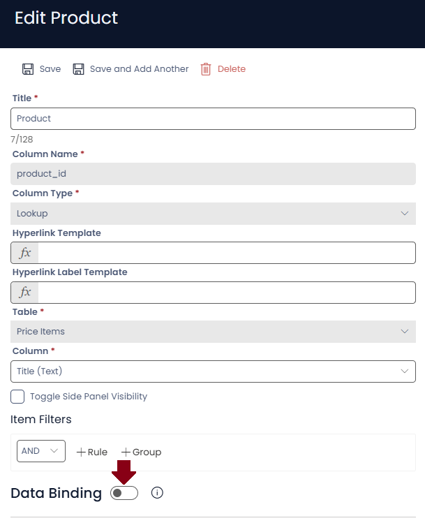
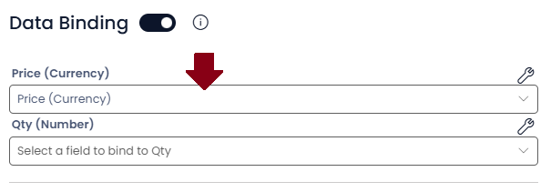
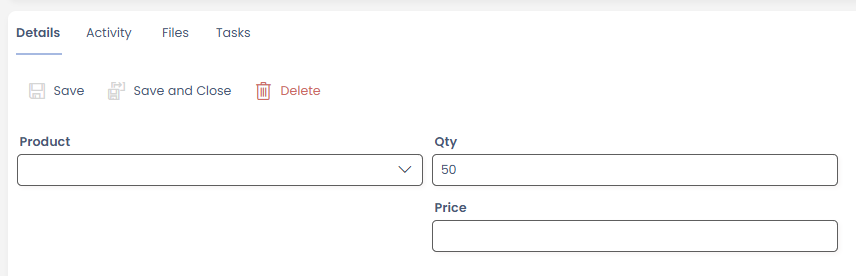
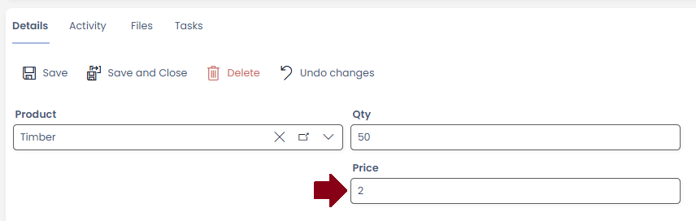

# Lookup Auto-fill

Lookups can be configured to source data from their target item and fill the current item with those values. For example, on a Invoice item you could select a product and have the price and discount fill in from the selected product definition.

## Configuration

Lookup auto-fill is configured at the Column level. When editing the Lookup column in Designer you will see a Data Binding toggle:

Enabling this will show a list of the columns on the current item. The purpose here is to define which values from the selected table map to the current item columns.
In this example the PO Lines item has Price and Qty columns. The lookup targets a Price Book item (essentially a product definition), so we will map the Price columns together like so:

## Behaviour

With the columns mapped together selecting an item will then 'load' the mapped data into the current item.
For example,

Here we have a new PO Line item with our lookup not yet set.

When then select a Price Book item 'Timber' with a Price of 2

After selecting the item, the PO Line price is set to 2 automatically