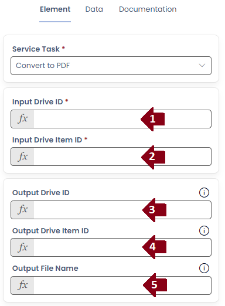

# Convert to PDF

SharePoint offers automated conversion of documents to PDF files. The Convert to PDF uses the SharePoint conversion to generate new PDF files and store them in a new location.

## Configuration

1) **Input Drive ID** : The Drive ID of the file you want to convert
2) **Input Drive Item ID** : The Item ID of the file you want to convert
3) **Output Drive ID** : The output Drive ID to place the generated PDF file
4) **Output Drive Item ID** : The output folder Item ID to place the generated PDF file
5) **Output File Name** : The name to give the generated PDF file

Each of the Output values are optional. When missing the generated PDF file will default to being placed next to the source file with the same name.