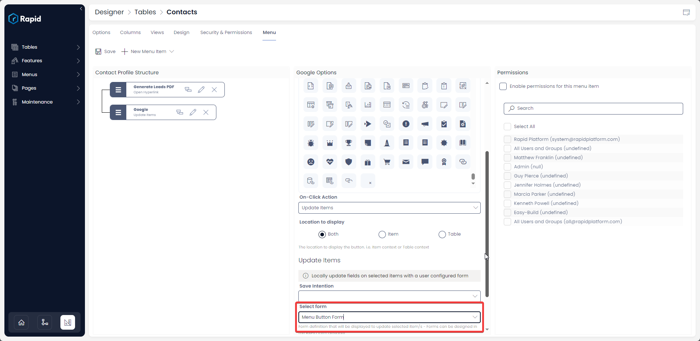
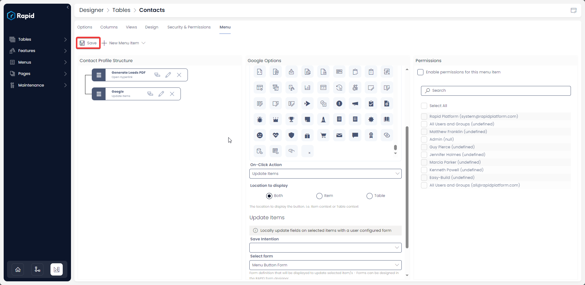
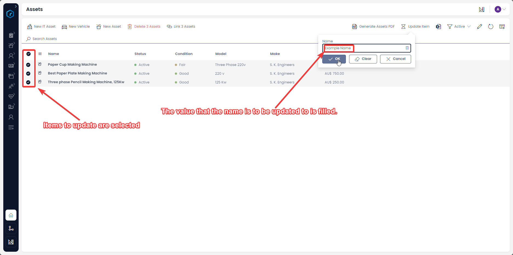
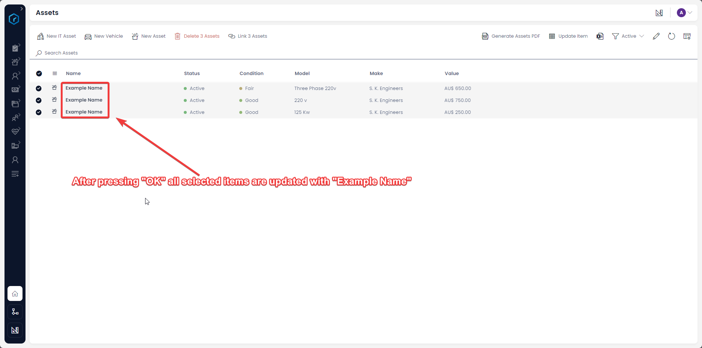

# How to update items from a click of a Menu button?

This is configurable only on the ***[Command Bar](https://docs.rapidplatform.com/books/glossary/page/command-bar)*** menu type.

#### Overview

There may be occasions when in a data table you would need to update an item *or* maybe update items in bulk from the list view.

For example - updating the status of tasks as complete with a click of a menu button.

#### How to configure an "Update Items" menu button

1. Navigate to Designer &gt; Tables &gt; All Tables  
    
2. Open your desired table. (Find your desired table by using the search bar or scrolling through the list)  
    
3. Navigate to the 'Menu' Tab  
    
4. Click on the **New Blank Item Drop down** then on **New Blank Item** 
5. Choose a name and icon  
    
6. Choose **Update Items** as the On-Click Action  
    *Image of 'update items' selected on anew menu item config
7. Select the form you wish to dropdown when the menu button is clicked  
    
8. Press Save  
    

#### Additional Details:

As we can observe, the Update Items On-Click Action has one additional field.

- **Select form -** This is the dropdown field. The dropdown will contain the titles of all the existing forms created in Rapid's Adaptive Designer. You can select the desired form by clicking on the title. The selected form will update item(s) based on user inputs provided in the selected form.

This On-Click Action, basically executes an Adaptive Document. The user can input information which can be updated to the table.

**Please note:** if you wish to update a specific table data from the menu button, please make sure that in the Adaptive Document, the connections to the table and columns are appropriately made.

**Updating Items in bulk:**

Now that the menu button is configured, makes it simple to update many items in bulks. Simply select the multiple items, press the menu button, fill in the field and press "OK". In image below the user wants to update the name of all three selected items to be the same.

[Go back to ***On-Click Actions*** learning resource](https://docs.rapidplatform.com/books/experiences/page/how-to-set-on-click-action-for-a-menu-item "How to set On-Click Action for a menu item?")