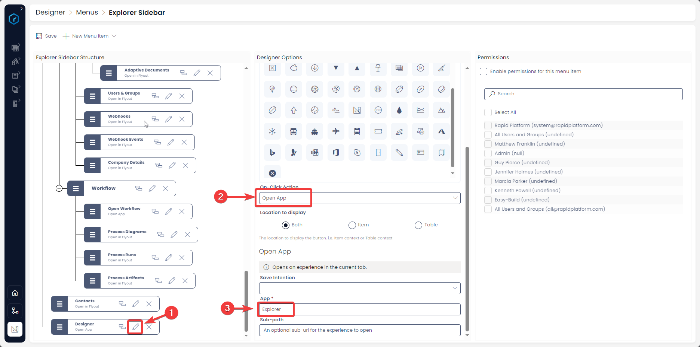

# How to Open a Rapid App from a Menu button?

This is configurable on both the ***[Side Bar](https://docs.rapidplatform.com/books/glossary/page/sidebar)*** and ***[Command Bar](https://docs.rapidplatform.com/books/glossary/page/command-bar)*** menu types.

#### Overview

There are three principle Rapid Platform Application:

1. [***Explorer***](https://docs.rapidplatform.com/books/glossary/page/explorer "Explorer")
2. [***Designer***](https://docs.rapidplatform.com/books/glossary/page/dezigna "Dezigna")
3. [***Workflow***](https://docs.rapidplatform.com/books/glossary/page/compoza-workflow "Compoza (Workflow)")

Do you wish to put a **menu item in a *[sidebar](https://docs.rapidplatform.com/books/glossary/page/sidebar "Sidebar")* that navigates to one of these applications.**

OR

You may wish to configure a menu button, which when clicked opens (say) **a particular workflow diagram.**

There can be other reasons, but if the question is - Is it possible configure a menu button to open an app? The answer is **YES.**

#### **How to configure a Menu button to "Open a Rapid App"**

1. **Press the Edit button on the desired menu button**
2. **App** - This is the mandatory field and allows you to specify which app you wish to point here.

**Please note:** You can only call RAPID applications here. It is not meant for external application.

Presently, there are three principle apps in RAPID:

1. Explorer
2. Designer
3. Workflow

There is another application - Forms, but it is being replaced by Adaptive Documents now.

The below table provides the keyword that needs to be entered in the App field to call respective RAPID applications

<table id="bkmrk-application-to-call-" ><tbody ><tr ><td class="align-left" >**Application to call**</td><td >**Keyword to write in App field**</td></tr><tr ><td class="align-center" >Explorer</td><td class="align-center" >Explorer</td></tr><tr ><td class="align-center" >Designer</td><td class="align-center" >Designer</td></tr><tr ><td class="align-center" >Workflow</td><td class="align-center" >Workflow</td></tr></tbody></table>

*Please note that you need to enter the Keywords exactly as matching here. However, these keywords are not case sensitive.*

3\. **Sub-path** - This field helps you provide partial URL that will allow the user to navigate to a specific page in the application.

For example - Imagine you wish to create a menu button that when pressed, navigates to:

[ https://test.rapidplatform.com/rapidplatform/documentation/compoza/blueprint/1/modeler](https://test.rapidplatform.com/rapidplatform/documentation/compoza/blueprint/1/modeler)

To achieve this, you need to fill:  
  
**Workflow** in the App field

**blueprint/1/modeler** in the Sub-path field

Hence, in the Sub-path, you only need to provide the portion of the URL as seen after the application keyword.

[Go back to ***On-Click Actions*** learning resource](https://docs.rapidplatform.com/books/experiences/page/how-to-set-on-click-action-for-a-menu-item "How to set On-Click Action for a menu item?")