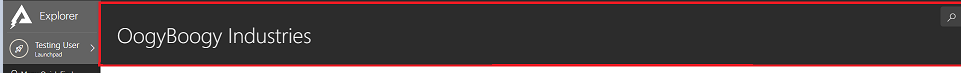
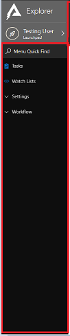
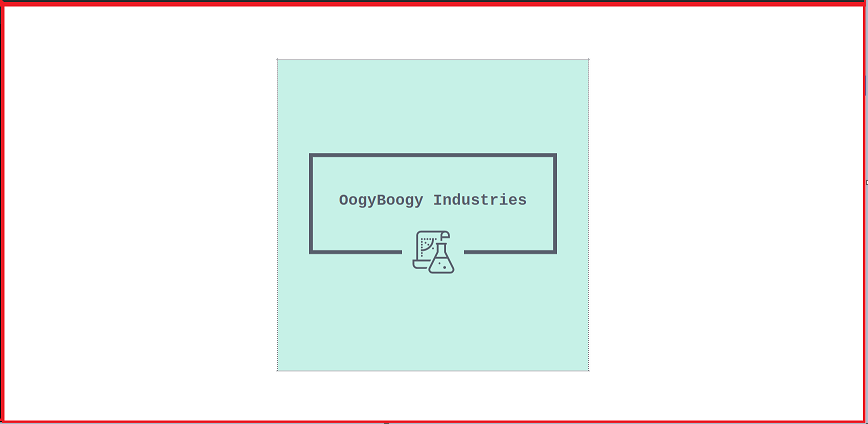

# Navigating Explorer

The main data manipulation tool that Rapid provides is the Explorer Experience. Explorer lets you view entities, modify, add and remove data. It is the primary front end experience that nearly all users interact with.

There are three main components which provide Explorer with its basic functionality

## Jumbotron

The jumbotron is found at the top of all configured pages within Explorer. It displays the title which is relevant for the page. In a Entity Context the entity name will be in the jumbotron, in an item context, the item title will be shown in the jumbotron.

*A snippet of the Jumbotron*

## Explorer Navigation Bar

The Explorer features a side bar for navigation. This menu is fully customisable where you are able to add external links as well as links to entities created. By default all entities created will be added to the Explorer side bar. Clicking on an entity in the sidebar will open the configured list page for that particular entity.

*A snippet of the Explorer Sidebar*

## Explorer Page

The Page component is how all data is conveyed. A page can be set up in countless ways as there are a multitude of page components which can be added to the page. In the previous example, an image component was added to the Dashboard page. This caused an image to be displayed on the Dashboard. The page component however is not limited to the Dashboard. All entities that are present in the Explorer sidebar can have pages added, along with the ability to edit them to suit the user requirements. An overview of all possible page components can be found [here](../../../4-Keyper%20Manual/2-Designer/2-Pages/3-Components/1-overview/1-overview.md).

*A snippet of a custom page in Explorer*