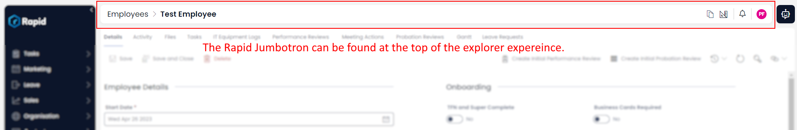
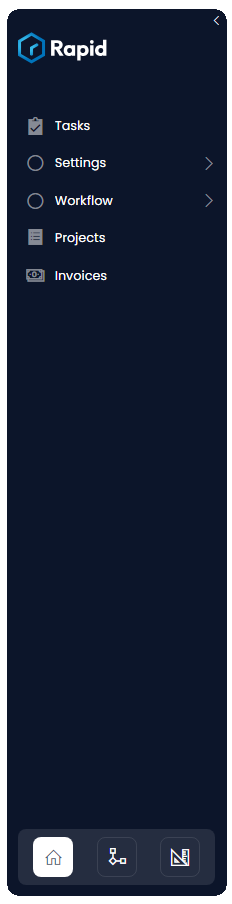
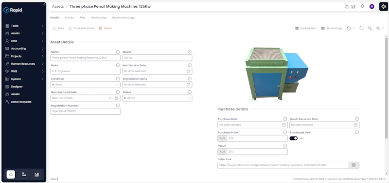

# Navigating Explorer

The main data manipulation tool that Rapid provides is the Explorer Experience. Explorer lets you view entities, modify, add and remove data. It is the primary front end experience that nearly all users interact with.

There are three main components which provide Explorer with its basic functionality

## Jumbotron

The jumbotron is found at the top of all pages within Explorer. It displays pages title, as well as a series of 'breadcrumbs' showing previous navigation steps. In a list Context the list name will be in the jumbotron, in an item context, the item title will be displayed.

In the far right of the Jumbotron there are three buttons:

These buttons allow you to access, from left to right:

**Environmental switch:** A button to quickly switch between the explorer and designer environments, withing the current item or list context.

**Notifications:** A button to access a quick popup window that presents the current users notifications

**User token:** A button to access information about the current user, including a log out button.

::tip[Please note]

To the right of the Jumbotron (as pictured above) is a button to access the Rapid ai powered chatbot. For more information please see our docs on //DO RAPIDO
 :::

## Explorer Navigation Bar

One of Explorer's main features is a side bar used for navigation which can be found on the far left of any page inside Rapid Platform. This menu is fully customisable. Items in the sidebar can point to Rapid Platform Pages, external links, or even open forms or apps. By default all entities created will be added to the Explorer side bar. Clicking on an entity in the sidebar will open the configured list page for that particular entity.  

## Explorer Page

The Page component is how all data is conveyed. A page can be set up in countless ways as there are a multitude of page components which can be added to the page. In the previous example, an image component was added to the Dashboard page. This caused an image to be displayed on the Dashboard. The page component however is not limited to the Dashboard. All entities that are present in the Explorer sidebar can have pages added, along with the ability to edit them to suit the user requirements. An overview of all possible page components can be found [here](/docs/Rapid/4-Keyper%20Manual/2-Designer/2-Pages/3-Components/1-overview/1-overview.md).

Here we can see an example of a custom page in explorer, showing two customized details panes (asset details and purchase details) as well as a custom image component.

