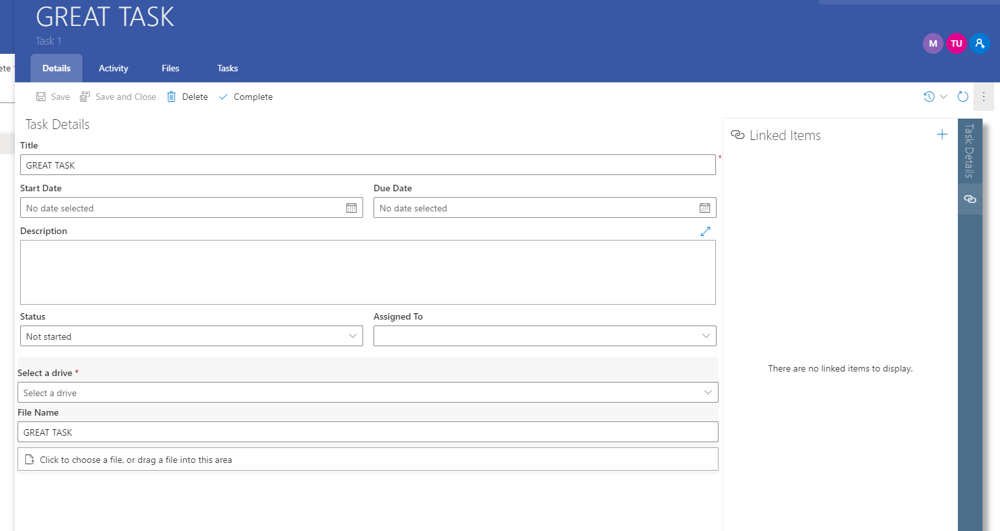
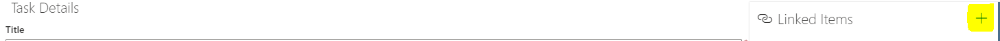

# Item Page

The item page is about a specific item from a table within your site. This page can enable viewing and changing:

1. Item Permissions

This is the Item's permissions configuration. It lists the users and groups which have access to the item. These are displayed as a user coin. To open more details as to what users exactly you are able to click on the 'Edit Permissions' button this will bring up the Permissions management config for that particular item. More can be read [here](https://docs.rapidplatform.com/books/explorer/page/item-level-permissions "Item-Level Permissions").

1. Basic Save Button The save button commits any changes made to an item to the database. Actions that can dirty data which will enable the save button include; Editing fields, adding a universal link and adding files.
2. Save and Close Button Performs the same action as a save button except closes the flyout as well. This is particularly useful if the save is the final edit to an item or if you wish to edit another item from the same list.
3. Deleting an Item This deletes the opened item. This is a basic delete which sets the item to a deleted state in the database. Deleted items' will not show up in Rapid Explorer. Deleting an item will close its flyout.

    :::info[**Note:**]
    Deleting an item will only remove it from the Rapid Site. The entry will still exist in the database meaning the action can be reverted by your system administrator.
    :::

4. Complete Button This button is universal across the task system entity as well as any inherited entities created from tasks. Other custom entities will not have this UI feature. Pressing this button will perform the following action: Set task status to complete and then save the item.
5. Item History The following button will open a UI which will list any changes made to an item along with the user that made the changes. More can be read [here](/docs/Rapid/3-User%20Manual/2-Explorer/1-Items/item-history/item-history.md "Item History").
6. Inline Refresh This button will perform an inline refresh on the current context. For an Item it will fetch the information pertaining to the item. A good use of this feature would be to view a Universal link added by another user which has not yet been displayed as the page has remained open. Read more about Inline Refresh [here](#item-page).
7. Linked Items Menu The linked items component is default on any entity, system or custom. However the page component can be removed. This Linked Items Menu however is consistent throughout Rapid and can be opened by pressing the **⋮** button. This will expand menu and will list any items which have been linked. This list, displayed Universal links between items. More can be read [here](#item-page).

*Linked Items Menu*

To add a new linked item press the +

*Interface for Adding a new Linked Item*

Refer to section &lt;**TODO**&gt; for more details on universally linking items. To close the item flyout press the 'x' in the top right of the screen, under the jumbotron. It is also possible to close all proceeding flyouts by tapping the jumbotron either on a previous flyout or on the base page.