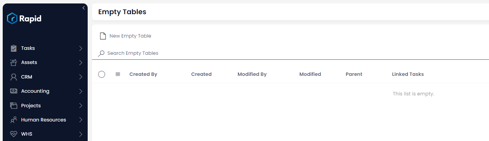

# Default Fields

This is the default view and page for an table. Notice there are multiple columns which are present in the header. These are the system columns which are present on all tables.

In some situations, viewing these system fields may be useful. Below is an outline of what each of these system fields do.

| System Field | Description |
| --- | --- |
| Created By | Outputs the name of the user who created the item|
|Created| Outputs a date in which the item was created|
|Modified By| If the entity was edited, the name of user who edited will be displayed|
|Modified| Outputs the date in which the item was edited|
|Parent Displays| the parent of the item (if applicable)|
|Linked Tasks| An array of tasks linked to an item|

These columns cannot be deleted and are necessary for Rapid to function correctly. These system columns will automatically be removed from the view if there are custom columns added to a table.